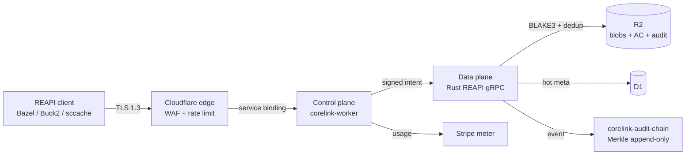

# CoreLink

> Cross-tenant safe content-addressable cache. Engineered as if you were the auditor.

[](#license)
[](./.github/workflows/)
[](./specs/03_architecture/compliance_matrix.md)
[](./openapi/corelink-v1.yaml)
[](./apps/docs/static/.well-known/security.txt)

---

> 📍 **Contributors / agents reading this for the first time:** read
> [`docs/POSITIONING.md`](./docs/POSITIONING.md) BEFORE proposing any
> market angle, pivot, or feature framing. CoreLink is repeatedly
> reduced to "build cache" by fresh readers — it is a multi-tenant
> CAS + governance platform with build-cache as ONE protocol surface.

## TL;DR

CoreLink is a multi-tenant, content-addressable cache for software builds, package indices, container layers, and ML artifacts — a [Remote Execution API v2 (REAPI)](./specs/03_architecture/) implementation in Rust on Cloudflare's edge. It commits to four invariant guarantees (integrity, tenant isolation, confidentiality, append-only audit) verified by TLA+ model checking, property-based tests, and runtime assertions. The same managed service ships BYOK envelope encryption across four KMS providers, RFC 6962 Merkle-chained audit logs, residency-honest multi-region storage, and a published OpenAPI contract — so customers do not have to choose between operational simplicity and the controls a regulated business actually needs.

## 30-second demo

Install, store, retrieve, and audit in under a minute.

**New?** Try the [5-minute quickstart](./apps/docs/docs/tutorials/quickstart-5min.mdx) —
sign up, export your PAT, run two `curl` commands, done. No CLI install required.
The full [10-minute quickstart](./apps/docs/docs/tutorials/quickstart-10min.mdx)
adds the CLI, Bazel wiring, and cache HITs.

```bash
# 1. Install the CLI (macOS shown; Linux/Windows in the quickstart).
brew install HumanGuardrail/tap/corelink

# 2. Sign in to the sandbox (24h scratch tenant; no credit card).
#    Visit https://app.corelink.humangr.com/sandbox, copy the PAT, then:
export CORELINK_PAT="corelink_sandbox_t_xxx.xxx.xxx"
corelink doctor                    # 8/8 checks PASS

# 3. Store an artifact. BLAKE3 digest IS the storage key.
echo "hello, corelink — $(date)" > /tmp/hello.txt
DIGEST=$(corelink put /tmp/hello.txt --output json | jq -r .digest)

# 4. Retrieve as if from another machine. Client-side BLAKE3 re-verify.
corelink get "$DIGEST" --output /tmp/restored.txt
diff -q /tmp/hello.txt /tmp/restored.txt    # identical

# 5. Confirm the audit trail saw both events.
corelink ls --limit 5
```

Every byte returned by `get` is re-hashed client-side against the
requested digest before it leaves the verifier (`CTRL-CAS-002`); a
mismatch refuses the read and emits a P0 integrity event.

## Production status

The production data plane is wired and deployed. The Wave 32
production-deploy campaign sealed 2026-05-22 (tag
[`corelink-prod-deploy-v1`](https://github.com/HumanGuardrail/corelink-server/releases/tag/corelink-prod-deploy-v1)),
with all 5 customer endpoints live behind the canonical
`corelink.humangr.com` domain. The Wave 33-36 reorg campaign
(2026-05-22 → 2026-05-27) then consolidated the workspace from 149
packages to 87 across 11 umbrella crates, restored the wasm32 build,
resolved the materializer dependency cycle via traits extraction,
added 14 proptests, and locked the adapter import boundaries down
with cargo-deny. The remaining path to GA Full is the human-driven
external-engagement track (pentest + SOC 2 + Legal + lighthouse
customers + 30-day staging burn-in) tracked in
[`ROADMAP-TO-GA.md`](./ROADMAP-TO-GA.md) Waves R-5..R-8. No code
debt; only time-bounded calendar work.

## Why CoreLink

Five invariant-grounded commitments. Each maps to a verifiable
artifact, not a marketing claim.

- **Integrity is unconditional.** Every CAS GET is BLAKE3-re-hashed
  client-side before bytes leave the verifier. `INV-CAS-INTEGRITY` is
  enforced in code and asserted in `debug_assert!`; the SLO
  (`SLO-CORRECT-CAS`) has zero budget. See
  [ARCHITECTURE.md §1](./ARCHITECTURE.md#1-purpose).

- **Tenant isolation is a TLA+ invariant, not a marketing word.**
  `INV-TenantIsolation` is modeled in
  [`specs/03_architecture/tla+/`](./specs/03_architecture/) and the
  model checker runs in CI on every change to `tenant-path`,
  `corelink-worker`, or `corelink-reapi`. Counterexamples block merge.
  See [ARCHITECTURE.md §4](./ARCHITECTURE.md#4-tenant-model).

- **BYOK is real across four KMS providers.** AWS KMS, GCP KMS, Azure
  Key Vault, and HashiCorp Vault. Customer-held KEKs, 5-minute
  in-memory DEK cap, AAD-bound ciphertext, signed Ed25519 erasure
  attestation. Disable the KEK and CoreLink cannot read your data.
  See [ARCHITECTURE.md §6.1](./ARCHITECTURE.md#6-trust-and-security-model).

- **The audit chain is a primary artifact.** Every state-changing
  operation lands in an append-only Merkle log (BLAKE3 leaves,
  Ed25519-signed hourly roots, RFC 3161 timestamped); customers and
  auditors re-derive the root from raw events. See
  [ARCHITECTURE.md §6.2](./ARCHITECTURE.md#6-trust-and-security-model).

- **Residency is honest.** Four enumerated regions (`wnam`, `enam`,
  `weur`, `sam`). Blobs stay in-region by structural invariant; the
  metadata cross-border story is documented per sub-processor, not
  glossed. See
  [ARCHITECTURE.md §9 — Compliance posture](./ARCHITECTURE.md#9-compliance-posture).

## Getting started

Pick the route that matches what you came here for.

### I want to test it (~10 min)

The [10-minute quickstart](./apps/docs/docs/tutorials/quickstart-10min.mdx)
takes you from install to a stored + retrieved + audited artifact.
Sandbox tenants are free, 24h-TTL, and require no credit card.

```bash
brew install HumanGuardrail/tap/corelink   # see quickstart for Linux/Windows
corelink doctor
```

### I want to read the code

Start with [`ARCHITECTURE.md`](./ARCHITECTURE.md) — 10 sections, 8
companion diagrams, 12 core crates explained in one paragraph each.
Then drop into the crate that owns your domain:

- [`crates/corelink-reapi/`](./crates/corelink-reapi/) — REAPI v2 wire surface.
- [`crates/corelink-hash/`](./crates/corelink-hash/) — BLAKE3-primary integrity.
- [`crates/tenant-path/`](./crates/tenant-path/) — HMAC tenant prefix; sole owner of `INV-TenantIsolation`.
- [`crates/corelink-audit-chain/`](./crates/corelink-audit-chain/) — Merkle append + Ed25519 roots.
- [`crates/corelink-byok/`](./crates/corelink-byok/) — envelope encryption core.

Workspace conventions are in
[`docs/internal/ENGINEERING-ONBOARDING.md`](./docs/internal/ENGINEERING-ONBOARDING.md)
(Day-0 through Day-30 path; first PR merged in ≤ 5 working days is
the target).

### I want to understand the security model

The audit chain is the substrate every compliance and forensic claim
rests on. Read in this order:

1. [Trust Center pages](./apps/docs/docs/trust/) — public-facing
   compliance, sub-processors, incident response posture.
2. [`SECURITY.md`](./SECURITY.md) — vulnerability disclosure policy,
   bounty scope, response SLA. Coordinated reports go to
   `security@humangr.com`; the canonical contact card is the
   [RFC 9116 security.txt](./apps/docs/static/.well-known/security.txt).
3. [`specs/03_architecture/security_model.md`](./specs/03_architecture/security_model.md)
   — STRIDE rows per trust boundary, `CTRL-*` catalog.
4. [`specs/03_architecture/key_management.md`](./specs/03_architecture/key_management.md)
   — envelope encryption, DEK lifecycle, BYOK rewrap path.
5. [`specs/03_architecture/compliance_matrix.md`](./specs/03_architecture/compliance_matrix.md)
   — `CTRL-*` ↔ SOC 2 / LGPD / GDPR / ISO 27001 / PCI DSS mapping.

Audit-chain inclusion proofs are obtainable per event via
[`crates/corelink-audit-chain/`](./crates/corelink-audit-chain/);
the [audit-chain diagram](./docs/internal/architecture/diagrams/audit-chain-merkle.mmd)
shows the leaf → root path.

#### Offline audit-chain verify (WI-S09-008)

Customers download a streaming NDJSON dump of their audit log via
`GET /v1/audit/export?since=<rfc3339>&until=<rfc3339>` (one
`{event, proof}` line per audit row + a trailing
`{"manifest": <ExportManifest>}` line). The response header
`X-CoreLink-Audit-Export-Chain-Head-Anchor` carries the 64-char
BLAKE3 chain-head anchor observed at export time.

To re-verify the dump offline (no network, no CoreLink trust):

```sh
corelink audit verify-ndjson \
  --ndjson ./export.ndjson \
  --chain-head-anchor <64-hex from X-CoreLink-Audit-Export-Chain-Head-Anchor>
```

The CLI recomputes every chain link from canonical bytes, walks the
chain forward asserting continuity, and asserts the final
recomputed hash matches both the manifest `chain_head_at_export`
AND the customer-supplied anchor (constant-time compare). Exit
code is `0` on success and `1` on any divergence, with a
structured chain-break diagnostic carrying the offending line
number, observed hash, expected hash, and failure kind
(`continuity` vs `link_recompute`).

### I want to contribute

Read [`CONTRIBUTING.md`](./CONTRIBUTING.md) first — DCO sign-off
required, two-person review on release scripts, conventional commits.
Then:

- Code of conduct: [`CODE_OF_CONDUCT.md`](./CODE_OF_CONDUCT.md)
  (Contributor Covenant v2.1).
- First-PR backlog: GitHub issues labeled
  [`good first issue`](https://github.com/HumanGuardrail/corelink-server/issues?q=is%3Aissue+is%3Aopen+label%3A%22good+first+issue%22)
  — each scoped to roughly half a day.
- OSS vs closed boundary:
  [`docs/internal/OSS-VS-CLOSED-MATRIX.md`](./docs/internal/OSS-VS-CLOSED-MATRIX.md)
  — 13 crates dual-licensed MIT/Apache; the remaining server-side
  crates stay closed (counts re-balanced after the Wave 33-36 reorg
  consolidated 149 packages into 87).

## Examples

Working, clone-and-run examples under [`apps/examples/`](./apps/examples/):

| Example | Description |
|---------|-------------|
| [`apps/examples/bazel/`](./apps/examples/bazel/) | Bazel remote cache via REAPI v2 — one `cc_library` + one `cc_binary`, `.bazelrc` with CoreLink flags, 3-step runbook |

## Workspace layout

The Cargo workspace ships 87 packages organized around **11 umbrella
crates** plus the apps, docs, specs, and launch surfaces. The current
shape is the result of the Wave 33-36 reorg campaign (2026-05-22 →
2026-05-27), which consolidated 149 historical packages into the
present 87 via the **Mod-Mono + Hex + EDA + Actor + µKernel** pattern
documented in
[`specs/_audits/sealed/2026-05-22-wave33-code-reorg-spec.md`](./specs/_audits/sealed/2026-05-22-wave33-code-reorg-spec.md).
The 11 umbrellas are
[`corelink-cas`](./crates/corelink-cas/),
[`corelink-ac`](./crates/corelink-ac/),
[`corelink-auth`](./crates/corelink-auth/),
[`corelink-billing`](./crates/corelink-billing/),
[`corelink-byok`](./crates/corelink-byok/),
[`corelink-privacy`](./crates/corelink-privacy/),
[`corelink-replication`](./crates/corelink-replication/),
[`corelink-telemetry`](./crates/corelink-telemetry/),
[`corelink-ops`](./crates/corelink-ops/),
[`corelink-adapter-host`](./crates/corelink-adapter-host/), and
[`corelink-container`](./crates/corelink-container/) (the gRPC server
binary, absorbed from `apps/server` in Wave 33 Stage 2.B). Top-level
directories, one line each:

- [`apps/`](./apps/) — Cloudflare Worker shim, admin UI
  (`apps/admin-ui`), and Docusaurus docs site (`apps/docs`). The
  production gRPC server now lives in
  [`crates/corelink-container`](./crates/corelink-container/) (binary
  name `corelink-server` preserved for Dockerfile + wrangler.toml).
- [`crates/`](./crates/) — 87-package Cargo workspace; the 12 core
  crates are listed in
  [ARCHITECTURE.md §3](./ARCHITECTURE.md#3-core-building-blocks).
- [`specs/`](./specs/) — canonical specs (Level 0 → Level 5), TLA+
  models, ADRs, runbooks, compliance matrix, invariant registry.
- [`marketing/`](./marketing/) — launch surface: blog posts, press
  kit, landing-page copy. Embargoed until GA-day per the launch
  charter.
- [`docs/`](./docs/) — internal engineering docs: onboarding,
  architecture diagrams, OSS-vs-closed matrix, tech-lead checklist.
- [`scripts/`](./scripts/) — validators, drills, migrations, CI
  helpers. `validate_specs.py` and `validate_references.py` run on
  every PR.
- [`infra/`](./infra/) — Terraform, Cloudflare config, K6 load
  harnesses, observability dashboards.
- [`tests/`](./tests/) — end-to-end suites (9 e2e crates),
  cross-crate property tests, chaos drills, region-failover rehearsal.

The [`openapi/`](./openapi/) directory holds the published API
contract ([v1 YAML](./openapi/corelink-v1.yaml),
[v1 JSON](./openapi/corelink-v1.json)) — regenerated by the
`corelink-openapi` crate from in-crate types so the docs site and
SDK generators never lag the server.

## Architecture diagram

The runtime architecture follows a **Mod-Mono + Hex + EDA + Actor +
µKernel** pattern: a single deployable mod-monolith (the
`corelink-container` gRPC server) composed of hexagonal umbrella
crates with ports/adapters at the boundaries; an event-driven audit
backbone in `corelink-audit-chain`; Cloudflare Durable Objects as
the actor substrate for per-tenant state; and a µKernel boundary
around BYOK so customer-held KEKs never cross trust zones. The full
charter is in
[`specs/_audits/sealed/2026-05-22-wave33-code-reorg-spec.md`](./specs/_audits/sealed/2026-05-22-wave33-code-reorg-spec.md);
the C4-L1 system-context diagram is at
[`docs/internal/architecture/diagrams/system-context.mmd`](./docs/internal/architecture/diagrams/system-context.mmd)
(72 lines, renders cleanly in GitHub Mermaid). The full diagram set —
[`audit-chain-merkle`](./docs/internal/architecture/diagrams/audit-chain-merkle.mmd),
[`byok-envelope`](./docs/internal/architecture/diagrams/byok-envelope.mmd),
[`data-flow-read`](./docs/internal/architecture/diagrams/data-flow-read.mmd),
[`data-flow-write`](./docs/internal/architecture/diagrams/data-flow-write.mmd),
[`data-flow-dsr`](./docs/internal/architecture/diagrams/data-flow-dsr.mmd),
[`region-failover`](./docs/internal/architecture/diagrams/region-failover.mmd),
[`tenant-isolation`](./docs/internal/architecture/diagrams/tenant-isolation.mmd) —
lives under
[`docs/internal/architecture/diagrams/`](./docs/internal/architecture/diagrams/).

A minimal request-flow sketch:



## Examples

Copy-paste runnable examples that connect popular build toolchains to CoreLink
as the remote cache backend.

| Example | Toolchain | Location |
|---------|-----------|----------|
| Turborepo remote cache | Turborepo v2 + pnpm | [`apps/examples/turborepo/`](./apps/examples/turborepo/) |

Each example ships a `.env.example`, a `README.md` with a full runbook
(set-env → first build → second build → expected cache-hit output), and the
minimal config files needed to wire the toolchain to CoreLink.

---

## License

Dual-licensed under your choice of:

- [Apache License, Version 2.0](./LICENSE-APACHE-2.0)
- [MIT License](./LICENSE-MIT)

The per-crate boundary — which crates are OSS-published vs which stay
server-side — is documented in
[`docs/internal/OSS-VS-CLOSED-MATRIX.md`](./docs/internal/OSS-VS-CLOSED-MATRIX.md).
At time of writing, 13 customer-facing crates (CLI, schema crates,
verifier primitives, FFI wrappers) are dual MIT/Apache and intended
for `crates.io`; the remaining server-side packages stay in the
closed deployment repo (the workspace currently ships 87 packages
total after the Wave 33-36 reorg).

## Contact

| Concern | Address |
|---|---|
| Vulnerability disclosure | `security@humangr.com` |
| Privacy / DSR / DPO | `privacy@humangr.com` |
| Press / launch / analyst | `press@humangr.com` |
| Procurement / DPA / auditor | `trust@humangr.com` |
| Code of conduct reports | `conduct@humangr.com` |

The canonical security contact card lives at
[`/.well-known/security.txt`](./apps/docs/static/.well-known/security.txt)
(RFC 9116). PGP key + acknowledgments page referenced inline there.

## References

- [`ARCHITECTURE.md`](./ARCHITECTURE.md) — invariant guarantees,
  system context, 12 core crates, tenant model, data lifecycle, BYOK
  envelope, audit chain, top-10 SLOs, failure-mode taxonomy,
  compliance posture.
- [`ROADMAP-TO-GA.md`](./ROADMAP-TO-GA.md) — 21-sprint plan from
  scaffold to GA, with per-sprint exit criteria and audit trail
  (v1.1.0; Waves 32-36 SEAL'd 2026-05-27).
- [`specs/_audits/sealed/2026-05-22-wave33-code-reorg-spec.md`](./specs/_audits/sealed/2026-05-22-wave33-code-reorg-spec.md)
  — Wave 33-36 reorg charter (Mod-Mono + Hex + EDA + Actor +
  µKernel; 149 → 87 packages; 11 umbrella crates).
- [`specs/_audits/sealed/2026-05-26-wave-33-34-closure-followups.md`](./specs/_audits/sealed/2026-05-26-wave-33-34-closure-followups.md)
  — Wave 33/34 closure-followups audit (`audit_status: CLOSED`).
  Tag chain: `wave-33-stage2-sealed`, `wave-34-adapters-sealed`,
  `wave-35-phase-2-sealed`, `wave-36-stage-2-sealed`,
  `wave-36-final-sealed`, and production
  `corelink-prod-deploy-v1`.
- [`SECURITY.md`](./SECURITY.md) — vulnerability disclosure policy
  and response SLA.
- [`CONTRIBUTING.md`](./CONTRIBUTING.md) — DCO, review process,
  first-PR walkthrough.
- [`CODE_OF_CONDUCT.md`](./CODE_OF_CONDUCT.md) — Contributor
  Covenant v2.1.
- [`CHANGELOG.md`](./CHANGELOG.md) — Keep-a-Changelog format,
  per-sprint releases.
- [Trust Center](./apps/docs/docs/trust/) — public-facing compliance,
  sub-processors, incident response, FedRAMP/PCI/ISO/SOC posture.
- [Launch blog posts](./marketing/launch/BLOG-POSTS/) — five posts
  covering the product story, BYOK deep-dive, audit chain proofs,
  multi-region residency, cache-hit economics. Embargoed until
  Engineering Gate D-day.
- [OpenAPI v1 (YAML)](./openapi/corelink-v1.yaml) /
  [OpenAPI v1 (JSON)](./openapi/corelink-v1.json) — published API
  contract.
- [10-minute quickstart](./apps/docs/docs/tutorials/quickstart-10min.mdx)
  — install → store → retrieve → audit → SDK in under 10 minutes.
- [Engineering onboarding](./docs/internal/ENGINEERING-ONBOARDING.md)
  — Day-0 through Day-30 path, 5 domain tracks, curated first-PR
  backlog.

---

CoreLink is a HuGR Labs product. The engineering gate is binary and
unappealable; the launch orchestration communicates what the
engineering gate has already proven. The customers we want are
customers who care about that separation.
