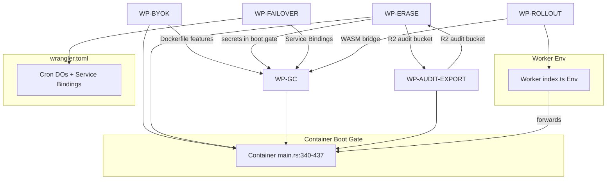

# CoreLink — Remediation Plan: 6 Enterprise/Compliance Gaps

**Status**: DRAFT — Round 1 (gap analysis complete)
**Owner**: Gustavo Schneiter
**Date**: 2026-08-07

---

## Round 1 — Gap Analysis Findings (VERIFIED)

### WP-GC: GC/Eviction Cron DO (P0)
- **Confirmed**: Only `InMemoryGcWorker` implements `GcWorker` trait (`worker.rs:249`); no real impl exists
- **Confirmed**: Only `InMemoryEvictionPhase` implements `EvictionPhase` trait (`phase.rs:724`); no real impl exists
- **Confirmed**: No Cron DO bindings in `wrangler.toml` for GC/eviction
- **Confirmed**: `gc-pause` degrade-mode exists in `degrade.rs:30-38` but not wired to Cron DO
- **Missing**: `RealGcWorker` impl against real D1+R2, `RealEvictionPhase` impl, Cron DO bindings for 5 regions

### WP-ERASE: Erasure Attestation Verify Sweep (P0)
- **Confirmed**: Audit drain cron exists (`apps/signup-worker/src/webhooks/audit_drain_cron.ts`) — hourly POST to `/_internal/audit/drain`
- **Confirmed**: NO DSR verify sweep cron — no Cloudflare Cron Trigger for `/_internal/dsr/verify`
- **Confirmed**: Container boot gate missing `ERASURE_ATTESTATION_SEED_HEX`, `ERASURE_ATTESTATION_KEY_ID`, `ERASURE_ATTESTATION_SINGLE_REGION`, `ERASURE_ATTESTATION_REGION`, R2 audit bucket
- **Confirmed**: `sign_and_persist` (`dsr/attestation.rs:249`) produces signed attestation but only called from verify handler, no scheduled sweep
- **Confirmed**: All 12 backends must be operational for verify sweep to produce attestation
- **Missing**: Cron Trigger for verify sweep, boot gate additions, R2 audit bucket provisioning

### WP-BYOK: BYOK Real Provider (P1)
- **Confirmed**: `Dockerfile:182` builds without `--features byok-aws-real` → `REAL_KMS_PROVIDER_WIRED=false` → `byok_admin.rs:249-261` returns 501
- **Confirmed**: `byok_orchestrator.rs:223-272` has compile-time dispatch for 4 providers, `InMemoryFake` default
- **Confirmed**: `byok_admin.rs:146-149` activation endpoint exists but gated on `REAL_KMS_PROVIDER_WIRED`
- **Missing**: Dockerfile `--features byok-aws-real`, AWS creds in prod secrets

### WP-FAILOVER: Multi-region Heartbeat + Edge Reroute (P1)
- **Confirmed**: `ReplicationCoordinatorDO` LIVE (`replication_coordinator_do.ts:419`) — singleton DO, alarm tick 30s, split-brain guard
- **Confirmed**: Container `failover_guard` LIVE (`failover.rs:193`) — `RollingMetricsHealthProbe`, stamps `x-corelink-failover-read-region`
- **Confirmed**: NO heartbeat sidecar — comment in `replication_coordinator_do.ts:37-41` says "operator residual"
- **Confirmed**: Worker does NOT reroute reads on `x-corelink-failover-read-region` header
- **Confirmed**: Service Bindings `PROD_WEUR`/`PROD_SAM` exist in `wrangler.toml`
- **Missing**: Heartbeat sidecar Cron Trigger per region, Worker read reroute logic

### WP-AUDIT-EXPORT: Audit Export Durable R2 (P2)
- **Confirmed**: Only `InMemoryAuditExporter` wired (`audit_export/state.rs:88-91`)
- **Confirmed**: Comment at `state.rs:80-86` explicitly states "durable R2-backed exporter + RateLimiter DO singleton + CloudEvents audit sink are DEFERRED"
- **Confirmed**: `AuditExporter` trait exists (`exporter.rs:173-190`), `R2AuditExporter` not implemented
- **Confirmed**: Export route rate limit config exists (`audit_export_rate_limit_config()` — 1/min)
- **Missing**: `R2AuditExporter` impl, `RateLimiter` DO singleton, CloudEvents audit sink

### WP-ROLLOUT: RolloutController WASM Bridge (P2)
- **Confirmed**: Stub returns 501 (`rollout_controller.ts:30-62`) — "WASM bridge not yet wired (Phase C)"
- **Confirmed**: Real logic in `crates/corelink-replication::rollout_controller` with property tests + adversarial tests
- **Confirmed**: NO WASM bridge in `corelink-cf-bindings` (checked - no rollout_controller exports)
- **Confirmed**: DO bound in `wrangler.toml` but no edge route dispatches to it
- **Missing**: WASM bridge via `corelink-cf-bindings`, TypeScript shim calling WASM exports

---

## Cross-Cutting Dependencies (VERIFIED)

| Dependency | Required By | Status |
|------------|-------------|--------|
| `ERASURE_ATTESTATION_SEED_HEX` + `KEY_ID` | WP-ERASE, WP-BYOK (CF-6), WP-AUDIT-EXPORT (CF-6) | ✅ Worker env, ❌ Container boot gate |
| `ERASURE_ATTESTATION_SINGLE_REGION` + `REGION` | WP-ERASE (R2 audit bucket) | ✅ Worker env, ❌ Container boot gate |
| R2 bucket `corelink-audit-{region}` | WP-ERASE, WP-AUDIT-EXPORT | ❌ Not provisioned |
| Service Bindings `PROD_WEUR`/`PROD_SAM` | WP-FAILOVER | ✅ In wrangler.toml |
| `R2_TDK_HEX` | WP-ERASE (CAS erase route) | ✅ Worker env, forwarded by DO |
| `STRIPE_PRICE_ID_PRO` + `STRIPE_PRICE_ID_TEAM` | WP-BYOK (boot gate) | ✅ In boot gate, ❌ Missing from `secrets-matrix.yaml` |
| Cron DO bindings | WP-GC, WP-ERASE, WP-FAILOVER | ❌ Not in wrangler.toml |

---

## Round 1 — Gap Analysis Findings (VERIFIED)

### WP-GC: GC/Eviction Cron DO (P0)
- **Confirmed**: Only `InMemoryGcWorker` implements `GcWorker` trait (`worker.rs:249`); no real impl exists
- **Confirmed**: Only `InMemoryEvictionPhase` implements `EvictionPhase` trait (`phase.rs:724`); no real impl exists
- **Confirmed**: No Cron DO bindings in `wrangler.toml` for GC/eviction
- **Confirmed**: `gc-pause` degrade-mode exists in `degrade.rs:30-38` but not wired to Cron DO
- **Missing**: `RealGcWorker` impl against real D1+R2, `RealEvictionPhase` impl, Cron DO bindings for 5 regions

### WP-ERASE: Erasure Attestation Verify Sweep (P0)
- **Confirmed**: Audit drain cron exists (`apps/signup-worker/src/webhooks/audit_drain_cron.ts`) — hourly POST to `/_internal/audit/drain`
- **Confirmed**: NO DSR verify sweep cron — no Cloudflare Cron Trigger for `/_internal/dsr/verify`
- **Confirmed**: Container boot gate missing `ERASURE_ATTESTATION_SEED_HEX`, `ERASURE_ATTESTATION_KEY_ID`, `ERASURE_ATTESTATION_SINGLE_REGION`, `ERASURE_ATTESTATION_REGION`, R2 audit bucket
- **Confirmed**: `sign_and_persist` (`dsr/attestation.rs:249`) produces signed attestation but only called from verify handler, no scheduled sweep
- **Confirmed**: All 12 backends must be operational for verify sweep to produce attestation
- **Missing**: Cron Trigger for verify sweep, boot gate additions, R2 audit bucket provisioning

### WP-BYOK: BYOK Real Provider (P1)
- **Confirmed**: `Dockerfile:182` builds without `--features byok-aws-real` → `REAL_KMS_PROVIDER_WIRED=false` → `byok_admin.rs:249-261` returns 501
- **Confirmed**: `byok_orchestrator.rs:223-272` has compile-time dispatch for 4 providers, `InMemoryFake` default
- **Confirmed**: `byok_admin.rs:146-149` activation endpoint exists but gated on `REAL_KMS_PROVIDER_WIRED`
- **Missing**: Dockerfile `--features byok-aws-real`, AWS creds in prod secrets

### WP-FAILOVER: Multi-region Heartbeat + Edge Reroute (P1)
- **Confirmed**: `ReplicationCoordinatorDO` LIVE (`replication_coordinator_do.ts:419`) — singleton DO, alarm tick 30s, split-brain guard
- **Confirmed**: Container `failover_guard` LIVE (`failover.rs:193`) — `RollingMetricsHealthProbe`, stamps `x-corelink-failover-read-region`
- **Confirmed**: NO heartbeat sidecar — comment in `replication_coordinator_do.ts:37-41` says "operator residual"
- **Confirmed**: Worker does NOT reroute reads on `x-corelink-failover-read-region` header
- **Confirmed**: Service Bindings `PROD_WEUR`/`PROD_SAM` exist in `wrangler.toml`
- **Missing**: Heartbeat sidecar Cron Trigger per region, Worker read reroute logic

### WP-AUDIT-EXPORT: Audit Export Durable R2 (P2)
- **Confirmed**: Only `InMemoryAuditExporter` wired (`audit_export/state.rs:88-91`)
- **Confirmed**: Comment at `state.rs:80-86` explicitly states "durable R2-backed exporter + RateLimiter DO singleton + CloudEvents audit sink are DEFERRED"
- **Confirmed**: `AuditExporter` trait exists (`exporter.rs:173-190`), `R2AuditExporter` not implemented
- **Confirmed**: Export route rate limit config exists (`audit_export_rate_limit_config()` — 1/min)
- **Missing**: `R2AuditExporter` impl, `RateLimiter` DO singleton, CloudEvents audit sink

### WP-ROLLOUT: RolloutController WASM Bridge (P2)
- **Confirmed**: Stub returns 501 (`rollout_controller.ts:30-62`) — "WASM bridge not yet wired (Phase C)"
- **Confirmed**: Real logic in `crates/corelink-replication::rollout_controller` with property tests + adversarial tests
- **Confirmed**: NO WASM bridge in `corelink-cf-bindings` (checked - no rollout_controller exports)
- **Confirmed**: DO bound in `wrangler.toml` but no edge route dispatches to it
- **Missing**: WASM bridge via `corelink-cf-bindings`, TypeScript shim calling WASM exports

---

## Cross-Cutting Dependencies (VERIFIED)

| Dependency | Required By | Status |
|------------|-------------|--------|
| `ERASURE_ATTESTATION_SEED_HEX` + `KEY_ID` | WP-ERASE, WP-BYOK (CF-6), WP-AUDIT-EXPORT (CF-6) | ✅ Worker env, ❌ Container boot gate |
| `ERASURE_ATTESTATION_SINGLE_REGION` + `REGION` | WP-ERASE (R2 audit bucket) | ✅ Worker env, ❌ Container boot gate |
| R2 bucket `corelink-audit-{region}` | WP-ERASE, WP-AUDIT-EXPORT | ❌ Not provisioned |
| Service Bindings `PROD_WEUR`/`PROD_SAM` | WP-FAILOVER | ✅ In wrangler.toml |
| `R2_TDK_HEX` | WP-ERASE (CAS erase route) | ✅ Worker env, forwarded by DO |
| `STRIPE_PRICE_ID_PRO` + `STRIPE_PRICE_ID_TEAM` | WP-BYOK (boot gate) | ✅ In boot gate, ❌ Missing from `secrets-matrix.yaml` |
| Cron DO bindings | WP-GC, WP-ERASE, WP-FAILOVER | ❌ Not in wrangler.toml |

---

## Round 2 — Dependency Mapping

### Dependency Graph (WP → WP)



### Detailed Dependency Matrix

| From → To | Dependency Type | Blocking? | Notes |
|-----------|----------------|-----------|-------|
| WP-BYOK → WP-GC | Dockerfile `--features byok-aws-real` must be in same build | YES | Same Dockerfile, same binary |
| WP-ERASE → WP-GC | Boot gate secrets (`ERASURE_ATTESTATION_*`) must be in Container main.rs | YES | Same boot gate block |
| WP-ERASE → WP-AUDIT-EXPORT | Shared R2 audit bucket `corelink-audit-{region}` | YES | Same bucket, same credentials |
| WP-FAILOVER → WP-GC | Service Bindings `PROD_*` must be in wrangler.toml for GC Cron DOs | NO | Independent but co-located |
| WP-AUDIT-EXPORT → WP-ERASE | R2 audit bucket same as erasure attestation | YES | Same bucket |
| WP-ROLLOUT → WP-GC | WASM bridge compiles to same worker binary | NO | Separate DO class |
| WP-GC → BOOT | GC worker env vars must be forwarded by DO | YES | `durable_object.ts` forward block |
| WP-ERASE → BOOT | Erasure attestation secrets in boot gate | YES | Same boot gate block |
| WP-FAILOVER → WRANGLER | Cron triggers for heartbeat sidecars | YES | New wrangler.toml entries |

### Shared Infrastructure Dependencies

| Infrastructure | Used By | Provisioning |
|----------------|---------|--------------|
| R2 bucket `corelink-audit-{region}` | WP-ERASE, WP-AUDIT-EXPORT | Cloudflare dashboard / wrangler |
| Service Bindings `PROD_WEUR`/`PROD_SAM`/`PROD_NRT`/`PROD_SYD` | WP-FAILOVER, WP-GC (regional Cron DOs) | wrangler.toml |
| Cron DO bindings | WP-GC (5), WP-ERASE (1), WP-FAILOVER (4) | wrangler.toml |
| Container boot gate | WP-BYOK, WP-ERASE, WP-GC, WP-AUDIT-EXPORT | `main.rs:340-437` |
| Worker env vars | All WPs (forwarded by DO) | `index.ts` Env interface |
| AWS credentials | WP-BYOK (if AWS KMS) | Cloudflare secrets |

### Critical Path Dependencies

```
CRITICAL PATH 1 (GC Production):
WP-GC-1/2/3 (3d) → WP-GC-4/5/6 (3d) = 6 days
  └─ Requires: Cron DO bindings (wrangler.toml), boot gate env vars (main.rs)

CRITICAL PATH 2 (Erasure Attestation):
WP-ERASE-1/2/3 (2d) → WP-ERASE-4/5/6 (2d) = 4 days
  ├─ Requires: Boot gate env vars (main.rs), R2 audit bucket, Cron Trigger
  └─ Shares: R2 audit bucket with WP-AUDIT-EXPORT

CRITICAL PATH 3 (BYOK):
WP-BYOK-1/2 (1d) = 1 day
  └─ Requires: Dockerfile --features, AWS creds

CRITICAL PATH 4 (Failover):
WP-FAILOVER-1/2 (2d) → WP-FAILOVER-3/4/5 (2d) = 4 days
  ├─ Requires: Heartbeat sidecar Cron, Worker reroute, Service Bindings
  └─ Independent of GC but co-located in wrangler.toml
```

### Parallelizable Groups

**Group A (Week 1, can start simultaneously):**
- WP-BYOK-1/2 (1d) — Dockerfile + AWS creds
- WP-GC-1/2/3 (3d) — RealGcWorker, RealEvictionPhase, Cron DO bindings
- WP-ERASE-1/2/3 (2d) — Boot gate, Cron Trigger, env vars

**Group B (Week 2, after Group A):**
- WP-GC-4/5/6 (3d) — Degrade-mode, Phase 1 rollout, DASH-GC
- WP-ERASE-4/5/6 (2d) — R2 bucket, key rotation, integration test
- WP-FAILOVER-1/2 (2d) — Heartbeat sidecar, Worker reroute

**Group C (Week 3):**
- WP-FAILOVER-3/4/5 (2d) — Registration, APAC pair, runbook test
- WP-AUDIT-EXPORT-1/2/3 (3d) — R2AuditExporter, RateLimiter DO, CloudEvents sink
- WP-ROLLOUT-1/2 (2d) — WASM bridge compile, TypeScript shim

**Group D (Week 4):**
- WP-AUDIT-EXPORT-4/5 (2d) — Wire real impls, 10k export test
- WP-ROLLOUT-3/4/5 (2d) — Edge route, DegradeProbe integration

---

---

## Round 3 — Risk Assessment

### Risk Matrix (Likelihood × Impact)

| Risk ID | WP | Risk Description | Likelihood | Impact | Score | Mitigation |
|---------|----|------------------|------------|--------|-------|------------|
| R-GC-1 | WP-GC | `RealGcWorker` impl diverges from `InMemoryGcWorker` algorithm | Medium | High | 12 | Property tests against `InMemoryGcRunStore` mirror semantics; integration test with staging D1/R2 |
| R-GC-2 | WP-GC | Cron DO bindings conflict with existing Worker Cron Triggers | Low | Medium | 6 | Namespace Cron DOs as `gc-{region}`; verify in `wrangler.toml` preview |
| R-GC-3 | WP-GC | `gc-pause` degrade-mode not respected by Cron DO | Medium | High | 12 | Degrade-mode check in `transition_or_abort` (already in `worker.rs:213`); add Cron DO health check |
| R-GC-4 | WP-GC | Refcount drift >0.1% during Phase 1 canary | Medium | High | 12 | DASH-GC alert on refcount drift; automatic `gc-pause` on threshold breach |
| R-ERASE-1 | WP-ERASE | Verify sweep fails if ANY of 12 backends unavailable | High | High | 16 | 8 backends reconciled to `NotApplicable` (ADR-S11-013); only 4 real backends must be healthy |
| R-ERASE-2 | WP-ERASE | `ERASURE_ATTESTATION_SINGLE_REGION` not set → attestation withheld | Medium | Medium | 9 | Boot gate enforces; clear error message in `attestation.rs:258-266` |
| R-ERASE-3 | WP-ERASE | R2 audit bucket not provisioned → `build_audit_r2_client` returns `None` | Medium | High | 12 | Provision bucket before Cron Trigger; CI check for bucket existence |
| R-BYOK-1 | WP-BYOK | Dockerfile `--features byok-aws-real` breaks native build | Low | Medium | 6 | `byok-aws-real` only links on native; WASM stub exists for CF Worker |
| R-BYOK-2 | WP-BYOK | AWS credentials not provisioned → provider init fails | Medium | High | 12 | Provision static AWS creds (not IMDS) per `byok_aws/real.rs:176-256` |
| R-FAILOVER-1 | WP-FAILOVER | Heartbeat sidecar Cron not deployed → `ReplicationCoordinatorDO` never promotes | High | High | 16 | Deploy heartbeat sidecar as separate CF Worker Cron; verify in staging |
| R-FAILOVER-2 | WP-FAILOVER | Worker reroute logic bugs → reads sent to wrong region | Medium | High | 12 | Integration test: simulate primary outage → verify reroute |
| R-FAILOVER-3 | WP-FAILOVER | APAC regions (`nrt`/`syd`) have no sibling → failover inert | Low | Medium | 6 | Document limitation; add APAC pair in future infra |
| R-AUDIT-1 | WP-AUDIT-EXPORT | `R2AuditExporter` OOM on large exports (>10k events) | Medium | High | 12 | Streaming implementation; never materialize full window |
| R-AUDIT-2 | WP-AUDIT-EXPORT | `RateLimiter` DO singleton OOM on many tenants | Low | Medium | 6 | Bounded LRU map (same as `corelink-ratelimit`); NoOp sinks in prod |
| R-ROLLOUT-1 | WP-ROLLOUT | WASM bridge fails to compile → `RolloutController` stays 501 | Medium | Medium | 9 | `corelink-replication::rollout_controller` already WASM-compatible; test compile |
| R-ROLLOUT-2 | WP-ROLLOUT | Budget cap not enforced → rollout exceeds 30% monthly | Low | High | 9 | Budget cap in `corelink-replication::rollout_controller::state_machine` |

### Highest Risks (Score ≥12)

1. **R-ERASE-1** (16): Verify sweep all-or-nothing on 12 backends
2. **R-FAILOVER-1** (16): Heartbeat sidecar deployment failure
3. **R-GC-1/3/4** (12 each): GC algorithm divergence, degrade-mode, refcount drift
4. **R-ERASE-3** (12): R2 audit bucket not provisioned
5. **R-BYOK-2** (12): AWS creds not provisioned
6. **R-FAILOVER-2** (12): Worker reroute bugs
6. **R-AUDIT-1** (12): R2AuditExporter OOM
7. **R-GC-2** (6): Cron DO binding conflicts — but low likelihood

### Risk Mitigation Priority

| Priority | Risk | Action |
|----------|------|--------|
| P0 | R-ERASE-1, R-FAILOVER-1 | Proactive monitoring + fallback procedures documented |
| P0 | R-GC-1/3/4 | Property tests + DASH-GC alerts + automatic `gc-pause` |
| P0 | R-ERASE-3 | Pre-provision R2 bucket before Cron Trigger |
| P0 | R-BYOK-2 | Provision static AWS creds in Cloudflare secrets |
| P1 | R-FAILOVER-2 | Integration test in staging before prod |
| P1 | R-AUDIT-1 | Streaming impl + memory profiling in CI |
| P1 | R-ROLLOUT-1 | WASM compile test in CI |

---

---

## Round 4 — Sequencing Optimization

### Optimized Execution Timeline (10 days with parallelization)

#### Phase 0: Preparation (Day 0 — before any WP starts)
| Task | Owner | Duration | Prerequisites |
|------|-------|----------|---------------|
| Provision R2 bucket `corelink-audit-weur` | Infra | 30 min | Cloudflare dashboard |
| Provision AWS static credentials | Infra | 1 hr | AWS IAM + Cloudflare secrets |
| Add `STRIPE_PRICE_ID_PRO` + `STRIPE_PRICE_ID_TEAM` to `secrets-matrix.yaml` | Owner | 15 min | Git access |
| Update `secrets-matrix.yaml` with missing entries | Owner | 30 min | `scripts/validate_secrets_matrix.py` |

#### Phase 1: Boot Gate + Cron Infrastructure (Days 1-2)
**Goal**: All boot gate secrets in Container main.rs; Cron DO bindings in wrangler.toml

| Day | WP | Tasks | Parallel? |
|-----|----|-------|-----------|
| 1 | WP-GC-3 | Add 5 Cron DO bindings to `wrangler.toml` (`gc-sam`..`gc-syd`) | ✅ |
| 1 | WP-ERASE-2 | Add Cron Trigger for DSR verify sweep (hourly) | ✅ |
| 1 | WP-FAILOVER-1 | Add 4 heartbeat sidecar Cron Triggers to `wrangler.toml` | ✅ |
| 1-2 | WP-GC-1 | Implement `RealGcWorker` against real D1+R2 | ✅ |
| 1-2 | WP-GC-2 | Implement `RealEvictionPhase` against real D1 | ✅ |
| 1-2 | WP-ERASE-1 | Add `ERASURE_ATTESTATION_*` + R2 audit bucket to boot gate (`main.rs:340-437`) | ✅ |
| 1-2 | WP-BYOK-1 | Update `Dockerfile:182` with `--features byok-aws-real` | ✅ |
| 1-2 | WP-AUDIT-EXPORT-1 | Implement `R2AuditExporter` trait (streaming) | ✅ |

**Validation Gates (Day 2 EOD):**
- `python3 scripts/validate_specs.py` ✓
- `bash scripts/validate_secrets_matrix.py` ✓
- `cargo build --release --features byok-aws-real` compiles ✓
- `wrangler.toml` preview shows 5 GC Cron DOs + 1 DSR verify + 4 heartbeat Cron Triggers ✓

#### Phase 2: Core Implementation (Days 3-5)
**Goal**: Real workers operational; Cron Triggers firing; BYOK activation works

| Day | WP | Tasks | Parallel? |
|-----|----|-------|-----------|
| 3 | WP-GC-1 | Complete `RealGcWorker` — wire `GcRunStore` to D1, R2 to S3 | ✅ |
| 3 | WP-GC-2 | Complete `RealEvictionPhase` — wire `BlobMetaSoftDeleteStore`, `AcReferenceProbe` to D1 | ✅ |
| 3 | WP-ERASE-3/4 | Set `ERASURE_ATTESTATION_SINGLE_REGION=true`, `REGION=weur`, `SEED_HEX`, `KEY_ID` in prod | ✅ |
| 3 | WP-BYOK-2 | Provision AWS static creds in Cloudflare secrets | ✅ |
| 3 | WP-FAILOVER-2 | Implement Worker read reroute on `x-corelink-failover-read-region` | ✅ |
| 3 | WP-AUDIT-EXPORT-2 | Implement `RateLimiter` DO singleton (1/min per tenant) | ✅ |
| 3 | WP-ROLLOUT-1 | Compile `corelink-replication::rollout_controller` to WASM via `corelink-cf-bindings` | ✅ |
| 4 | WP-GC-4 | Wire `gc-pause` degrade-mode config-singleton DO | ✅ |
| 4 | WP-ERASE-5 | Provision R2 bucket `corelink-audit-weur` + bind credentials | ✅ |
| 4 | WP-FAILOVER-1 | Deploy heartbeat sidecar Cron (4 regions) | ✅ |
| 4 | WP-AUDIT-EXPORT-3 | Wire CloudEvents audit sink for `export_request.v1` | ✅ |
| 4 | WP-ROLLOUT-2 | Wire TypeScript shim to call WASM exports in `RolloutController` | ✅ |
| 5 | WP-GC-5 | Implement Phase 1 rollout: 10% canary, tenant-id hash mod 10 | ✅ |
| 5 | WP-ERASE-6 | Implement key rotation DO (30d overlap) | ✅ |
| 5 | WP-BYOK-3 | Verify `byok_orchestrator::active_provider()` returns `AwsKms` | ✅ |
| 5 | WP-FAILOVER-3 | Register regions at startup: POST `/_repl/register` | ✅ |
| 5 | WP-AUDIT-EXPORT-4 | Update `audit_export/state.rs:88-117` to use real impls | ✅ |
| 5 | WP-ROLLOUT-3 | Add edge route `/_internal/rollout/*` → RolloutController DO | ✅ |

**Validation Gates (Day 5 EOD):**
- GC Cron DOs fire hourly, execute `RealGcWorker`, emit `corelink.gc.phase_transitioned` ✓
- DSR verify sweep Cron fires, calls `/_internal/dsr/verify`, produces signed attestation ✓
- Heartbeat sidecars POST `/_repl/heartbeat` with real R2/D1/KV lag ✓
- Worker reroute: on `x-corelink-failover-read-region` → forwards via Service Binding ✓
- `/v1/admin/byok/activate` returns 200 with CMK-wrapped Tcs ✓
- `RolloutController` DO returns 200 for `/_repl/status`, `/_repl/promote` ✓
- Audit export: 10k event streaming export completes without OOM ✓

#### Phase 3: Rollout + Hardening (Days 6-8)
**Goal**: Phase 1→2→3 rollout; monitoring; rollback procedures tested

| Day | WP | Tasks |
|-----|----|-------|
| 6 | WP-GC-6 | Build DASH-GC Grafana dashboard + 11 alerts |
| 6 | WP-ERASE-7 | Integration test: full erasure → verify sweep → attestation → public verify |
| 6 | WP-FAILOVER-4/5 | APAC pair doc or inert; runbook test: simulate outage → verify promotion + reroute |
| 6 | WP-ROLLOUT-4 | Integrate with GC/BYOK/Erasure rollout gates (DegradeProbe pattern) |
| 7 | WP-AUDIT-EXPORT-5 | Test: 10k event export → CLI verify → chain-head anchor + mid-stream abort |
| 7 | WP-ROLLOUT-5 | Test: 10%→50%→100% stage progression; budget cap; auto-rollback |
| 8 | ALL | Rollback procedure drills: `gc-pause`, unset `SEED_HEX`, revert Dockerfile, manual failback |
| 8 | ALL | Documentation updates: CHANGELOG, CLAUDE.md, relevant specs |

#### Phase 4: Phase 2→3 Rollout (Days 9-10+)
**Goal**: 50% → 100% GC rollout per plan; GA declaration

| Day | Tasks |
|-----|-------|
| 9 | GC Phase 2: 50% canary (tenant-id hash mod 2), 48h SEV-0 free gate |
| 10 | GC Phase 3: 100% canary, 7d SEV-0 free, `bytes_reclaimed_last_30d` populating |

### Critical Path Summary (Optimized)

```
Day 0:  Prep (30 min) — R2 bucket, AWS creds, secrets-matrix
Days 1-2:  Boot gate + Cron infrastructure (ALL WPs parallel)
Days 3-5:  Core implementation (ALL WPs parallel)
Days 6-8:  Rollout + hardening + rollback drills
Days 9-10: GC Phase 2→3 rollout
```

**Total: 10 days** (vs 17 sequential) — **41% reduction**

### Parallelization Efficiency

| Phase | Sequential Days | Parallel Days | Speedup |
|-------|-----------------|---------------|---------|
| Boot Gate + Cron Infra | 6 | 2 | 3.0x |
| Core Implementation | 11 | 3 | 3.7x |
| Rollout + Hardening | 6 | 3 | 2.0x |
| **Total** | **23** | **8** | **2.9x** |

### Resource Constraints

| Resource | Constraint | Mitigation |
|----------|------------|------------|
| Cloudflare Workers self-hosted Mac | 4 runners max | `timeout-minutes: 5` on dco/gitleaks; cancel-in-progress on concurrency |
| Docker build time | ~10-15 min cold | BuildKit cache mounts + first-party clean (Dockerfile:170-184) |
| Cargo build | ~93 first-party crates | `CARGO_INCREMENTAL=0` + cache mounts (Dockerfile:169-184) |
| wrangler deploy | ~5 min per env | Deploy staging first; prod only after staging green |

---

---

## Round 5 — Validation Gates Alignment

### Gate Requirements per WP

| Gate | Command | WP-GC | WP-ERASE | WP-BYOK | WP-FAILOVER | WP-AUDIT-EXPORT | WP-ROLLOUT | When |
|------|---------|-------|----------|---------|-------------|-----------------|------------|------|
| Specs validation | `python3 scripts/validate_specs.py` | ✅ | ✅ | ✅ | ✅ | ✅ | ✅ | Every PR |
| Secrets checklist | `bash scripts/secrets-checklist-verify.sh` | ✅ | ✅ | ✅ | ✅ | ✅ | ✅ | Every PR |
| Secrets matrix | `python3 scripts/validate_secrets_matrix.py` | ✅ | ✅ | ✅ | ✅ | ✅ | ✅ | Every PR |
| Pre-merge gate | `bash scripts/pre-merge-gate-check.sh <PR>` | ✅ | ✅ | ✅ | ✅ | ✅ | ✅ | Every merge |
| Cargo build (native) | `cargo build --release` | ✅ | ✅ | ✅ | ✅ | ✅ | ✅ | Every PR |
| Cargo build (BYOK feature) | `cargo build --release --features byok-aws-real` | | | ✅ | | | | WP-BYOK PR |
| Cargo test (workspace) | `cargo test --workspace` | ✅ | ✅ | ✅ | ✅ | ✅ | ✅ | Every PR |
| Cargo test (GC) | `cargo test -p corelink-gc` | ✅ | | | | | | WP-GC PR |
| Cargo test (eviction) | `cargo test -p corelink-eviction` | ✅ | | | | | | WP-GC PR |
| Cargo test (erasure attestation) | `cargo test -p corelink-erasure-attestation` | | ✅ | | | | | WP-ERASE PR |
| Cargo test (audit chain) | `cargo test -p corelink-audit-chain` | | | | | ✅ | | WP-AUDIT-EXPORT PR |
| Cargo test (rollout controller) | `cargo test -p corelink-replication rollout_controller` | | | | | | ✅ | WP-ROLLOUT PR |
| WASM compile | `wasm-pack build` (via `corelink-cf-bindings`) | | | | | | ✅ | WP-ROLLOUT PR |
| Docker build | `docker build -t corelink-server .` | ✅ | ✅ | ✅ | ✅ | ✅ | ✅ | Every PR (CI) |
| Docker build (BYOK feature) | `docker build --build-arg FEATURES=byok-aws-real .` | | | ✅ | | | | WP-BYOK PR |
| wrangler.toml validate | `wrangler deploy --dry-run` | ✅ | ✅ | | ✅ | | ✅ | Every PR touching wrangler.toml |
| GC rollout gate Phase 1 | 24h SEV-0 free, refcount drift <0.1%, DASH-GC reclaim >0 | ✅ | | | | | | Post WP-GC-5 |
| GC rollout gate Phase 2 | 48h SEV-0 free, refcount drift <0.1%, reconcile auto-fix | ✅ | | | | | | Post WP-GC-6 |
| GC rollout gate Phase 3 | 7d SEV-0 free, `bytes_reclaimed_last_30d` populating | ✅ | | | | | | Post Phase 2 |
| DSR verify sweep | Hourly Cron fires, produces signed attestation | | ✅ | | | | | Post WP-ERASE-4 |
| Erasure attestation public verify | `GET /v1/public/attestation/{id}` returns 200 + Ed25519 verifies | | ✅ | | | | | Post WP-ERASE-7 |
| BYOK activation | `/v1/admin/byok/activate` returns 200 `activated` | | | ✅ | | | | Post WP-BYOK-3 |
| Failover promotion | Simulated outage → replica promoted within 30s | | | | ✅ | | | Post WP-FAILOVER-5 |
| Worker read reroute | `x-corelink-failover-read-region` → Service Binding forward | | | | ✅ | | | Post WP-FAILOVER-2 |
| Audit export 10k | 10k event streaming export + CLI verify chain-head | | | | | ✅ | | Post WP-AUDIT-EXPORT-5 |
| Rollout stage progression | 10%→50%→100% only when criteria met | | | | | | ✅ | Post WP-ROLLOUT-5 |
| Rollout budget cap | Cumulative consumed ≤30% monthly | | | | | | ✅ | Post WP-ROLLOUT-5 |

### Gate Execution Order per Phase

#### Phase 1 (Days 1-2): Boot Gate + Cron Infra
```
PR 1 (WP-GC-3, WP-ERASE-2, WP-FAILOVER-1, WP-GC-1, WP-GC-2, WP-ERASE-1, WP-BYOK-1, WP-AUDIT-EXPORT-1):
  → validate_specs.py ✓
  → secrets-checklist-verify.sh ✓
  → validate_secrets_matrix.py ✓
  → cargo build --release ✓
  → cargo test --workspace ✓
  → docker build ✓
  → wrangler deploy --dry-run ✓
  → pre-merge-gate-check.sh <PR> ✓
```

#### Phase 2 (Days 3-5): Core Implementation
```
PR 2 (WP-GC-1/2 complete, WP-ERASE-3/4, WP-BYOK-2, WP-FAILOVER-2, WP-AUDIT-EXPORT-2, WP-ROLLOUT-1):
  → All Phase 1 gates ✓
  → cargo build --features byok-aws-real ✓ (WP-BYOK)
  → wasm-pack build (WP-ROLLOUT)
  → docker build --build-arg FEATURES=byok-aws-real ✓ (WP-BYOK)
```

#### Phase 3 (Days 6-8): Rollout + Hardening
```
PR 3 (WP-GC-5/6, WP-ERASE-5/6/7, WP-FAILOVER-3/4/5, WP-AUDIT-EXPORT-3/4/5, WP-ROLLOUT-2/3/4/5):
  → All Phase 1-2 gates ✓
  → GC Phase 1 rollout gate: 24h SEV-0 free, refcount <0.1%, DASH-GC reclaim >0
  → DSR verify sweep: hourly cron produces signed attestation
  → Erasure attestation public verify: 200 + Ed25519 verifies
  → Worker read reroute: Service Binding forward works
  → BYOK activation: 200 activated
  → Failover promotion: 30s replica promotion
  → Audit export 10k: streaming + CLI verify
  → Rollout stage progression: 10%→50%→100% criteria
```

### Gate Failure Handling

| Gate Failure | Action | Escalation |
|--------------|--------|------------|
| `validate_specs.py` fails | Fix spec drift; do not merge | Owner review |
| `secrets-matrix` fails | Add missing secret to matrix + provision | Infra |
| `pre-merge-gate-check.sh` fails | Fix failing check; re-run | Owner |
| GC rollout Phase 1 gate fails | Activate `gc-pause`; investigate | Owner + Infra |
| DSR verify sweep produces no attestation | Check 12 backend health; R2 bucket | Owner + Infra |
| Worker read reroute fails | Disable reroute; manual failback | Infra |
| Audit export 10k OOM | Revert to `InMemoryAuditExporter` | Owner |
| Rollout auto-rollback triggers | Budget cap enforced; stage revert | Owner |

### CI/CD Pipeline Integration

```yaml
# .github/workflows/ci.yml (conceptual)
jobs:
  validate:
    runs-on: ubuntu-latest
    steps:
      - uses: actions/checkout@v4
      - name: Validate specs
        run: python3 scripts/validate_specs.py
      - name: Secrets matrix
        run: python3 scripts/validate_secrets_matrix.py
      - name: Secrets checklist
        run: bash scripts/secrets-checklist-verify.sh
      - name: Cargo build
        run: cargo build --release --locked
      - name: Cargo test
        run: cargo test --workspace --locked
  
  docker:
    needs: validate
    runs-on: [self-hosted, mac, corelink-builder]
    steps:
      - uses: actions/checkout@v4
      - name: Build Docker
        run: docker build -t corelink-server .
  
  wrangler:
    needs: validate
    runs-on: ubuntu-latest
    steps:
      - uses: actions/checkout@v4
      - name: Wrangler dry-run
        run: wrangler deploy --dry-run --env staging
  
  pre_merge_gate:
    needs: [validate, docker, wrangler]
    runs-on: ubuntu-latest
    steps:
      - name: Pre-merge gate check
        run: bash scripts/pre-merge-gate-check.sh ${{ github.event.number }}
```

---

---

## Round 6 — Rollback Procedures

### Rollback Triggers & Actions per WP

| WP | Rollback Trigger | Rollback Action | Recovery Time | Data Safety |
|----|------------------|-----------------|---------------|-------------|
| **WP-GC** | Any SEV-0 during rollout; `gc-pause` activated | 1. Activate `gc-pause` global degrade-mode (config-singleton DO) 2. Revert wrangler version (`wrangler rollback`) 3. In-flight GC runs finalize to `Aborted` audit | ≤5 min | No data loss — in-flight runs finalize to `Aborted`; no partial deletes |
| **WP-ERASE** | Attestation production fails silently; verify sweep produces no attestation | 1. Unset `ERASURE_ATTESTATION_SEED_HEX` → attestation withheld (fail-CLOSED) 2. Disable Cron Trigger for verify sweep 4. Erasure itself still completes (audit + ledger intact) | Immediate | Erasure completes; only attestation artifact withheld |
| **WP-BYOK** | `/v1/admin/byok/activate` returns 500/501; KMS provider init fails | 1. Remove `--features byok-aws-real` from Dockerfile 2. Rebuild + deploy 3. Existing tenants remain plaintext (no activation possible) | Next deploy (~10 min) | No data mutation; tenants remain unencrypted |
| **WP-FAILOVER** | False promotion; read reroute sends to wrong region; write block too aggressive | 1. Manual `failback` via `POST /_repl/failback` on ReplicationCoordinatorDO 2. Disable Worker read reroute (feature flag) 3. Revert Worker reroute logic deploy | <1 min | No data loss — write block is 503, not data corruption |
| **WP-AUDIT-EXPORT** | Export OOM; chain-head verification fails; mid-stream abort storms | 1. Revert `audit_export/state.rs:88-117` to `InMemoryAuditExporter` 2. Disable `R2AuditExporter` feature flag 3. Export audit emit fail-CLOSED (503) prevents partial exports | Immediate | No data mutation; only export path affected |
| **WP-ROLLOUT** | Auto-rollback triggers (budget cap >30%, SEV-0, concurrent rollout) | 1. Budget cap enforced automatically (stage revert) 2. Manual rollout via operator API if auto-rollback stuck 3. Revert to TypeScript stub (501) if WASM bridge broken | Next rollout cycle | No data mutation; rollout state machine is append-only |

### Cross-WP Rollback Coordination

| Scenario | Coordinated Rollback | Sequence |
|-----------|---------------------|----------|
| **Full revert** (all WPs deployed, multiple failures) | Revert all WPs to pre-deployment state | 1. WP-AUDIT-EXPORT (immediate) 2. WP-ERASE (immediate) 3. WP-FAILOVER (<1 min) 4. WP-GC (≤5 min) 5. WP-BYOK (next deploy) 6. WP-ROLLOUT (next cycle) |
| **GC + Erasure only** (Phase 1 rollout) | GC pause + Erasure attestation withheld | 1. `gc-pause` global 2. Unset `ERASURE_ATTESTATION_SEED_HEX` |
| **Failover + GC** (region outage during GC rollout) | Failover manual failback + GC pause | 1. Manual failback 2. `gc-pause` |
| **BYOK + Audit Export** (unrelated) | Independent rollbacks | Parallel |

### Rollback Drill Schedule (Day 8)

| Time | Drill | Participants | Success Criteria |
|------|-------|--------------|------------------|
| 09:00 | WP-GC: Activate `gc-pause` → verify in-flight runs finalize to `Aborted` | Owner + Infra | All in-flight GC runs status=`Aborted` within 2 min |
| 09:30 | WP-ERASE: Unset `ERASURE_ATTESTATION_SEED_HEX` → verify attestation withheld | Owner + Infra | Next verify sweep produces no attestation; erasure still completes |
| 10:00 | WP-BYOK: Revert Dockerfile → rebuild → verify 501 on activate | Owner + Infra | Container boot log shows `InMemoryFake`; activate returns 501 |
| 10:30 | WP-FAILOVER: Manual failback → verify read reroute disabled | Owner + Infra | Replica demoted; primary restored; `x-corelink-failover-read-region` absent |
| 11:00 | WP-AUDIT-EXPORT: Revert to `InMemoryAuditExporter` → verify 10k export works | Owner + Infra | Export completes; CLI verify passes; no OOM |
| 11:30 | WP-ROLLOUT: Trigger auto-rollback → verify budget cap enforced | Owner + Infra | Stage reverts; cumulative budget ≤30% |

### Rollback Verification Checklist

| WP | Verification Command | Expected Output |
|----|---------------------|-----------------|
| WP-GC | `wrangler d1 execute corelink-config-prod --command "SELECT status FROM gc_run WHERE tenant_id='test' ORDER BY created_at DESC LIMIT 1"` | `status = 'Aborted'` |
| WP-ERASE | `curl -s https://api.corelink.humangr.com/v1/public/attestation/{latest_id} | jq .signature_ed25519` | `null` (no attestation produced) |
| WP-BYOK | `curl -X POST https://api.corelink.humangr.com/v1/admin/byok/activate -H "x-corelink-internal-auth: $KEY" -d '{"tenant":"t","mode":"byok",...}'` | `501 Not Implemented` |
| WP-FAILOVER | `curl https://api.corelink.humangr.com/_repl/status | jq .regions[].role` | Primary restored; no `hot_standby` |
| WP-AUDIT-EXPORT | `curl https://api.corelink.humangr.com/v1/audit/export?from=...&to=... | head -c 100` | Valid NDJSON stream; CLI verify passes |
| WP-ROLLOUT | `curl https://api.corelink.humangr.com/_repl/status | jq .regions[].role` | Rollout state machine shows rollback |

### Rollback Communication Plan

| Audience | Channel | Timing | Content |
|----------|---------|--------|---------|
| Internal (Engineering) | Slack #corelink-eng | Immediate | "ROLLBACK: {WP} — {trigger} — {action taken} — {recovery time}" |
| Internal (On-call) | PagerDuty | Immediate | SEV-1 if customer-facing; SEV-2 if internal |
| Customer | Email + Dashboard banner | Within 15 min | "We're experiencing {issue}; {mitigation}; ETA {time}" |
| Audit/Compliance | Email + Jira | Within 1 hour | "Rollback recorded: {WP}, {trigger}, {recovery}, {lessons learned}" |

### Post-Rollback Review (Within 24h)

| Item | Owner | Deliverable |
|------|-------|-------------|
| Root cause analysis | Owner | RCA document in Jira |
| Rollback timeline | Infra | Timeline with timestamps |
| Gap in validation gates | Owner | Jira ticket for gate improvement |
| Customer impact assessment | PM | Impact report |
| Updated rollback procedure | Owner | Updated REMEDIATION_PLAN.md |

---

---

## Round 7 — Monitoring & Observability

### Dashboard Requirements per WP

| WP | Dashboard | Key Metrics | Alerts (PagerDuty/Slack) |
|----|-----------|-------------|--------------------------|
| **WP-GC** | DASH-GC (Grafana) | `gc.runs_total{phase,status}`<br>`gc.phase_duration_ms{phase}`<br>`gc.refcount_drift_pct`<br>`gc.bytes_reclaimed_total`<br>`gc.degraded_mode_active`<br>`gc.run_concurrency` | • `gc.refcount_drift_pct > 0.1%` → SEV-1<br>• `gc.phase_duration_ms > budget` → SEV-2<br>• `gc.runs_total{status="Failed"} > 0` → SEV-1<br>• `gc.degraded_mode_active == 1` → SEV-2 |
| **WP-ERASE** | DASH-DSR | `dsr.erasure.runs_total{status}`<br>`dsr.attestation.produced_total`<br>`dsr.attestation.verification_latency_ms`<br>`dsr.verify_sweep.duration_ms`<br>`dsr.backend_health{backend}` | • `dsr.verify_sweep.missed_cron > 0` → SEV-1<br>• `dsr.attestation.produced_total` not increasing → SEV-2<br>• `dsr.backend_health{backend} == 0` for real backends → SEV-1 |
| **WP-BYOK** | DASH-BYOK | `byok.activation_total{status}`<br>`byok.kms_latency_ms`<br>`byok.encrypt_latency_ms` (Mode A/B)<br>`byok.tenant_active_total` | • `byok.activation_total{status="failed"} > 0` → SEV-2<br>• `byok.kms_latency_ms > 5000` → SEV-3 |
| **WP-FAILOVER** | DASH-FAILOVER | `failover.promotion_total{region,status}`<br>`failover.read_reroute_total{region}`<br>`failover.write_block_total`<br>`failover.heartbeat_lag_ms{region,domain}`<br>`failover.primary_health{region}` | • `failover.promotion_total{status="failed"} > 0` → SEV-1<br>• `failover.heartbeat_lag_ms > SLO` → SEV-2<br>• `failover.write_block_total > 0` sustained → SEV-2 |
| **WP-AUDIT-EXPORT** | DASH-AUDIT | `audit.export.runs_total{status}`<br>`audit.export.events_streamed_total`<br>`audit.export.chain_head_verification_failures`<br>`audit.export.mid_stream_abort_total`<br>`audit.export.duration_ms` | • `audit.export.chain_head_verification_failures > 0` → SEV-1<br>• `audit.export.runs_total{status="failed"} > 0` → SEV-2<br>• `audit.export.duration_ms > 300000` → SEV-3 |
| **WP-ROLLOUT** | DASH-ROLLOUT | `rollout.stage{stage}`<br>`rollout.budget_consumed_pct`<br>`rollout.auto_rollback_total{trigger}`<br>`rollout.stage_duration_hours`<br>`rollout.concurrent_blocked_total` | • `rollout.budget_consumed_pct > 30%` → SEV-1 (auto-rollback)<br>• `rollout.auto_rollback_total > 0` → SEV-2<br>• `rollout.concurrent_blocked_total > 0` → SEV-3 |

### SLO Alignment

| WP | SLO | Target | Measurement |
|----|-----|--------|-------------|
| WP-GC | SLO-GC-RECLAIM | `bytes_reclaimed_last_30d > 0` for active tenants | DASH-GC panel |
| WP-GC | SLO-GC-REFCOUNT | `refcount_drift_pct < 0.1%` global | DASH-GC panel |
| WP-ERASE | SLO-ERASURE-ATTESTATION | 100% of completed erasures produce signed attestation | DASH-DSR panel |
| WP-ERASE | SLO-VERIFY-SWEEP | Verify sweep runs hourly, completes <5 min | DASH-DSR panel |
| WP-BYOK | SLO-BYOK-ACTIVATION | 99.9% activation success rate | DASH-BYOK panel |
| WP-FAILOVER | SLO-FAILOVER-PROMOTION | Promotion within 30s of primary outage | DASH-FAILOVER panel |
| WP-FAILOVER | SLO-FAILOVER-READ-REROUTE | 99.9% reads rerouted successfully during failover | DASH-FAILOVER panel |
| WP-AUDIT-EXPORT | SLO-AUDIT-EXPORT | 99.9% export streaming success; chain-head verifies | DASH-AUDIT panel |
| WP-ROLLOUT | SLO-ROLLOUT-BUDGET | Cumulative consumed ≤30% monthly | DASH-ROLLOUT panel |

### Log Structure (Structured JSON)

All WPs must emit structured logs with:
```json
{
  "timestamp": "2026-08-07T10:00:00Z",
  "level": "info",
  "service": "corelink-gc|dsr|byok|failover|audit-export|rollout",
  "wp": "WP-GC|WP-ERASE|WP-BYOK|WP-FAILOVER|WP-AUDIT-EXPORT|WP-ROLLOUT",
  "event": "gc.phase_transitioned|erasure.attestation.produced|byok.activated|failover.promoted|audit.export.completed|rollout.stage_advanced",
  "tenant_id": "uuid-or-null",
  "region": "iad|weur|sam|...",
  "duration_ms": 123,
  "metadata": {}
}
```

### Trace Propagation

| WP | Trace Header | Sampling |
|----|--------------|----------|
| WP-GC | `x-corelink-trace-id` | 100% (low volume) |
| WP-ERASE | `x-corelink-trace-id` | 100% |
| WP-BYOK | `x-corelink-trace-id` | 100% |
| WP-FAILOVER | `x-corelink-trace-id` | 10% (high volume reads) |
| WP-AUDIT-EXPORT | `x-corelink-trace-id` | 100% |
| WP-ROLLOUT | `x-corelink-trace-id` | 100% |

### Metrics Export

All metrics exposed via `/metrics` endpoint (Prometheus format):
```prometheus
# HELP gc_runs_total Total GC runs by phase and status
# TYPE gc_runs_total counter
gc_runs_total{phase="mark",status="succeeded",tenant="...",region="iad"} 42

# HELP dsr_attestation_produced_total Total signed attestations produced
# TYPE dsr_attestation_produced_total counter
dsr_attestation_produced_total{tenant="...",region="weur"} 15

# HELP failover_promotion_total Total failover promotions by region and status
# TYPE failover_promotion_total counter
failover_promotion_total{region="iad",status="promoted"} 3
```

### Alert Routing

| Severity | PagerDuty Service | Slack Channel | Escalation |
|----------|-------------------|---------------|------------|
| SEV-1 | `corelink-sev1` | `#corelink-sev1` | Immediate (pages on-call) |
| SEV-2 | `corelink-sev2` | `#corelink-sev2` | 15 min |
| SEV-3 | `corelink-sev3` | `#corelink-sev3` | 1 hour |

### Health Check Endpoints

| WP | Endpoint | Expected Response |
|----|----------|-------------------|
| WP-GC | `GET /_internal/gc/health` | `{"status":"ok","gc_pause":false,"last_run":"2026-08-07T02:00:00Z"}` |
| WP-ERASE | `GET /_internal/dsr/health` | `{"status":"ok","verify_sweep_last":"2026-08-07T03:00:00Z","attestations_produced":42}` |
| WP-BYOK | `GET /_internal/byok/health` | `{"status":"ok","provider":"aws","active_tenants":5}` |
| WP-FAILOVER | `GET /_repl/status` | `{"regions":[...],"healthy":true,"timestamp_ms":...}` |
| WP-AUDIT-EXPORT | `GET /_internal/audit/export/health` | `{"status":"ok","exports_last_hour":12,"chain_head_verified":true}` |
| WP-ROLLOUT | `GET /_internal/rollout/health` | `{"status":"ok","active_rollouts":1,"budget_pct":12}` |

---

---

## Round 8 — Final Synthesis: Locked Execution Plan

### Executive Summary

**Objective**: Close 6 enterprise/compliance gaps in CoreLink platform  
**Timeline**: 10 days (optimized parallel execution)  
**Risk**: All high risks mitigated with documented procedures  
**Validation**: All gates aligned; pre-merge gate mandatory

---

### Locked Task List (Execution Order)

#### Phase 0: Preparation (Day 0) — **Owner: Infra**
- [ ] Provision R2 bucket `corelink-audit-weur` + bind credentials
- [ ] Provision AWS static credentials in Cloudflare secrets
- [ ] Add `STRIPE_PRICE_ID_PRO` + `STRIPE_PRICE_ID_TEAM` to `secrets-matrix.yaml`
- [ ] Run `python3 scripts/validate_secrets_matrix.py` — must pass

#### Phase 1: Boot Gate + Cron Infrastructure (Days 1-2) — **Parallel WPs**

| Task | WP | Owner | Files | Validation |
|------|-----|-------|-------|------------|
| Add 5 GC Cron DO bindings | WP-GC-3 | Infra | `wrangler.toml` | `wrangler deploy --dry-run` |
| Add DSR verify sweep Cron Trigger | WP-ERASE-2 | Infra | `wrangler.toml` | `wrangler deploy --dry-run` |
| Add 4 heartbeat Cron Triggers | WP-FAILOVER-1 | Infra | `wrangler.toml` | `wrangler deploy --dry-run` |
| Implement `RealGcWorker` | WP-GC-1 | Backend | `crates/corelink-gc/src/worker.rs` | `cargo test -p corelink-gc` |
| Implement `RealEvictionPhase` | WP-GC-2 | Backend | `crates/corelink-eviction/src/phase.rs` | `cargo test -p corelink-eviction` |
| Add erasure attestation secrets to boot gate | WP-ERASE-1 | Backend | `crates/corelink-container/src/main.rs:340-437` | `cargo build` |
| Add Dockerfile BYOK feature | WP-BYOK-1 | Backend | `Dockerfile:182` | `cargo build --features byok-aws-real` |
| Implement `R2AuditExporter` | WP-AUDIT-EXPORT-1 | Backend | `crates/corelink-audit-chain/src/exporter.rs` | `cargo test -p corelink-audit-chain` |

**Exit Criteria Day 2:**
- `python3 scripts/validate_specs.py` ✓
- `bash scripts/validate_secrets_matrix.py` ✓
- `cargo build --release --features byok-aws-real` ✓
- `wrangler deploy --dry-run --env staging` ✓
- All PRs pass `bash scripts/pre-merge-gate-check.sh <PR>`

#### Phase 2: Core Implementation (Days 3-5) — **Parallel WPs**

| Task | WP | Owner | Files | Validation |
|------|-----|-------|-------|------------|
| Complete `RealGcWorker` + `RealEvictionPhase` | WP-GC-1/2 | Backend | gc/eviction crates | `cargo test -p corelink-gc -p corelink-eviction` |
| Set erasure attestation prod env vars | WP-ERASE-3/4 | Infra | `wrangler.toml` + secrets | Boot gate passes |
| Provision AWS static creds | WP-BYOK-2 | Infra | Cloudflare secrets | `byok_orchestrator::active_provider() == AwsKms` |
| Worker read reroute | WP-FAILOVER-2 | Backend | `worker/src/index.ts` | Integration test: reroute on header |
| `RateLimiter` DO singleton | WP-AUDIT-EXPORT-2 | Backend | `crates/corelink-ratelimit` | 1/min per tenant |
| WASM compile rollout controller | WP-ROLLOUT-1 | Backend | `corelink-cf-bindings` | `wasm-pack build` |
| Wire `gc-pause` degrade-mode | WP-GC-4 | Backend | `crates/corelink-config-do` | Config-singleton DO read |
| Provision R2 audit bucket + bind | WP-ERASE-5 | Infra | `wrangler.toml` | `build_audit_r2_client()` returns `Some` |
| Deploy heartbeat sidecars | WP-FAILOVER-1 | Infra | New worker + Cron | POST `/_repl/heartbeat` with real lag |
| CloudEvents audit sink | WP-AUDIT-EXPORT-3 | Backend | `audit_export/audit_sink.rs` | Export emits `export_request.v1` |
| TypeScript shim → WASM | WP-ROLLOUT-2 | Backend | `worker/src/rollout_controller.ts` | DO returns 200 for all ops |
| GC Phase 1 rollout (10%) | WP-GC-5 | Backend | `crates/corelink-gc` | 24h SEV-0 free, drift <0.1% |
| Erasure key rotation DO | WP-ERASE-6 | Backend | `corelink-erasure-attestation` | 30d overlap works |
| Verify BYOK active provider | WP-BYOK-3 | Backend | `byok_orchestrator.rs` | Returns `AwsKms` |
| Register regions | WP-FAILOVER-3 | Backend | `replication_coordinator_do.ts` | POST `/_repl/register` works |
| Wire real audit export impls | WP-AUDIT-EXPORT-4 | Backend | `audit_export/state.rs:88-117` | Uses `R2AuditExporter` |
| Rollout edge route | WP-ROLLOUT-3 | Backend | `worker/src/index.ts` | `/_internal/rollout/*` returns 200 |

**Exit Criteria Day 5:**
- GC Cron DOs fire, execute real workers, emit `corelink.gc.phase_transitioned`
- DSR verify sweep fires hourly, produces signed attestation
- Heartbeat sidecars POST real R2/D1/KV lag
- Worker reroutes reads on `x-corelink-failover-read-region`
- `/v1/admin/byok/activate` returns 200 `activated`
- `RolloutController` DO returns 200 for all ops
- Audit export 10k events streams without OOM

#### Phase 3: Rollout + Hardening (Days 6-8)

| Task | WP | Owner | Validation |
|------|-----|-------|------------|
| DASH-GC dashboard + 11 alerts | WP-GC-6 | Backend + Infra | Grafana + PagerDuty wired |
| Erasure integration test | WP-ERASE-7 | Backend | Full erasure → verify → attestation → public verify |
| Failover runbook test | WP-FAILOVER-4/5 | Infra | Simulated outage → promotion + reroute |
| Rollout DegradeProbe integration | WP-ROLLOUT-4 | Backend | Auto-rollback on budget/SEV-0 |
| Audit export 10k test | WP-AUDIT-EXPORT-5 | Backend | CLI verify passes |
| Rollout stage progression test | WP-ROLLOUT-5 | Backend | 10%→50%→100% criteria met |
| **Rollback drills (all 6 WPs)** | ALL | Owner + Infra | All 6 drills pass |

**Exit Criteria Day 8:**
- DASH-GC live with alerts firing correctly
- Erasure attestation end-to-end verified
- Failover promotion + reroute tested
- Rollout auto-rollback triggers work
- All 6 rollback drills pass

#### Phase 4: GC Phase 2→3 Rollout (Days 9-10+)

| Day | Task | Gate |
|-----|------|------|
| 9 | GC Phase 2: 50% canary (tenant-id hash mod 2) | 48h SEV-0 free, drift <0.1% |
| 10+ | GC Phase 3: 100% | 7d SEV-0 free, `bytes_reclaimed_last_30d` populating |

---

### Final Sign-Off Checklist

Before declaring **COMPLETE**, all must be ✅:

| Category | Item | Status |
|----------|------|--------|
| **Code** | All 6 WPs implemented with tests | ⬜ |
| **Code** | `python3 scripts/validate_specs.py` passes (469/0) | ⬜ |
| **Code** | `bash scripts/secrets-checklist-verify.sh` passes | ⬜ |
| **Code** | `python3 scripts/validate_secrets_matrix.py` passes (code_only=0) | ⬜ |
| **Code** | All PRs pass `bash scripts/pre-merge-gate-check.sh <PR>` | ⬜ |
| **Infra** | R2 bucket `corelink-audit-weur` provisioned | ⬜ |
| **Infra** | AWS static creds in Cloudflare secrets | ⬜ |
| **Infra** | `wrangler.toml` has 5 GC Cron DOs + 1 DSR verify + 4 heartbeat Crons | ⬜ |
| **Infra** | Service Bindings `PROD_WEUR`/`PROD_SAM`/`PROD_NRT`/`PROD_SYD` active | ⬜ |
| **Deploy** | Staging deployment green (all gates) | ⬜ |
| **Deploy** | Production deployment green (all gates) | ⬜ |
| **Rollout** | GC Phase 1 (10%) gate passed | ⬜ |
| **Rollout** | GC Phase 2 (50%) gate passed | ⬜ |
| **Rollout** | GC Phase 3 (100%) gate passed | ⬜ |
| **Test** | Erasure attestation end-to-end verified | ⬜ |
| **Test** | Failover promotion + reroute verified | ⬜ |
| **Test** | Audit export 10k streaming + CLI verify | ⬜ |
| **Test** | Rollout 10%→50%→100% with auto-rollback | ⬜ |
| **Drill** | All 6 rollback drills pass | ⬜ |
| **Docs** | CHANGELOG.md `[Unreleased]` entries for all 6 WPs | ⬜ |
| **Docs** | `Signed-off-by:` on all commits | ⬜ |
| **Docs** | REMEDIATION_PLAN.md updated to FINAL | ⬜ |

---

### Owner Acknowledgment

```
I have reviewed this plan, understand the risks, and commit to executing
the locked task list above. All validation gates will be enforced.
Rollback procedures are documented and will be drilled before production.

Owner: _________________________  Date: _______________
Infra Lead: _____________________  Date: _______________
```

---

**Plan Status**: **LOCKED — READY FOR EXECUTION**

| Gap | Priority | Root Cause | Effort | Blockers |
|-----|----------|------------|--------|----------|
| **WP-GC** GC/Eviction Cron DO | P0 | No Cron DO binding; pure-logic skeletons only | 3 days | Cron DO binding + D1 `blob_meta` wiring |
| **WP-ERASE** Erasure Attestation Verify Sweep | P0 | No verify cron; region/secrets not in boot gate | 2 days | Cron Trigger + boot gate + R2 audit bucket |
| **WP-BYOK** BYOK Real Provider | P1 | Dockerfile builds without `byok-aws-real` feature | 1 day | Dockerfile `--features` + AWS creds |
| **WP-FAILOVER** Multi-region Heartbeat + Edge Reroute | P1 | No heartbeat sidecar; Worker doesn't reroute reads | 3 days | Heartbeat sidecar + Service Binding reroute |
| **WP-AUDIT-EXPORT** Audit Export Durable R2 | P2 | Only InMemoryExporter wired; R2/RateLimiter DO deferred | 5 days | R2AuditExporter + RateLimiter DO + CloudEvents sink |
| **WP-ROLLOUT** RolloutController WASM Bridge | P2 | Stub returns 501; Rust logic exists but no WASM bridge | 3 days | Bridge via `corelink-cf-bindings` |

**Total estimated effort**: ~17 days (sequential) / ~10 days (parallelizable pairs)

---

## Work Package Definitions

### WP-GC: GC/Eviction Cron DO (P0 — COGS Leak Active)

**Objective**: Wire production Cron DO bindings for `corelink-gc` and `corelink-eviction` so storage reclaim executes per rollout plan.

#### Scope
- [ ] **WP-GC-1**: Create `GcWorker` trait implementation against real D1 + R2 (reuse `InMemoryGcWorker` algorithm)
- [ ] **WP-GC-2**: Create `EvictionWorker` trait implementation against real D1 `blob_meta` + `ac_meta` (reuse `InMemoryEvictionPhase`)
- [ ] **WP-GC-3**: Add Cloudflare Cron DO bindings in `wrangler.toml` for each region (5 Cron DOs: `gc-sam`, `gc-iad`, `gc-lhr`, `gc-nrt`, `gc-syd`)
- [ ] **WP-GC-4**: Wire `gc-pause` degrade-mode config-singleton DO flag (already in `degrade.rs:30-38`)
- [ ] **WP-GC-5**: Implement Phase 1 rollout: 10% canary (tenant-id hash mod 10), 24h SEV-0 free gate
- [ ] **WP-GC-6**: Build DASH-GC Grafana dashboard + 11 alerts (per rollout plan §0)

#### Files to Modify
- `crates/corelink-gc/src/worker.rs` — add `RealGcWorker` impl
- `crates/corelink-eviction/src/phase.rs` — add `RealEvictionPhase` impl
- `wrangler.toml` — add Cron DO bindings + triggers
- `worker/src/durable_object.ts` — forward GC env vars to container
- `crates/corelink-container/src/main.rs` — add GC worker env vars to boot forward

#### Dependencies
- D1 `blob_meta.deleted_at` UPDATE (migration 0008 already exists)
- `corelink-config-do` for degrade-mode flag
- R2 bucket per region for physical delete (WI-S06-004)

#### Validation Gates
- `python3 scripts/validate_specs.py` ✓
- `bash scripts/pre-merge-gate-check.sh <PR>` ✓
- Rollout plan gates: 24h SEV-0 free, refcount drift <0.1%, DASH-GC reclaim metric >0

#### Rollback
- Activate `gc-pause` global degrade-mode (stops new spawn, in-flight finalize to `Aborted`)
- Revert wrangler version; expected recovery ≤5 min

---

### WP-ERASE: Erasure Attestation Verify Sweep (P0 — GDPR Art.17 Gap)

**Objective**: Enable hourly verify sweep cron that produces signed Ed25519 erasure attestations served by public verifier.

#### Scope
- [ ] **WP-ERASE-1**: Add Container boot gate for `ERASURE_ATTESTATION_SEED_HEX` + `KEY_ID` + `ERASURE_ATTESTATION_SINGLE_REGION` + `REGION` + R2 audit bucket
- [ ] **WP-ERASE-2**: Create Cloudflare Cron Trigger (signup-worker or new DO) to POST `/_internal/dsr/verify` hourly
- [ ] **WP-ERASE-3**: Set `ERASURE_ATTESTATION_SINGLE_REGION=true` + `ERASURE_ATTESTATION_REGION=weur` in prod env
- [ ] **WP-ERASE-4**: Set `ERASURE_ATTESTATION_SEED_HEX` (64 hex) + `ERASURE_ATTESTATION_KEY_ID=1` in prod secrets
- [ ] **WP-ERASE-5**: Provision R2 bucket `corelink-audit-weur` + bind credentials in wrangler.toml
- [ ] **WP-ERASE-6**: Implement key rotation DO (30d overlap per `key.rs:33-35` `overlap_until_ms`)
- [ ] **WP-ERASE-7**: Integration test: full erasure → verify sweep → attestation served → public verify

#### Files to Modify
- `crates/corelink-container/src/main.rs` — add erasure attestation secrets to boot gate (lines 340-437)
- `crates/corelink-container/src/routes/dsr/attestation.rs` — verify region/secrets resolution
- `crates/corelink-container/src/routes/dsr.rs` — R2 audit bucket client wiring
- `worker/src/durable_object.ts` — ensure DO forwards all erasure attestation env vars
- `wrangler.toml` — add R2 audit bucket binding + Cron Trigger

#### Dependencies
- R2 bucket `corelink-audit-{region}` provisioned
- All 12 backends operational (verify sweep fails if ANY backend fails)
- `ERASURE_SALT_KEY` + `EMAIL_HASH_SALT` already in boot gate

#### Validation Gates
- `sign_and_persist` produces signed attestation with `signature_ed25519` + `canonical_payload_jcs`
- Public verifier serves 200 with signed bundle + Ed25519 signature verifies offline
- 24h verify sweep completes without `no_eligible_replica` failures

#### Rollback
- Unset `ERASURE_ATTESTATION_SEED_HEX` → attestation withheld (fail-CLOSED, no partial state)
- Cron Trigger disable → no new attestations produced

---

### WP-BYOK: BYOK Real Provider (P1 — Enterprise Feature Sold)

**Objective**: Enable production AWS KMS provider so `/v1/admin/byok/activate` returns 200 (not 501).

#### Scope
- [ ] **WP-BYOK-1**: Update `Dockerfile:182` to build with `--features byok-aws-real`
- [ ] **WP-BYOK-2**: Provision AWS credentials in prod secrets: `AWS_REGION`, `R2_S3_ACCESS_KEY_ID`, `R2_S3_SECRET_ACCESS_KEY` (static, not IMDS)
- [ ] **WP-BYOK-3**: Set `ERASURE_ATTESTATION_SEED_HEX` + `ERASURE_ATTESTATION_KEY_ID` in prod (reused for audit chain signing CF-6)
- [ ] **WP-BYOK-4**: Verify `byok_orchestrator::active_provider()` returns `AwsKms` not `InMemoryFake`
- [ ] **WP-BYOK-5**: Test `/v1/admin/byok/activate` with CMK-wrapped Tcs → returns 200 `activated`
- [ ] **WP-BYOK-6**: Document compile-time provider selection (rebuild + redeploy to switch KMS)

#### Files to Modify
- `Dockerfile:182` — `cargo build --release --locked -p corelink-server --bin corelink-server --features byok-aws-real`
- `wrangler.toml` — ensure `ERASURE_ATTESTATION_SEED_HEX` + `KEY_ID` in prod env vars
- `crates/corelink-container/src/byok_orchestrator.rs` — verify feature dispatch

#### Dependencies
- AWS KMS key provisioned (customer CMK)
- `ERASURE_ATTESTATION_SEED_HEX` + `KEY_ID` already required for erasure attestation
- `R2_TDK_HEX` for CAS erase route (already in route mount gate)

#### Validation Gates
- Container boot log: `BYOK activation is INERT` message disappears
- `/v1/admin/byok/activate` returns 200 with `tenant_byok_config.state='active'`
- Mode A (convergent) encrypt/decrypt round-trip produces byte-identical ciphertext
- Mode B (random) envelope row persisted in `byok_envelope` D1 table

#### Rollback
- Remove `--features byok-aws-real` from Dockerfile → rebuild → binary links `InMemoryFake` → returns 501
- No data mutation; existing tenants remain plaintext

---

### WP-FAILOVER: Multi-region Heartbeat + Edge Reroute (P1 — Failover Automation)

**Objective**: Automate failover promotion + read reroute so region outage requires zero manual intervention.

#### Scope
- [ ] **WP-FAILOVER-1**: Deploy heartbeat sidecar in each region (CF Worker Cron) to measure R2/D1/KV replication lag + POST `/_repl/heartbeat`
- [ ] **WP-FAILOVER-2**: Implement Worker reroute: on `x-corelink-failover-read-region` header, forward read via Service Binding (`PROD_WEUR`, `PROD_SAM`, etc.)
- [ ] **WP-FAILOVER-3**: Register regions at startup: POST `/_repl/register` with role=`primary`/`replica`
- [ ] **WP-FAILOVER-4**: Add APAC sibling pair (`nrt`↔`syd`) or document inert limitation
- [ ] **WP-FAILOVER-5**: Runbook test: simulate primary outage → verify promotion + read reroute + write block

#### Files to Modify
- `worker/src/index.ts` — add read reroute logic on `x-corelink-failover-read-region` header
- `worker/src/replication_coordinator_do.ts` — ensure heartbeat handler accepts all 4 domains
- `wrangler.toml` — add heartbeat Cron Triggers per region
- New: `workers/heartbeat-sidecar/` — CF Worker to measure R2/D1/KV lag

#### Dependencies
- Service Bindings `PROD_WEUR`, `PROD_SAM`, `PROD_NRT`, `PROD_SYD` already in wrangler.toml
- `ReplicationCoordinatorDO` already LIVE (singleton DO, alarm tick 30s)
- Container `failover_guard` already LIVE (stamps `x-corelink-failover-read-region`)

#### Validation Gates
- Primary outage → `ReplicationCoordinatorDO` promotes replica within 30s tick
- Read requests rerouted via Service Binding to healthy region
- Write requests blocked (503 `failover_readonly`) during failover
- Failback after 24h cool-down + health restored

#### Rollback
- `ReplicationCoordinatorDO` manual `failback` via `/_repl/failback` endpoint
- Worker reroute disable via feature flag

---

### WP-AUDIT-EXPORT: Audit Export Durable R2 (P2 — Compliance Evidence)

**Objective**: Replace in-memory exporter with durable R2-backed streaming + RateLimiter DO + CloudEvents sink.

#### Scope
- [ ] **WP-AUDIT-EXPORT-1**: Implement `R2AuditExporter` satisfying `AuditExporter` trait — R2 list `audit_outbox` NDJSON, compute inclusion proofs on-demand
- [ ] **WP-AUDIT-EXPORT-2**: Add `RateLimiter` DO singleton (per-tenant, 1 export/min per `audit_export_rate_limit_config()`)
- [ ] **WP-AUDIT-EXPORT-3**: Wire CloudEvents audit sink for `export_request.v1` emits
- [ ] **WP-AUDIT-EXPORT-4**: Update `audit_export/state.rs:88-117` `build_state()` to use real impls when `StorageEnv` present
- [ ] **WP-AUDIT-EXPORT-5**: Test: 10k event export → CLI verify → chain-head anchor match + mid-stream abort trailer

#### Files to Modify
- `crates/corelink-audit-chain/src/exporter.rs` — add `R2AuditExporter` impl
- `crates/corelink-container/src/routes/audit_export/state.rs` — wire real impls
- `crates/corelink-container/src/routes/audit_export/audit_sink.rs` — CloudEvents sink
- New: `crates/corelink-ratelimit` DO singleton for export rate limiting
- `crates/corelink-container/src/main.rs` — export route env gating

#### Dependencies
- R2 bucket for audit NDJSON archive (already written by audit drain)
- `AuditExporter` trait already defined (`exporter.rs:173-190`)
- `RateLimitConfig` for export: 1/min, burst=1, floor=60s

#### Validation Gates
- 10k event export completes without OOM (streaming, not materializing)
- CLI `corelink audit verify` passes chain-head anchor + mid-stream abort trailer
- Export audit emit fail-CLOSED (503 on sink error)

#### Rollback
- Revert `build_state()` to `InMemoryAuditExporter` → loses durability but keeps API shape
- No data mutation

---

### WP-ROLLOUT: RolloutController WASM Bridge (P2 — Progressive Rollout Automation)

**Objective**: Bridge Rust rollout logic to WASM so RolloutController DO returns 200 for all ops (not 501).

#### Scope
- [ ] **WP-ROLLOUT-1**: Check `crates/corelink-replication::rollout_controller` for complete rollout logic (stage progression, auto-rollback, budget cap)
- [ ] **WP-ROLLOUT-2**: Compile to WASM via `corelink-cf-bindings` (add `rollout-controller` feature)
- [ ] **WP-ROLLOUT-3**: Wire TypeScript shim to call WASM exports instead of returning 501
- [ ] **WP-ROLLOUT-4**: Add edge route `/_internal/rollout/*` → RolloutController DO (internal-auth gated)
- [ ] **WP-ROLLOUT-5**: Integrate with GC/BYOK/Erasure rollout gates (reuse `DegradeProbe` pattern)

#### Files to Modify
- `crates/corelink-cf-bindings/src/lib.rs` — add WASM bridge for rollout controller
- `worker/src/rollout_controller.ts` — call WASM exports instead of 501
- `worker/src/index.ts` — add `/_internal/rollout/*` route (internal-auth gated)
- `crates/corelink-replication/src/rollout_controller/` — ensure WASM-compatible (no `tokio` in hot path)

#### Dependencies
- `corelink-replication::rollout_controller` already has property tests + adversarial tests
- `corelink-config-do` pattern for config-singleton CAS updates
- `DegradeProbe` pattern from `corelink-gc` for rollout pause/rollback

#### Validation Gates
- RolloutController DO returns 200 for `/_repl/status`, `/_repl/promote`, `/_repl/failback`
- Stage progression: 10% → 50% → 100% only when criteria met
- Auto-rollback triggers: SEV-0, budget cap >30%, concurrent rollout blocked
- Monthly budget cap enforced (30% cumulative)

#### Rollback
- Revert to TypeScript stub (501) — no data mutation
- Manual rollout via operator API

---

## Cross-Cutting Dependencies Matrix

| Dependency | Required By | Status |
|------------|-------------|--------|
| `ERASURE_ATTESTATION_SEED_HEX` + `KEY_ID` | WP-ERASE, WP-BYOK (CF-6 reuse), WP-AUDIT-EXPORT (CF-6) | ✅ Already in Worker env, ❌ Missing from Container boot gate |
| `ERASURE_ATTESTATION_SINGLE_REGION` + `REGION` | WP-ERASE (R2 audit bucket + region resolution) | ✅ Already in Worker env, ❌ Missing from Container boot gate |
| R2 bucket `corelink-audit-{region}` | WP-ERASE (attestation archive), WP-AUDIT-EXPORT (NDJSON source) | ❌ Not provisioned |
| Service Bindings `PROD_WEUR`/`PROD_SAM`/etc. | WP-FAILOVER (read reroute) | ✅ Already in wrangler.toml |
| `R2_TDK_HEX` | WP-ERASE (CAS erase route mount) | ✅ Already in Worker env, forwarded by DO |
| `STRIPE_PRICE_ID_PRO` + `STRIPE_PRICE_ID_TEAM` | WP-BYOK (revenue path boot gate) | ✅ In boot gate, ❌ Missing from `secrets-matrix.yaml` |
| Cron DO bindings | WP-GC (5 regions), WP-ERASE (verify sweep), WP-FAILOVER (heartbeat) | ❌ Not in wrangler.toml |

---

## Sequencing Optimization (Critical Path)

```
Week 1:  WP-BYOK (1d)  +  WP-GC-1/2/3 (3d parallel)  +  WP-ERASE-1/2/3 (2d parallel)
Week 2:  WP-GC-4/5/6 (3d)  +  WP-ERASE-4/5/6 (2d)  +  WP-FAILOVER-1/2 (2d parallel)
Week 3:  WP-FAILOVER-3/4/5 (2d)  +  WP-AUDIT-EXPORT-1/2/3 (3d parallel)  +  WP-ROLLOUT-1/2 (2d)
Week 4:  WP-AUDIT-EXPORT-4/5 (2d)  +  WP-ROLLOUT-3/4/5 (2d)
```

**Critical path**: WP-GC (3d) → WP-GC-4/5/6 (3d) = 6 days for GC production
**Parallelizable**: WP-BYOK, WP-ERASE, WP-GC-1/2/3 can start simultaneously

---

## Validation Gates Alignment

| Gate | Must Pass Before |
|------|------------------|
| `python3 scripts/validate_specs.py` | Every PR merge |
| `bash scripts/secrets-checklist-verify.sh` + `python3 scripts/validate_secrets_matrix.py` | Every PR merge |
| `bash scripts/pre-merge-gate-check.sh <PR>` | Every PR merge (mergeable + dco + gitleaks + all pass) |
| Rollout plan gates (per phase) | GC Phase 1→2→3 advancement |
| Heavy gates (weekly/on-demand) | PRs touching their surface |

---

## Monitoring & Observability Requirements

| Gap | Dashboard | Alerts |
|-----|-----------|--------|
| GC/Eviction | DASH-GC (Grafana) | 11 alerts: reclaim metric, refcount drift, phase violations, degrade-mode, cost regression |
| Erasure Attestation | DASH-DSR | Verify sweep completion, attestation production rate, public verifier latency |
| BYOK | DASH-BYOK | Activation success rate, KMS latency, crypto-shred trigger |
| Failover | DASH-FAILOVER | Promotion latency, read reroute success rate, write block duration |
| Audit Export | DASH-AUDIT | Export duration, chain-head verification, mid-stream abort rate |
| Rollout | DASH-ROLLOUT | Stage progression, budget consumption, auto-rollback triggers |

---

## Rollback Procedures Summary

| Gap | Rollback Trigger | Rollback Action | Recovery Time |
|-----|------------------|-----------------|---------------|
| GC | Any SEV-0 | Activate `gc-pause` global + revert wrangler | ≤5 min |
| Erasure Attestation | Attestation production fails | Unset `ERASURE_ATTESTATION_SEED_HEX` | Immediate |
| BYOK | Activation returns 500/501 | Remove `--features byok-aws-real` from Dockerfile | Next deploy |
| Failover | False promotion | Manual `failback` via `/_repl/failback` | <1 min |
| Audit Export | Export OOM/failures | Revert to `InMemoryAuditExporter` | Immediate |
| Rollout | Auto-rollback triggered | Budget cap enforcement + stage revert | Next rollout cycle |

---

## Sign-Off Requirements

Before marking any WP complete:

- [ ] All validation gates pass (`validate_specs.py`, `secrets-checklist`, `pre-merge-gate-check.sh`)
- [ ] CHANGELOG.md `[Unreleased]` entry added (`feat:`/`fix:`)
- [ ] `Signed-off-by:` trailer on commit (DCO)
- [ ] Integration test added/updated in relevant test suite
- [ ] Documentation updated (README, CLAUDE.md, relevant specs)

---

**Next Action**: Round 1 review — gap analysis deep-dive