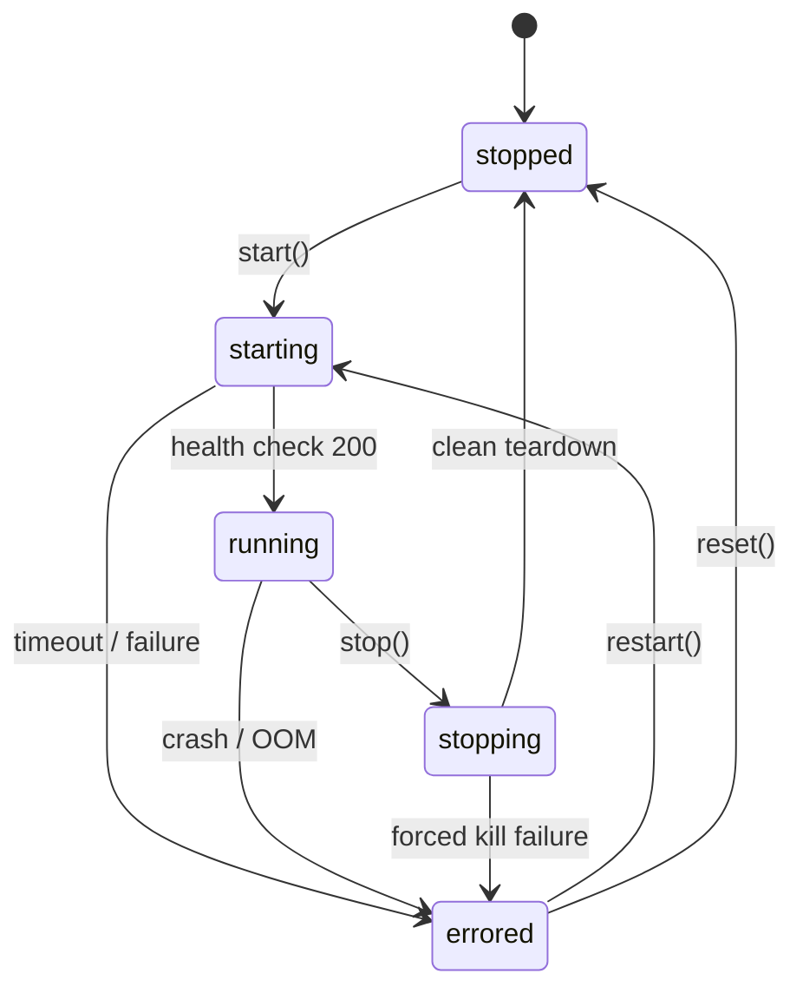

# CoreLink DevEnv — Core Concepts

Understanding the architecture, lifecycle state machine, and data persistence guarantees of CoreLink DevEnv.

---

## 1. Container & Durable Object Topology

Each tenant's DevEnv is anchored by a singleton **Cloudflare Container Durable Object** (`RunnerDevEnvDO`):
- **MicroVM Isolation**: Secure gVisor/firecracker virtualization boundary.
- **WebSocket Hibernation**: Keeps zero idle connections active on edge servers while preserving client session state.
- **Supervisor (`supervisord`)**: Manages in-container services:
  - `ttyd` on port 7681
  - `noVNC / websockify` on port 6080
  - `code-server` on port 8080
  - `corelink-check-exec-server` on port 9090

---

## 2. Strict State Machine (INV-I2)

The DevEnv state transitions adhere strictly to the validated invariant matrix:

---

## 3. Workspace Persistence & CAS

Workspaces are decoupled from container ephemeral lifecycles:
- **`clw snapshot`**: Content-Addressed chunking (CDC) deduplicates modified files and pushes chunks to R2 CAS.
- **`clw hydrate`**: Reconstructs exact workspace filesystem trees into `/workspace` upon container cold boot.
- **D1 Metadata**: Tracks tenant monthly vCPU usage, snapshot references, and hardware tiers.
