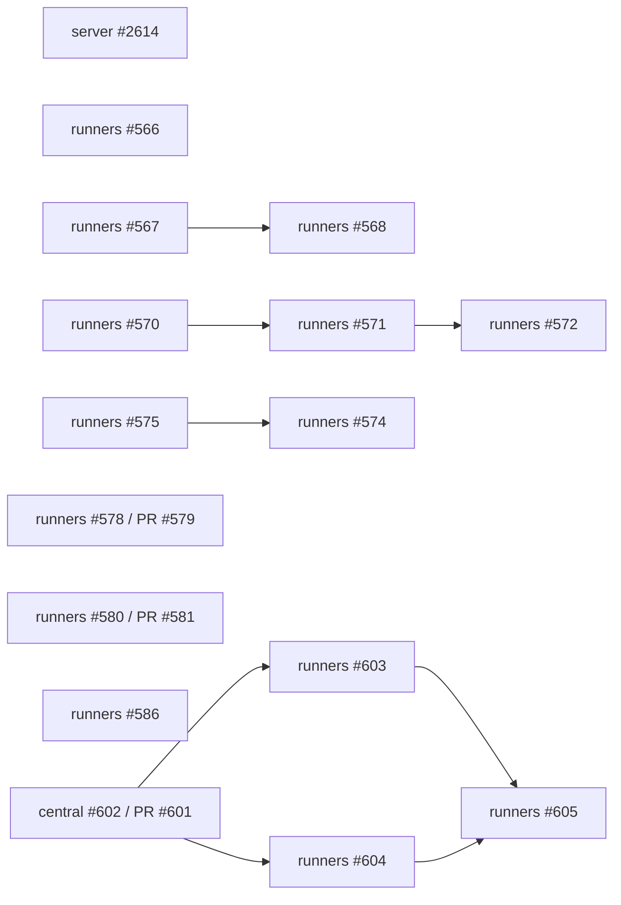

# Handoff: Cross-Repository Luna 15-Issue Orchestrator

**Generated:** 2026-09-25 15:55 BRT  
**Execution owner:** the new parallel orchestrator session  
**Merge and closure owner:** the original central session  
**Fleet:** rolling, up to 12 Luna agents including independent cold reviewers  
**Fixed package:** exactly 15 issues; no opportunistic expansion

Read this document together with:

- `.claude/skills/corelink-parallel-15-orchestrator/SKILL.md`
- `docs/handoff/2026-09-25-parallel-15-issue-orchestrator-manifest.json`

## 1. Authority and mission

The new session is a peer orchestrator for execution, evidence, and quality. It must hand the central session PRs that are ready for a merge decision. It must never merge, close issues, publish releases, deploy, or mutate providers.

Authority order:

1. Current GitHub issue and PR state
2. Current default-branch SHAs and diffs
3. The fixed manifest
4. This operational handoff

The issue ledger is canonical. Record claim, PR, exact-head CI, cold verdict, blocker, and handoff in the issue as each transition happens. Do not report completion only in chat or a local file.

## 2. Frozen baseline and current ownership

| Repository | Baseline when authored | Notes |
|---|---|---|
| `HuGR-dev/corelink-server` | `3515ba04f68f91be63b58b5346d71200786b0808` | PR #2613 was merged green immediately before this handoff. |
| `HuGR-Labs/corelink-runners` | `7dc29913fd51047fa15d65f2ded759af9c6da8e6` | Private canonical runner repository. |
| `HuGR-Labs/corelink-workspaces` | `9907d7d68a3df97dabad0f13e07ff43cb868bfcf` | Cross-repo producer for #567/#568. |

Refresh these SHAs before every branch. The baseline records the handoff observation; it is not permission to branch from stale state.

Central-session exclusions:

- Server #2374, #2576, and #2612 are active central lanes.
- Runners #602 and PR #601 are central-owned. They own `.github/workflows/spawn-worker-ci.yml`, `deploy/cloudflare/src/billing_recovery.ts`, and `deploy/cloudflare/test/billing-recovery.test.ts`.
- The entire OKF package is deferred until the codebase stops moving.
- The shared root checkouts may be dirty or stale. Never edit, reset, clean, stash, or repurpose them.

## 3. Campaign acceptance contract

Every implementation packet starts with five issue-specific sections copied from or reconciled into the issue:

1. **Success criteria:** observable outcomes that must become true.
2. **Definition of done:** exact code, evidence, review, and handoff state.
3. **Completeness criteria:** all callers, failures, compatibility, documentation, and cleanup required.
4. **Invariants:** properties that may not regress.
5. **Quality standards:** exact realistic tests, limits, security, and evidence quality.

A deliverable is `MERGE_READY` only when all five are met for the repository-owned scope, the exact head has a green scoped GitHub-hosted CI pack, the commit is signed and DCO compliant, one independent cold review returns `APPROVE`, and cleanup is recorded.

External/runtime acceptance may keep a parent issue open. Fixtures, mocks, static inspection, or workflow YAML do not prove production behavior.

## 4. Fleet and dispatch algorithm

Use a rolling scheduler rather than batches that wait for the slowest member.

1. Refresh the issue, open PRs, default branch, and active ownership.
2. Select a ready DAG node with no active file overlap.
3. Claim it in the GitHub issue with agent, branch, planned paths, baseline, and dependency state.
4. Give one Luna implementer one issue, one branch, one isolated worktree, one bounded outcome, and one CI pack.
5. While implementation proceeds, a separate Luna slot may prepare the cold review packet but must not review until the exact head and receipts exist.
6. When an agent returns, triage immediately. Dispatch the next ready disjoint node into the freed slot.
7. On green exact-head proof, run one cold review. One consolidated correction is allowed. Re-run only the affected CI pack.
8. Send `MERGE_READY` to the central session and clean the worktree. Do not wait for central merge before using the slot on a disjoint node.

Keep up to 12 active agents when the DAG and file ownership support it. Never create artificial parallelism by assigning two agents to the same files or by spawning reviewers with no exact head to review.

## 5. Branch, worktree, and repository hygiene

For each issue:

```text
git fetch origin <default-branch>
git worktree add -b codex/issue-<number>-<slug>-20260925 \
  /private/tmp/<repo>-issue-<number>-20260925 origin/<default-branch>
```

Rules:

- One issue, one owner, one branch, one isolated worktree, and normally one PR.
- Cross-repo issues use one branch/PR per repository, linked under the same issue owner. Freeze the wire contract before edits in either repository.
- Never work from the shared checkout. Never run `git reset --hard`, `git clean -fd`, blanket `git stash`, or remove unrelated branches/worktrees.
- Do not amend or rewrite another session's branch.
- Before push, fetch again, reconcile main drift, inspect the complete diff, confirm only owned paths changed, and record base/head SHAs.
- Commits require a verified signature and `Signed-off-by`.
- Use force push only to rescue PR #579 or #581. Record old head and patch-id, recreate the same intended patch on fresh main, and use `--force-with-lease=<branch>:<old-oid>`.
- After evidence is durable and the PR is pushed, remove the issue worktree and local temporary branch. Never delete the remote PR branch before central disposition.
- Do not print secret values, tokens, cookies, provider data, or tenant identifiers.

## 6. CI policy

All tests, builds, lints, audits, mutations, and long-running proof execute asynchronously in GitHub Actions on GitHub-hosted runners. Do not use `runs-on: corelink`, local heavy suites, provider credentials, staging, or production.

Each PR gets the smallest pack that proves its five sections. The pack must:

- run on the exact PR head SHA;
- include DCO/signature checks and actionlint when workflows change;
- fail closed if it accidentally checks out another SHA;
- retain logs or a bounded receipt that names repository, base, head, commands, and results;
- avoid unrelated global suites unless the issue changes their contract;
- restore any temporary workflow enablement before handoff;
- be cancelled if it fans out to a self-hosted `corelink` runner.

CI runs remain asynchronous. Dispatch other disjoint work while they execute.

## 7. Cold review and terminal states

The cold reviewer must be a different Luna agent. Give it the issue body, the five sections, exact base/head, complete diff, hosted receipts, and known exclusions. Do not provide the author's reasoning or verdict.

Allowed outcomes:

- `APPROVE`: every repository-owned criterion is met and evidence matches the exact head.
- `FIX-FIRST`: one consolidated, bounded list of candidate-owned defects. The implementer receives one correction turn.
- `BLOCKED`: a named dependency or external authority is absent; record the exact unblock event.
- `TERMINAL_REJECT`: the proposed approach cannot satisfy the contract without a new charter. Stop that branch; do not create successor PR loops.

No second review cycle after the one correction. The orchestrator either accepts the corrected exact-head proof or records a terminal state.

## 8. Dependency and collision graph



Only nodes without a path collision may run at the same time. Required serialization:

- #567 then #568: shared memoize Action and `clw run` wire protocol.
- #570 then #571 then #572: shared `runner_dev_env.ts` lifecycle and snapshot surface.
- #575 then #574: shared container-image build workflow.
- #603 and #604 wait for central confirmation that #602/PR #601 is merged or for a frozen contract head. #605 waits for both.

#603 and #604 may run concurrently only after their final path maps are disjoint. If both need the same consumer, freeze ownership in one packet and serialize the edits.

## 9. Dispatch waves

### Wave 0: immediately executable

- Server #2614
- Runners #566
- Runners #567
- Runners #570
- Runners #575
- Runners #578 / existing PR #579 rescue
- Runners #580 / existing PR #581 rescue
- Runners #586

### Wave 1: after shared-surface predecessor

- #568 after #567 is integrated or its exact protocol is frozen by the central session.
- #571 after #570 reaches central merge or an explicit frozen-contract handoff.
- #574 after #575 reaches central merge or an explicit frozen workflow contract.

### Wave 2

- #572 after #571.
- #603 and #604 after central #602/PR #601 confirmation.

### Wave 3

- #605 after #603 and #604 are integrated and both repository SHAs are frozen.

## 10. Issue execution cards

### `HuGR-dev/corelink-server#2614` — historic link-key uncertainty

Emit an explicit `INDETERMINATE` result from the normal verifier CLI when historic link-key material is absent, malformed, or unavailable. It must exit nonzero and must not write a false-success checkpoint. Valid keys remain a passing control. Keep secrets and real keys out of fixtures.

Likely ownership: `crates/corelink-audit-chain/src/bin/verifier.rs`, focused CLI tests, and one disabled-by-default `i2614` exact-head suite in `.github/workflows/campaign-ci.yml`. Do not touch release files from merged PR #2613 or active central issue files.

### `HuGR-Labs/corelink-runners#566` — GitHub REST pagination

Replace fictional JSON cursors in orphan run/job discovery with a bounded provider-correct paginator that retains and validates `Link` headers. Never forward the bearer to another origin. Distinguish complete empty results from truncation or unavailable pages. Cover page 2, 31/101+ jobs, multiple run pages, malformed/cyclic/cross-origin links, rate limit, and mid-scan failure. Audit the sibling completed-job paginator and active callers.

Likely ownership: `deploy/cloudflare/src/lib.ts`, `deploy/cloudflare/test/index.test.ts`, and focused pagination helpers/fixtures.

### `HuGR-Labs/corelink-runners#567` — child exit 125 executes twice

Freeze a structured execution-state contract across runners and workspaces. A real child that exits 125 must execute exactly once; a proven pre-execution cache failure may fall back once; possibly-executed or unknown state must never retry automatically. Preserve child verdict transparency and cover spawn, post-dispatch I/O, signal, and output-cap paths.

Likely ownership: `actions/corelink-memoize/**`, `corelink-workspaces/crates/clw-cli/src/subcmds/run.rs`, `crates/clw-run/src/lib.rs`, and focused real Action/CLI integration tests. Create separate linked PRs when both repositories change; one issue owner coordinates them.

### `HuGR-Labs/corelink-runners#568` — required-hit capability mismatch

Begin after #567. The real accepted CLI artifact must support the exact Action invocation and prove zero child executions on miss, corruption, missing blobs, unavailable cache, and unsupported capability. Bind source SHA, binary digest/signature, capability declaration, Action pin, and distribution metadata. Package version alone is not capability proof, and required-hit must never degrade to optional.

Likely ownership overlaps #567 and therefore cannot be active simultaneously.

### `HuGR-Labs/corelink-runners#570` — incomplete DevEnv cleanup

When credential cleanup returns incomplete, preserve its durable handle and autonomously re-arm a bounded recovery consumer. Do not assume a generic idle alarm retries the one-time expiry task. Preserve stale-session fencing, stop responsiveness, idempotency, and revocation secrecy. Cover stash wipe, PAT revoke, storage put/delete, repeated recovery, and healthy controls.

Likely ownership: `deploy/cloudflare/src/lib/devenv_credentials.ts`, `deploy/cloudflare/src/durable_objects/runner_dev_env.ts`, and credential/DO tests.

### `HuGR-Labs/corelink-runners#571` — malformed snapshot reports

Begin after #570. Parse and validate the real snapshot CLI report fail closed. Empty, malformed, path-invalid, digest-invalid, partial, oversized, or inconsistent reports must not return `ok`. Preserve valid snapshot behavior and never claim CAS persistence from synthetic roots.

Likely ownership: `deploy/cloudflare/src/lib/clw.ts`, `runner_dev_env.ts`, and snapshot tests.

### `HuGR-Labs/corelink-runners#572` — snapshot session/generation binding

Begin after #571. Bind both snapshot exec effects and the returned pair to one authorized session/generation. A stop/restart or replacement between effects must safely refuse/cancel stale intent. A `running` flag is not a generation fence. Use bounded coordination and preserve stop/recovery behavior.

Likely ownership: `runner_dev_env.ts`, session/generation types, and barrier-driven lifecycle tests.

### `HuGR-Labs/corelink-runners#575` — image build ENOSPC

Fix the build path so BuildKit cache, exported tarball, and containerd import do not exceed the ephemeral box together. Prove the selected strategy bounds disk usage and preserves digest/provenance. Do not claim closure from a different image or by moving the lane to the owner's machine. No production publish is authorized.

Likely ownership: `.github/workflows/build-cf-container-images.yml`, build helpers, image contract tests.

### `HuGR-Labs/corelink-runners#574` — reproducible DevEnv image

Begin after #575. Add the missing reproducible workflow path for `deploy/cloudflare/Dockerfile.runner-devenv`, producing an immutable digest with the same pin/provenance rules as sibling images. Manual one-off image construction does not close this issue. Do not publish or repin production.

Likely ownership overlaps #575 and must be serialized.

### `HuGR-Labs/corelink-runners#578` — README CI truth

Rescue existing PR #579. Its head was `a83efa6c99d15b5e7a72d1ffe229a36f8ccde335`, merge state `CLEAN`, and sole path `README.md`, but the commit signature was invalid and no hosted checks were recorded. Preserve the intended documentation patch, rebase it onto live main, create one signed+DCO commit, and use force-with-lease only after verifying the old OID and patch-id. State dated successful evidence and the actual lack of merge enforcement accurately.

### `HuGR-Labs/corelink-runners#580` — rustls advisory

Rescue existing PR #581. Its head was `442e1c9c92c8fe12cf4499d3d137c85aacb8cd2a`, merge state `CLEAN`, paths `Cargo.toml` and `Cargo.lock`, but the signature was invalid and no hosted checks were recorded. Preserve the minimal upgrade to `rustls >= 0.23.45`, avoid unrelated dependency movement, recreate a signed+DCO commit on live main, and run deny, audit, all-target compile, and focused TLS tests.

### `HuGR-Labs/corelink-runners#586` — terminal uncertain intake capacity

Keep ambiguous effects fenced against duplicate provider work while allowing capacity reclamation only through authenticated, evidenced, idempotent reconciliation. Add read-only count/age observability without payloads or credentials. Cover 500 uncertain rows, safe reconciliation, repeated execution, malformed storage, and authorization. Never delete durable evidence blindly.

Likely ownership: `deploy/cloudflare/src/lib/normal_intake_inbox.ts`, authenticated readback/reconciliation seams, and normal-intake tests. Do not touch #602/PR #601 billing files.

### `HuGR-Labs/corelink-runners#603` — historical false-settlement recovery

Wait for central #602/PR #601. Build a bounded tenant-safe dry-run and recovery path that classifies already accepted/deduped events separately from unresolved historical markers. No marker or source is removed before durable classification. Restart, partial failure, replay, and rollback remain idempotent. Runtime execution requires separate authority and is outside this package.

### `HuGR-Labs/corelink-runners#604` — sibling acknowledgement consumers

Wait for central #602/PR #601. Produce a complete caller census and repair every active status-only success assumption under the frozen typed acknowledgement contract. Negative vectors cover missing outcomes, inconsistent counters, reorder, idem-key mismatch, and status-only success. Use separate linked PRs per repository if code changes cross repository boundaries.

### `HuGR-Labs/corelink-runners#605` — Rust/TypeScript restart integration

Wait for #603 and #604. Build a credentialless deterministic hosted harness using the real Rust ingest and TypeScript flusher. Cover partial rejection, restart, retry, lost acknowledgement, settlement-write failure, quarantine-write failure, and bounded low-cardinality metrics. Record exact server and runner SHAs; never mutate a provider or production state.

## 11. Existing PR and dependency custody

| Item | Observed state | Rule |
|---|---|---|
| Runners PR #579 / issue #578 | Clean diff, unsigned head, no checks | Rescue in place with stable patch intent and force-with-lease. Do not open a successor PR. |
| Runners PR #581 / issue #580 | Clean diff, unsigned head, no checks | Rescue in place with minimal dependency delta and force-with-lease. Do not open a successor PR. |
| Runners PR #601 / issue #602 | Head `82a8d60e84bdaee5a60d2baec69e79e34b7e7f52`, signed, central-owned, no reported checks | Do not edit, push, supersede, merge, or close. Report dependency and continue other lanes. |

## 12. Agent packet template

Every implementation agent receives this shape:

```text
Issue/repository:
Live baseline and observed open PRs:
Single deliverable:
Owned paths:
Forbidden paths and active owners:
Dependencies/unblock event:
Success criteria:
Definition of done:
Completeness criteria:
Invariants:
Quality standards:
Branch/worktree path:
GitHub-hosted CI pack:
Stop conditions:
Return: branch, base/head SHA, commit signature+DCO, PR, changed paths,
hosted run IDs, evidence, blocker, and cleanup state. Do not merge.
```

Agents execute the packet; they do not redesign scope. If discovery invalidates the packet, they stop with exact evidence so the orchestrator can update the issue once.

## 13. Handoff to the central merge owner

For every PR, send one compact row:

| Issue | Status | PR | Base | Head | Paths | Hosted runs | Cold verdict | Closure eligibility | Blocker | Cleanup |
|---|---|---|---|---|---|---|---|---|---|---|

The central session independently verifies live head, checks, cold verdict, ownership, and mergeability, then decides merge and issue closure. A green PR may be merge-ready while its parent remains open for runtime evidence.

At campaign end, write one final handoff in `docs/handoff/` with all 15 rows, central dependencies, remaining runtime evidence, workflow restoration, and proof that no worktrees or temporary refs remain.

