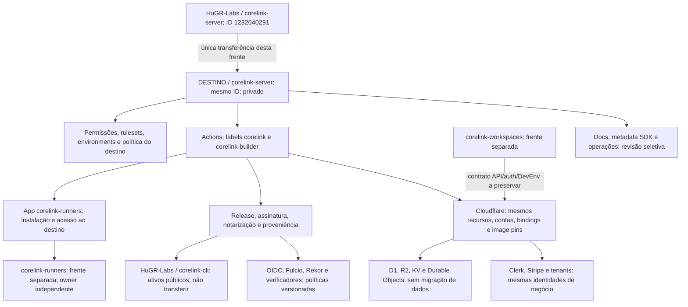

# Mapa de dependências e fronteiras

Leitura junto com [as âncoras](SOURCE-ANCHORS.md) e [o snapshot](evidence/github-snapshot.json). Referências de código pertencem ao commit-base. **Declarado** significa fonte; **observado** significa API; **provado** exige execução identificada. Não extrapolar uma dessas categorias para outra.

## 1. Grafo

A seta de Workspaces descreve o contrato a confirmar com aquela frente, não uma auditoria completa de seu código. O server foi inspecionado. Referências externas ao server precisam de inventário de quem controla o consumidor; o scanner deste repo não as descobre.

## 2. Identidades independentes

| Identidade | Estado | Decisão desta frente |
| --- | --- | --- |
| Server | `HuGR-Labs/corelink-server`, ID `1232040291`, privado | Alterar owner; manter ID/nome/visibilidade. |
| Origem | `HuGR-Labs`, ID `311862110`, plano Free | Conferir políticas de saída. |
| Destino | Não informado | G01 bloqueado. |
| Runners repository | `HuGR-Labs/corelink-runners`, ID `1266754321` | Handoff; nenhuma edição ou transferência do repo irmão. |
| Workspaces repository | `HuGR-Labs/corelink-workspaces`, ID `1259579816` | Handoff; nenhuma edição ou transferência do repo irmão. |
| CLI distribution | `HuGR-Labs/corelink-cli`, ID `1251605593`, público | Preservar destino dos assets e escopo de publicação. |
| GitHub App | Instalação `150584374`, app ID `4222041`, slug `corelink-runners` na origem | Instalação no destino é recurso separado; não transferir a App nem presumir continuidade. |
| Connector App | Instalação `162524831`, app ID `1144995`, `chatgpt-codex-connector` na origem | Garantir acesso pós-transferência pela configuração da integração. |
| Go module | `github.com/HumanGuardrail/corelink-go/v1` | Namespace de módulo independente; não reescrever com owner do server. |
| Fornecedores e domínios | Cloudflare, `humangr.com`, Clerk, Stripe, registries | Não são aliases do owner GitHub. |

O [readback das dependências](evidence/dependency-identities.json) registra seus IDs. IDs de instalação observados não são valores a reutilizar automaticamente no destino. `HumanGuardrail` aparece como histórico e como literal ainda ativo; `gmhelmold` é também um principal real, não um texto para substituir em massa.

## 3. Matriz de mudanças prioritárias

| ID | Fonte no commit-base | Risco | Preparação obrigatória |
| --- | --- | --- | --- |
| M01 | `cas_foundation.yml:295`; `mutation-nightly.yml:294,348`; `semgrep.yml:134`; `real-ignored-harnesses.yml:52` | Guardas fixam o nome antigo; jobs podem ser recusados ou pulados. | ID server + owner aprovado, preservando evento/ref/proteção; proibir comparação tautológica. |
| M02 | `perf-production-evidence.yml:75,117,207,210`; `collect_b102_b108_context.py:74`; `verify_b102_b108_evidence.py:36` | Routing API, SAN e verificação passam a discordar. | Adaptar produtor e consumidores juntos, com fronteira histórica explícita. |
| M03 | `crates/corelink-ops/src/deploy/types.rs:169-194` | Construtor e matcher estrutural fixam `HumanGuardrail`; mudar apenas `pattern` não muda `matches_simple`. | Refatorar autoridade do matcher, inventariar seus consumidores e testar políticas antiga/nova. Não afirmar incidente de produção sem prova do caminho usado. |
| M04 | `release-cli.yml`, `sign-linux.yml`, `sign-windows.yml`, `notarize-macos.yml`, `release-slsa3.yml` | Confusão entre repo produtor e repo de distribuição. | Manter `HuGR-Labs/corelink-cli` e token de destino; alterar só identidade de origem quando aplicável. |
| M05 | `release-slsa3.yml:235-280`; API OIDC | Mudam owner, owner ID, refs e eventualmente audience; consumidores podem rejeitar assinaturas novas. | Política versionada e claims reais no destino; sem confiança genérica. |
| M06 | `apps/signup-worker/src/webhooks/github_app_manifest.ts:129` | Fallback `GITHUB_APP_ORG` aponta para a org legada ao criar App. | Decidir owner da App separadamente; não recriar App existente. |
| M07 | API installations + jobs `runs-on: corelink` | Instalação/fabric não provisiona para a nova org. | Handoff com Runners e canário real; cinco Macs online não provam atendimento ao label `corelink`. |
| M08 | `infra/ci-runners/linux/docker-compose.yml:36`; `runner_wedge_watchdog.py:63,178` | Bootstrap e nomes locais de serviço dependem da origem. | Inventário por host/instância; remapear apenas o autorizado. |
| M09 | `.github/dependabot.yml` (12 reviewers antigos); `subprocessors-sync.yml:221`; `.github/CODEOWNERS` | Reviewers inválidos ou sem acesso. | Mapear principals reais no destino e comprovar acesso; CODEOWNERS não impõe proteção sozinho. |
| M10 | `apps/docs/docusaurus.config.ts:32`; `apps/docs/tests/config.test.ts:10`; templates; quatro Cargo manifests | Novas URLs/metadata mantêm owner legado. | Adaptadores do catálogo com testes; manter política de privacidade dos links. |
| M11 | `cut-v1-0-0-ga-tag.sh:597`; `check_runner_fleet.py:48`; `check_workflow_state.py:63`; ferramentas B028/B152/B250/B373 | Defaults operacionais apontam para a origem. | Separar routing da autoridade; atualizar testes que fixam strings. |
| M12 | `verify_d03_graduation.py`; `verify_owner_action_packets.py:1223`; `verify_b155_batch_g.py` | Gates rejeitam mudanças legítimas por literals antigos. | Separar contratos históricos de novas coletas; não apagar ou afrouxar verificadores. |

M01–M12 são grupos, não uma lista de apenas doze arquivos. O [inventário](evidence/source-inventory.json) enumera 3.063 linhas candidatas em 819 arquivos. Nem toda ocorrência requer mudança. A classificação por caminho é triagem, **não autorização de substituição**. Antes do corte, cada referência ativa deve ter patch ou justificativa exata revisada.

## 4. CI: fonte não é capacidade comprovada

A árvore tem **138 arquivos** de workflow. A API registra **147 workflows active**; reconciliar IDs e paths, não inferir nove jobs executáveis extras. A diferença exata está em [workflow-api-delta.json](evidence/workflow-api-delta.json).

Contagem de definições de job: **182** com seletor literal `corelink`, **45** com `[self-hosted, mac, corelink-builder]`, cinco `ubuntu-latest`, uma expressão condicional hosted/fabric e quatro chamadas reutilizáveis sem `runs-on`. Não há expansão de matrizes nem inferência de simultaneidade, execução de caminhos condicionais ou custo.

A API retornou cinco runners de repositório, Mac, label `corelink-builder`, online e desocupados; zero runners organizacionais naquele instante. A App `corelink-runners` na origem recebe `workflow_job` e possui `actions:read`, `metadata:read`, `administration:write`. Isso não demonstra provisionamento no destino, nem ausência de fabric efêmero quando não há job. G04 exige uma execução real; não se resolve com fallback pago.

Seis workflows têm permissão YAML `id-token: write`: `cas_foundation`, `cf-deploy-prod`, `perf-production-evidence`, `release-cli`, `release-slsa3`, `terraform-drift`. Comentários não contam. Permissão não prova uso de federação por todos; a lane Cloudflare usa API token e comenta OIDC como possibilidade futura. [População extraída](evidence/workflow-surface.json).

## 5. Credenciais e governança

Readback: 18 secrets de repo, sete variáveis, zero secrets/variáveis organizacionais expostos ao repo, ambientes `production` e `staging` sem secrets/variáveis próprios. Os ambientes não têm protection rules nem branch policy no snapshot. Existem 82 nomes de secrets e 30 de variáveis em expressões YAML estáticas: **a diferença de contagens não prova secrets obrigatórios ausentes**. Resolver cada consumidor, `GITHUB_TOKEN`, condições e parâmetros reutilizáveis antes de classificar requisitos.

Preservar escopos dos tokens Cloudflare, CLI, GPG, PagerDuty e backend Terraform. O recurso-alvo de `CORELINK_CLI_RELEASE_TOKEN` continua sendo a CLI pública; mudar o server não exige ampliar esse token. Nunca registrar valores no manifesto, Git, chat, logs ou anexos.

Nenhum webhook de repo nem deploy key foi observado, mas existem duas instalações de App organizacionais. Teams do repo: lista vazia; colaborador retornado: `gmhelmold`, admin. Protection e rulesets retornam 403 no plano atual: isso é limitação de observação/capacidade, não uma lista vazia ou prova de enforcement. Validar as proteções reais do destino antes de aprovar publicação.

## 6. Infraestrutura preservada

| Superfície declarada | Invariante |
| --- | --- |
| `wrangler.toml`: `corelink-prod`, `corelink-prod-sam`, `corelink-prod-lhr`, `corelink-prod-nrt`, `corelink-prod-syd` | Mesmos names, rotas, contas, serviços, bindings e image pins. |
| R2 CAS/AC/chunk/manifest; D1 `corelink-config-prod`; KV; classes DO | Sem criação, rename, cópia ou migração de estado. |
| Signup Worker, D1 `corelink-prod-d1`, queues, Clerk/Stripe | Preservar tenants, assinaturas, endpoints, chaves e consumidores de filas. |
| Admin UI, analytics, audit witness e synthetic pager | Preservar recursos; conferir integração Git nos projetos do fornecedor. |
| Get-CLI Worker | `RELEASE_ORIGIN` continua na CLI pública, com mesmo domínio e API. |
| Backend Terraform | Mesmos bucket/key/state; nenhuma operação de migração de infraestrutura. |

As cinco imagens de produção declaradas usam `registry.cloudflare.com`, não GHCR da org. Ocorrências de `ghcr.io` incluem upstream Homebrew e exemplos; pacotes GitHub efetivamente vinculados ao repo exigem inventário próprio, ainda não concluído nesta entrega.

**Não usar release como smoke:** `release-cli` bem-sucedido pode disparar `cf-deploy-prod`; env vazio seleciona as cinco regiões e o fluxo contém ordenação de writer/container e D1 migrations. Canário de migração não publica release/imagem, não implanta código nem altera dados de produção.

## 7. Coexistência com outras frentes

| Momento | Server | Runners | Workspaces | CLI |
| --- | --- | --- | --- | --- |
| Antes | Origem | Owner atual confirmado | Owner atual confirmado | `HuGR-Labs` |
| Corte do server | Destino | Pode continuar na origem | Pode continuar na origem | `HuGR-Labs` |
| Depois | Destino | Migração independente | Migração independente | Sem mudança presumida |

Handoff com Runners: app/instalação do destino, repository ID permitido, labels/toolchain, eventos aceitos, prova enqueue → runner → job concluído e tratamento de leases em voo. Mapping instalação/tenant não pode ser reescrito em massa por texto de owner.

Handoff com Workspaces: identidade canônica, referências Git/release realmente consumidas, API/auth/DevEnv preservados e smoke em tenant autorizado. Ausência de dependência Git direta deve ser concluída com evidência daquela frente, não presumida pelo mapa do server.
