# Runbook — transferência controlada do server

**Estado atual: somente preparação.** Não executar os passos mutáveis deste documento sem autorização explícita de transferência e G01–G08 aprovados. O kit não executa esses passos. Responsáveis por papel devem ser substituídos por pessoas identificadas no registro de [ACCEPTANCE.md](ACCEPTANCE.md).

## 0. Máquina de estados

```mermaid
stateDiagram-v2
  [*] --> DISCOVERY
  DISCOVERY --> PREPARATION: G01 a G03; desenho e autoridade
  PREPARATION --> REHEARSAL: G04 a G06; contratos e canários isolados
  REHEARSAL --> FROZEN: G07; população e recursos fixados
  FROZEN --> TRANSFERRING: G08; autorização específica
  TRANSFERRING --> READBACK: solicitação aceita; não é conclusão
  READBACK --> VALIDATION: G09; identidade e refs comprovadas
  VALIDATION --> OBSERVATION: G10; comportamento mínimo comprovado
  OBSERVATION --> CLOSED: registro e aceite completos
  DISCOVERY --> BLOCKED: dado ausente ou contraditório
  PREPARATION --> BLOCKED: prova falhou
  REHEARSAL --> BLOCKED: contrato não demonstrado
  FROZEN --> BLOCKED: drift ou autorização expirada
  TRANSFERRING --> RECOVERY: estado incerto ou falha
  READBACK --> RECOVERY: identidade ou refs divergentes
  VALIDATION --> RECOVERY: comportamento divergente
```



`BLOCKED` antes do corte significa não transferir. `RECOVERY` depois significa descobrir o estado real e recuperar a operação; não emitir outra transferência automaticamente. Monitoramento e produto em execução não devem ser desligados junto com os produtores GitHub.

## 1. Preparar o registro e o checkout

Ler `CLAUDE.md`, skill, MAP, PORTABILITY e ACCEPTANCE. Verificar dirty state, branch e SHA. Não usar stash/reset/clean no trabalho de outra frente. Criar branch/worktree isolado a partir do commit confirmado. Não modificar os repositórios irmãos.

```bash
set -euo pipefail
AUDIT="$(mktemp -d "${TMPDIR:-/tmp}/server-org-audit.XXXXXX")"
SOURCE_OWNER=HuGR-Labs
REPO=corelink-server
BASE=cca798ff5bc2df660ecf2570ed243eb9775ff3d0
python3 scripts/repository_org_migration.py scan --revision "$BASE" \
  > "$AUDIT/source-baseline.json"
python3 -m unittest discover -s tests -p 'test_repository_org_migration*.py' -v
```

Executar o snapshot como uma etapa própria, preservando seu exit code. Código `2` exige ler quais superfícies ficaram não verificadas; não o converter em aprovação.

```bash
python3 scripts/repository_org_snapshot.py --owner "$SOURCE_OWNER" \
  > "$AUDIT/github-before.json"
```

**Evidência:** SHA, hash do manifesto, identidade do operador, timestamps, resultados e escopo. O snapshot só contém metadados; não permite recuperar valores de secrets. A aprovação deve referenciar um cofre/owner de credencial autorizado, nunca valores em texto.

## 2. G01 — validar o destino, antes de qualquer adaptação

Obter login canônico e ID da organização do usuário/responsável. Usar GET em `orgs/TARGET_OWNER` e na identidade do operador. Confirmar organização, owner ID, capacidade de criar/receber repos, política de saída da origem e de entrada do destino, SSO/2FA/enterprise/restrições de Apps e um segundo caminho administrativo autorizado.

Confirmar ausência de `TARGET_OWNER/corelink-server` e de fork conflitante da mesma rede. Um 404 isolado pode significar falta de acesso: não é prova de disponibilidade. Conferir com autoridade administrativa do destino e, quando necessário, UI/listagem autorizada. Não criar um repo vazio para “reservar” o nome: isso bloqueia a transferência. Não renomear nem mudar visibilidade como atalho.

```bash
: "${TARGET_OWNER:?login canônico conferido no GitHub}"
: "${TARGET_OWNER_ID:?ID numérico conferido no GitHub}"
gh api --hostname github.com --method GET "orgs/$TARGET_OWNER" \
  --jq '{login,id,default_repository_permission}'
python3 scripts/repository_org_migration.py plan \
  --target-owner "$TARGET_OWNER" --target-owner-id "$TARGET_OWNER_ID" \
  > "$AUDIT/plan.json"
```

**Saída:** G01 com evidência e responsável. `plan` apenas valida estrutura e separação de papéis; não comprova existência/acesso. Destino não informado permanece bloqueio, não motivo para deixar de produzir o restante do desenho.

## 3. G02/G03 — governança e preparação de código

Comparar capacidades do plano, default repository permission, membros, equipes, convidados, rulesets herdados, branches/tags, reviews, checks, environments, secret scope, Actions allowed/SHA pinning e permissões de workflow. Definir quem terá acesso ao código privado no destino; não aceitar ampliação silenciosa via permissões padrão.

O baseline tem protection/rulesets não observáveis por 403 e environments sem proteção. Não inventar enforcement inexistente. O responsável deve definir controles efetivamente suportados pelo destino e provar o resultado; se uma condição exigida pelo workflow não puder ser cumprida, ela bloqueia a publicação. Não retirar `ref_protected` para fazer um job ficar verde.

Implementar WP-02 segundo PORTABILITY e revisar toda a matriz M01–M12. Os consumidores ativos precisam de patch ou disposição explícita. Classificações históricas preservam bytes assinados. Rodar testes focais de cada consumidor, validators, actionlint para YAML alterado e prova de isolamento da CLI, Go module e recursos cloud. O kit entregue não faz esses patches automaticamente.

Atualizar triggers dos gates da normalização para catálogo, consumidores, testes e regra. Adotar a política via PR, com revisão independente e CI verde no head exato. Para merge, seguir `scripts/pre-merge-gate-check.sh --merge <PR>` conforme o contrato do repo; não fazer merge direto contornando o gate. Rebase/novo head invalidam a evidência anterior afetada.

**Saída:** PRs/SHA de preparação, decisões por referência, testes e G02/G03. Os patches devem continuar funcionando na origem antes do corte.

## 4. G04 — handoff Apps/runners/Workspaces

Confirmar owner da App `corelink-runners`, visibilidade da App e se ela pode ser instalada no destino. Registrar nova instalação autorizada e acesso ao server por ID; o ID da instalação antiga não migra por substituição de texto. Registrar também acesso do connector e outras integrações. Não recriar/transferir a App silenciosamente.

Com a frente Runners, registrar webhook routing, repo allowlist, instalação/tenant, labels, ferramenta de provisionamento, toolchain e comportamento de leases. Testar infraestrutura do destino num repo canário separado, de nome diferente, com autorização própria. Isso prova a instalação/fabric do destino, **não** a execução do server antes de ser transferido. A prova definitiva do server acontece em G10.

Com Workspaces, confirmar os pontos de consumo Git/release/API, owner atual e contrato de autenticação/DevEnv preservado. O owner dos irmãos pode continuar antigo durante o corte do server. Toda alteração neles precisa da outra frente e de seu registro; este runbook não a executa.

Inventariar runners persistentes, URLs de bootstrap, labels, watchdogs e nomes de serviço por host. Não remover registros/reiniciar todos os serviços do Mac por padrão. Reconfiguração eventual deve ser por instância, autorizada e com plano de reversão específico.

**Saída:** contrato assinado por cada frente, IDs e runs canários isolados. Ausência de resposta é `UNVERIFIED`, não “sem dependência”.

## 5. G05/G06 — credenciais, distribuição e identidade

Construir matriz por nome: consumidor/job, scope repo/org/environment, fornecedor-alvo, permissões, owner responsável e método de prova. Resolver condições e parâmetros reutilizáveis. Não comparar simplesmente 82 referências YAML com 18 secrets e concluir indisponibilidade.

Secret values não são exportáveis pelo inventário. Confirmar que há recuperação autorizada no cofre quando necessária. Tokens fine-grained que têm o repo server como recurso exigem revisão do resource owner no destino; `GITHUB_TOKEN` não dá acesso automático a outros repos privados. O token da CLI continua restrito à CLI pública na organização atual, a menos que outra migração seja aprovada. Não ampliar todos os tokens como solução.

Inventariar, por projeto, integração Git em Cloudflare e demais fornecedores, OAuth callbacks, Apps, deploy hooks, bots, webhooks organizacionais, allowlists, registries/pacotes vinculados, SSO, Dependabot e acessos externos. O coletor não enumera tudo isso. Toda superfície aplicável precisa de prova ou N/A fundamentado. Não confundir inventário de webhook de repo com inventário de Apps.

Registrar os digests dos artefatos/release assets atuais, bundles, política de verificação e último artefato bom. Preparar a geração nova de trust usando identidade independente, com compatibilidade histórica limitada a refs/digests inventariados. Exercitar positivos/negativos em fixtures e canário de assinatura sem privilégio de produção. O filename `release-slsa3.yml` não torna o builder L3: o próprio código declara SLSA L2 self-hosted.

Ler configuração OIDC e políticas reais dos providers. Preparar audience, issuer, prefixos e workflow identities; o owner ID do destino deve estar aprovado. Não solicitar JWT de produção nem registrar JWT completo. Não exigir token do server já no destino antes de transferir: preparar a política agora e comprovar emissão real depois, em G09/G10.

**Saída:** matrizes, provas de leitura/validação com menor privilégio, plano de publicação canário e G05/G06. Uma credencial não testada não fica “garantida” porque seu nome persiste.

## 6. G07 — congelar produtores e registrar a recuperação

Definir janela, operador, revisor, prazo máximo de indisponibilidade do controle de CI, orçamento permitido (sem fallback hosted pago), canários, alertas e critério de abortar. Esses limites devem ser numéricos no registro; sem valores e responsáveis, não há G07.

Pausar somente mutações GitHub aprovadas: releases/tags, publish/sign/notarize, container build/push, deploys, bots de merge e demais produtores identificados. Registrar o estado anterior e a mudança por workflow. Não desativar automaticamente monitores, backups e rotinas necessárias ao produto. Listar runs queued/in_progress/waiting/pending e leases do fabric; aguardar conclusão segura de deploys ou usar recuperação aprovada, sem cancelamento em massa.

A relação `release-cli` → `cf-deploy-prod` exige drenar também downstream `workflow_run`. Controlar produtores externos e schedules; não basta observar fila vazia uma vez. Sem freeze efetivo de mutadores e ausência de novos runs inesperados, interromper.

Capturar **FREEZE_SHA após os patches**, refs heads/tags com object SHA/tipo, PRs/issues, releases/assets e hashes, workflows e estados, permissões/environments/Apps, configuração OIDC e identidades cloud. A população de 132 branches/52 tags do baseline não é um valor fixo futuro. O delta entre baseline e freeze deve conter só mudanças autorizadas; preservar os snapshots originais.

Backup Git: mirror independente e verificação de todas as refs remotas; guardar em armazenamento aprovado. Um bundle/mirror não contém issues, configurações, secrets, assets de release nem conteúdo LFS externo. Inventariar/exportar esses itens com ferramentas autorizadas. Verificar LFS no histórico relevante, não só `.gitattributes` da main; se houver, comprovar os objetos. Gitlinks não são expandidos pelo scanner.

Recuperação deve privilegiar manter serviço e restaurar acesso/CI no destino. Não prometer voltar à URL antiga: a documentação do GitHub prevê aposentadoria de namespaces em algumas transferências. Não criar um repo/fork no caminho antigo; isso pode destruir redirects. [Regras oficiais](SOURCE-ANCHORS.md#fontes-oficiais).

**Saída:** freeze pack, recuperação aprovada e G07. Coletar os metadados críticos novamente imediatamente antes do corte; usar limite operacional de 30 minutos para a coleta pré-corte e invalidar antes disso se houver qualquer mudança material. Esse limite é política deste runbook, não garantia do GitHub.

## 7. G08 — autorização específica

O registro deve identificar `HuGR-Labs/corelink-server`, ID `1232040291`, destino/owner ID, nome mantido, visibilidade privada, FREEZE_SHA, hash do manifesto, janela, operador e revisor. Exigir G01–G07 aprovados e nenhuma superfície aplicável `UNVERIFIED`.

Autorização para documentar, criar PR ou preparar código não é autorização para transferir. A confirmação de transferência deve ser posterior à avaliação dos gates e cobrir o estado exato. Um novo destino, head, plano, confiança ou alcance exige nova aprovação.

## 8. Transferir uma única vez

Usar UI do GitHub no repo correto: Settings → Danger Zone → Transfer. Conferir owner/ID e destino do registro, manter nome e visibilidade e concluir a confirmação humana. Alternativamente, um operador autorizado pode usar o endpoint REST `POST /repos/{owner}/{repo}/transfer` com `new_owner`; detalhes e permissões na [fonte REST](SOURCE-ANCHORS.md#fontes-oficiais). O kit não automatiza essa chamada.

Registrar hora e resposta, sem dados sensíveis. `202 Accepted` representa solicitação aceita, não transferência concluída. Em timeout ou resposta ambígua, **não repetir POST**. Ler origem, destino e identidade por ID para determinar o estado. Se não for possível determiná-lo, manter produtores suspensos e escalar, sem recriar repositórios.

## 9. G09 — readback canônico antes de reativar

Ler `repos/TARGET_OWNER/corelink-server` com a credencial do destino; exigir ID `1232040291`, owner login/ID exatos, nome mantido, private=true e default branch esperada. Consultar `repositories/1232040291` como readback independente de caminho. Uma resposta na URL antiga pode ser redirect: avaliar o `full_name` retornado, não apenas HTTP 200.

Executar snapshot no owner novo. Comparar o conjunto completo de refs e object SHAs com o freeze pack antes de introduzir novos commits/tags. Conferir PRs/issues/releases/assets, permissões, environments, states, App access, políticas de Actions e OIDC. Toda diferença precisa de disposição, inclusive metadata organizacional que não acompanha automaticamente o repo.

Atualizar remotes de clones autorizados para URL canônica, preservando alterações locais; conferir push URLs separados e worktrees que compartilham a configuração Git. Sem apagar branches, reescrever história ou tocar checkout de outro trabalho. Conferir consumidores externos e links antigos sem recriar caminhos.

Verificar recursos cloud contra o baseline: contas, names, IDs, bindings, image pins e ausência de deploy inesperado. Não executar deploy para corrigir uma divergência de naming GitHub. G09 bloqueia reativação se identidade/refs/recursos divergirem.

## 10. G10 — prova comportamental e reativação gradual

Executar o canário já revisado, com permissões mínimas, sem release/tag/publish/deploy. Para o server real no destino: job `corelink` deve sair da fila, registrar runner/labels, executar e concluir; repetir a classe `corelink-builder` quando parte do caminho de release. Comprovar instalação→workflow_job→provisionamento→conclusão, não só a cor de um teste local.

Validar claims OIDC efetivamente emitidos e assinatura de um artefato canário não produtivo. Verificar com política independente nova e negar identidade errada; validar também bundles históricos inventariados com política histórica. Qualquer diferença entre previsão e emissor exige correção de política revisada, não alargamento de confiança.

Provas de produto: comparar endpoints/versões observadas com o estado pré-corte; testar leitura API e autenticação autorizada, UI/signup e distribuição CLI; confirmar bytes/digests do asset existente e consumer contract de Workspaces/Runners. Mutação de cache/DevEnv só em tenant isolado explicitamente autorizado, com cleanup comprovado, nunca em dados de clientes. Não inventar `/health` ou tratar HTTP 200 genérico como prova: registrar método, rota real, semântica e resultado esperado do contrato de cada superfície.

Reativar os produtores pausados um a um, restaurando **somente** o estado que foi alterado pela janela. Observar primeiro a lane sem publicação, depois o fluxo normal explicitamente aprovado. O primeiro release real no destino é outra execução autorizada e deve respeitar o acoplamento com deploy; não é canário.

Observar por uma janela operacional definida no registro (referência: 24 horas após retomada) e cobrir os jobs periódicos relevantes, mediante execução equivalente segura ou acompanhamento do agendamento aprovado. Não encerrar com jobs ainda pendentes ou chamar um weekly job de validado porque um smoke curto passou. Definir owner da observação; este documento não cria automações nem promete monitoramento em segundo plano.

## 11. Recuperação e encerramento

| Falha | Resposta |
| --- | --- |
| Antes do corte, qualquer gate falha | Não transferir; restaurar pausas já feitas somente se seguro; registrar causa. |
| POST/transfer UI com estado incerto | Readback por repo ID/caminhos; não repetir solicitação nem criar outro repo. |
| Repo transferido, acesso/CI quebrado | Preservar runtime atual; corrigir acesso/instalação/runner no destino com aprovação e prova. |
| Signing/trust quebrado | Manter publicação suspensa, preservar artefatos anteriores e corrigir política sem curingas. |
| Divergência de refs/assets | Suspender novos escritores; comparar freeze/backup; não sobrescrever automaticamente. |
| Necessidade de transferir de volta | Nova mudança autorizada, com elegibilidade e namespace conferidos; não rollback garantido. |
| Mudança cloud indevida detectada | Incidente operacional separado e recuperação pelo runbook daquele recurso; não “corrigir” recriando dados. |

Fechar somente com G01–G10, inventário reconciliado, exceções justificadas, responsabilidades das outras frentes registradas, URLs canônicas, testes/observação concluídos, revisor independente identificado e PRs/branches da campanha organizados. Retirar worktree apenas se limpo e já publicado; não apagar evidências. Fechamento do kit de documentação é separado do fechamento da transferência.
