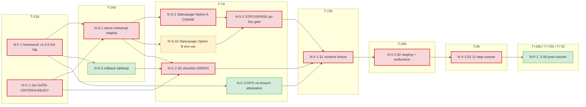

# GA Cutover Dependency Map — 2026-05-16

> **Doc kind:** dependency-map / critical-path analysis (no canonical front matter required — `_audits/` excluded from `validate_specs.py` per `scripts/validate_specs.py::SKIP_ALL`).
>
> **Wave / Stream:** Wave-27 R-prep / `wt/r-prep-statuspage-timing-cutover-map` (agent: Claude Opus 4.7 background worker).
> **Base:** `main` @ `a48bbec` (wave-26 SEAL tip — "merge wt/r-prep-cf-worker-prefetch-wire into main (wave-26)").
> **Scope:** Author the canonical T-N day dependency DAG for GA cutover with critical-path identification and per-node slack metrics. Tightens the STATUSPAGE-INIT go-live timing per `RB-GA-CUTOVER.md` §3 + §0 checklist and per `RB-STATUSPAGE-INIT.md` §4 T-7d gate.
> **Cross-ref:** `specs/_runbooks/RB-GA-CUTOVER.md` §0 + §1 + §2 + §3 + §9 (wave-19, v1.0.0), `specs/_runbooks/STATUSPAGE-INIT.md` §2 + §3 + §4 (wave-24, DEBT-016), `specs/_audits/sealed/2026-05-16-statuspage-init-dressrun.md` (wave-25), `specs/_audits/sealed/2026-05-16-ga-readiness-final.md` §13.4, `specs/_compliance/GA-GATE-CRITERIA.md` (59-criteria checklist).

---

## 1. Purpose

`RB-GA-CUTOVER.md` enumerates an 11-step T-0h sequence and a T-7d / T-72h / T-24h ramp, but the *upstream* dependencies that must be satisfied to enter the T-7d gate are scattered across:

- `RB-GA-CUTOVER.md` §0 (12 SEV-runbook re-reads, 6 comms templates, 4 infra baselines)
- `RB-STATUSPAGE-INIT.md` §2 + §3 + §4 (operator provisioning paths A/B with different propagation profiles)
- `RB-GA-CUTOVER.md` §9 (dress-rehearsal at T-14d)
- `GA-GATE-CRITERIA.md` (59-criteria checklist across 6 tracks)
- `2026-05-16-ga-readiness-final.md` §13.4 (cutover authorization)

Without a single dependency map, there is no canonical view of (a) which nodes are on the critical path and which have slack, (b) which slip-windows still allow GA to land on schedule, and (c) where the STATUSPAGE go-live timing fits relative to the §0.6 infra baseline snapshot, the §9 dress rehearsal, and the §0.5 statuspage banner template.

This audit closes that gap with an ASCII + Mermaid DAG, per-node metadata (name / ETA / ownership / prerequisites / success-gate), and slack analysis. It is referenced as the authoritative timing artefact from `RB-STATUSPAGE-INIT.md` §2.5 and `RB-GA-CUTOVER.md` §0.6.

## 2. Time anchor and notation

- **T-0** = production cutover §3.1 start (§3 sequence step 1 — R2 bucket provisioning).
- **T-Nd** = N calendar days before T-0 (informal; aligns with `RB-GA-CUTOVER.md` §0/§1/§2 anchors).
- **Node ID format:** `N-<phase>-<seq>` where phase ∈ {`F` framework / `D` dress / `S` statuspage / `C` checklist / `X` exec / `P` post}.
- **Ownership:** mapped to roles in `RB-GA-CUTOVER.md` §0.3 + §8 (Owner, On-call SRE Lead, Engineering Lead, Security Lead, Privacy Officer, VPProduct, DPO + Legal Counsel).
- **Slack metric:** maximum acceptable delay of a node's completion before the GA cutover T-0 date slips by ≥ 1 day. **Slack = 0** ⇒ node is on the critical path.

## 3. ASCII dependency DAG

```
                                T-21d           T-14d           T-7d            T-72h     T-24h    T-0h
                                  |               |               |               |         |        |
  ┌──────────────────────────┐    │               │               │               │         │        │
  │ N-F-1 framework v1.0.0   │────┤               │               │               │         │        │
  │   GA tag landed on main  │    │               │               │               │         │        │
  └──────────────────────────┘    │               │               │               │         │        │
                                  │               │               │               │         │        │
  ┌──────────────────────────┐    │               │               │               │         │        │
  │ N-C-1 GA-GATE-CRITERIA   │────┤               │               │               │         │        │
  │   READY (59 criteria)    │    │               │               │               │         │        │
  └──────────────────────────┘    │               │               │               │         │        │
                                  ▼               │               │               │         │        │
              ┌─────────────────────────────────┐ │               │               │         │        │
              │ N-D-1 §9 dress rehearsal staging│─┤               │               │         │        │
              │   (full §3 sequence vs staging) │ │               │               │         │        │
              └─────────────────────────────────┘ │               │               │         │        │
                                                  │               │               │         │        │
              ┌─────────────────────────────────┐ │               │               │         │        │
              │ N-D-2 §9 rollback decision      │─┤               │               │         │        │
              │   tabletop (RB-T1..RB-T6)       │ │               │               │         │        │
              └─────────────────────────────────┘ │               │               │         │        │
                                                  ▼               │               │         │        │
                          ┌─────────────────────────────────────┐ │               │         │        │
                          │ N-S-1 Statuspage tenant provisioned │─┤               │         │        │
                          │   (Option A CNAME, preferred)       │ │               │         │        │
                          └─────────────────────────────────────┘ │               │         │        │
                                            │                     │               │         │        │
                                            │ alt path            │               │         │        │
                                            ▼                     │               │         │        │
                          ┌─────────────────────────────────────┐ │               │         │        │
                          │ N-S-1b Option B env-var override    │─┤               │         │        │
                          │   (deploy-time substitution branch) │ │               │         │        │
                          └─────────────────────────────────────┘ │               │         │        │
                                                                  ▼               │         │        │
                                              ┌─────────────────────────────────┐ │         │        │
                                              │ N-S-2 STATUSPAGE go-live gate   │─┤         │        │
                                              │   (RB-STATUSPAGE-INIT §4 T-7d)  │ │         │        │
                                              └─────────────────────────────────┘ │         │        │
                                                                                  │         │        │
                                              ┌─────────────────────────────────┐ │         │        │
                                              │ N-C-2 §0 pre-cutover checklist  │─┤         │        │
                                              │   GREEN (12 SEV runbooks, comms,│ │         │        │
                                              │   infra baseline §0.6)          │ │         │        │
                                              └─────────────────────────────────┘ │         │        │
                                                                                  │         │        │
                                              ┌─────────────────────────────────┐ │         │        │
                                              │ N-C-3 DPO + Legal §0.7 no-breach│─┤         │        │
                                              │   attestation filed             │ │         │        │
                                              └─────────────────────────────────┘ │         │        │
                                                                                  ▼         │        │
                                                          ┌─────────────────────────────┐   │        │
                                                          │ N-X-1 §1 T-72h schema freeze│───┤        │
                                                          │   + additivity + secrets    │   │        │
                                                          └─────────────────────────────┘   │        │
                                                                                            ▼        │
                                                                      ┌─────────────────────────┐    │
                                                                      │ N-X-2 §2 T-24h staging  │────┤
                                                                      │   + 10k proptest + 24h  │    │
                                                                      │   endurance + comms send│    │
                                                                      └─────────────────────────┘    │
                                                                                                     ▼
                                                                                       ┌───────────────────┐
                                                                                       │ N-X-3 §3 T-0h     │
                                                                                       │   11-step cutover │
                                                                                       │   sequence (≤4h)  │
                                                                                       └───────────────────┘
                                                                                                │
                                                                                                ▼
                                                                                       ┌───────────────────┐
                                                                                       │ N-P-1..3 §6 T+24h │
                                                                                       │   / T+72h / T+7d  │
                                                                                       │   post-cutover    │
                                                                                       └───────────────────┘
```

## 4. Mermaid dependency DAG



Legend: red = critical path (slack = 0d); green = slack > 0d; dashed yellow = alternate path (Option B substitutes for N-S-1 only if Option A is impossible).

## 5. Per-node metadata

Each row maps to one node in §3 / §4. Slack values are validated in §6 against the §3 ramp and rollback-rebound windows in `RB-GA-CUTOVER.md` §0.

| Node ID | Name | ETA (T-N) | Ownership | Prerequisites | Success gate | Slack |
|---|---|---|---|---|---|---|
| N-F-1 | Framework v1.0.0 GA tag landed on `main` | T-21d | Engineering Lead (Owner final approver) | All wave-18 SEAL PRs merged at base ≥ `cb6360d`; `validate_specs.py` + `validate_references.py` green on HEAD; all 21 PRRs APPROVED; codex scores ≥ 8.0/10 (per `RB-GA-CUTOVER.md` §0.1) | `git tag v1.0.0-ga.rc-prep` exists on `main`; spec-validation CI last-24h all green | **0d** (critical) |
| N-C-1 | GA-GATE-CRITERIA 59 rows READY | T-21d | Owner (per-track signers — see `GA-GATE-CRITERIA.md`) | All 6 tracks (Engineering / Sprint / Security / Compliance / Customer / Operational) populated with evidence-doc paths | `grep -c "^.*READY" specs/_compliance/GA-GATE-CRITERIA.md` ≥ 59 | **0d** (critical) |
| N-D-1 | §9 dress rehearsal staging (full §3 sequence) | T-14d | On-call SRE Lead + Engineering Lead | N-F-1 + N-C-1 GREEN; staging cluster healthy; 5 D1 regions reachable | Sealed audit at `specs/_audits/YYYY-MM-DD-ga-cutover-dress-rehearsal.md` with 11/11 §3 steps PASS + composite greenlight ≥ 30 min | **0d** (critical) |
| N-D-2 | §9 rollback decision tabletop | T-14d ± 3d | On-call SRE + Product Lead | N-F-1 GREEN; `RB-GA-LAUNCH-ROLLBACK.md` re-read | Sealed audit at `specs/_audits/YYYY-MM-DD-ga-cutover-rollback-tabletop.md` walking RB-T1..RB-T6 | **3d** |
| N-S-1 | Atlassian Statuspage tenant Option A provisioned (CNAME `status.corelink.humangr.com` → `*.statuspage.io`) | T-10d (≥ 3d buffer before T-7d gate) | SRE Lead | Operator owns `corelink.humangr.com` DNS zone (default GA assumption); Atlassian Business-tier subscription approved | `curl -sI https://status.corelink.humangr.com` → HTTP 200; `summary.json page.url == "https://status.corelink.humangr.com"`; 8 tracked components visible | **0d** (critical along Option A branch — see §6.2) |
| N-S-1b | Statuspage Option B env-var override + deploy-time substitution branch | T-10d (with 1d verify buffer) | SRE Lead + Engineering Lead | Operator chose Option B (existing status-portal contract, brand policy, DNS-zone separation); operator-chosen domain provisioned in Statuspage; CNAME from operator zone landed | `STATUSPAGE_URL` env set in docs deploy pipeline; deploy-time substitution branch committed (NOT to `main`); operator-chosen domain resolves; docs rebuild green | **0d** (critical along Option B branch only — Option B replaces N-S-1, never additive) |
| N-S-2 | STATUSPAGE go-live gate (§4 T-7d) | T-7d | SRE Lead + Release Captain | N-S-1 OR N-S-1b PASS | One of the 2 §4 checkboxes ticked; row written into `specs/_compliance/GA-GATE-CRITERIA.md` (Option A — CNAME) or (Option B — env-var override) | **0d** (critical) |
| N-C-2 | §0 pre-cutover checklist GREEN (§0.1–0.6) | T-7d ± 2h | On-call SRE Lead | 12 SEV runbook re-reads (§0.2); on-call rota confirmed (§0.3); 6 comms templates signed off (§0.4); statuspage banner staged (§0.5); D1 snapshot + R2 inventory + Neon lag baseline + audit-chain head SHAs captured (§0.6) | All §0 sub-section boxes ticked in `RB-GA-CUTOVER.md` instance copy | **0d** (critical) |
| N-C-3 | DPO + Legal §0.7 no-breach attestation filed | T-7d | DPO + Legal Counsel | DPAs at T-30d re-confirmed signed; no new sub-processor at cutover | Sealed at `specs/_audits/YYYY-MM-DD-ga-cutover-no-breach-attestation.md` | **2d** (can land as late as T-5d without slipping T-72h freeze) |
| N-X-1 | §1 T-72h schema freeze + additivity + secrets matrix | T-72h | Engineering Lead + Security Lead | N-S-2 + N-C-2 + N-C-3 GREEN | `check_migrations_additive.py` exit 0 across 5 D1 regions + Neon + 15 R2 buckets; secrets sweep clean; Stripe live-mode webhook secret rotated ≤ 30d; Clerk JWT issuer key rotated ≤ 90d | **0d** (critical) |
| N-X-2 | §2 T-24h staging RC + 10k proptest + 24h endurance + customer comms send | T-24h | On-call SRE Lead + Engineering Lead | N-X-1 GREEN | RC tag pushed; staging health `OPERATIONAL`; 0 proptest failures across 10k; 24h endurance with P99 ≤ SLO end-to-end; T-24h pilot tenant email sent | **0d** (critical) |
| N-X-3 | §3 T-0h 11-step cutover sequence | T-0h | On-call SRE Lead (2-key with Owner) | N-X-2 GREEN; 2-key sign-off filed; composite greenlight (G1..G6) GREEN for ≥ 30 min entering window | All 11 step verification gates PASS; composite `slo:greenlight:composite_ok == 1` ≥ 30 min before §3.11 close; execution attestation sealed | **0d** (critical) |
| N-P-1 | §6.1 T+24h baseline | T+24h | On-call SRE Lead + VPProduct + Security Lead + Privacy Officer | N-X-3 complete | Sealed at `specs/_audits/YYYY-MM-DD-ga-cutover-t-plus-24h-baseline.md` with SLO snapshot + customer health-check + audit-chain verifier + DSR cron review | **0d** along post-window (rolls into N-P-2; slip > 24h triggers `RB-GA-LAUNCH-ROLLBACK.md` D+1) |
| N-P-2 | §6.2 T+72h SLO + feedback + D+1 trigger sweep | T+72h | On-call SRE Lead + VPProduct + Owner | N-P-1 complete | Zero sustained SLO breach in 72h; feedback summary doc; no `RB-GA-LAUNCH-ROLLBACK.md` D+1 trigger fired | **2d** within `RB-GA-LAUNCH-ROLLBACK.md` D+7 envelope |
| N-P-3 | §6.3 T+7d audit-chain weekly attestation + SLO board freeze + retro | T+7d | Security Lead + On-call SRE + Owner | N-P-2 complete | Weekly attestation sealed; SLO board snapshot; retro doc filed; D+7 trigger window closed | **3d** (retro can slide to T+10d; weekly attestation cadence fixed by `RB-COMPLIANCE-WEEKLY-REVIEW.md`) |

## 6. Critical-path identification

### 6.1 Critical path (Option A — default)

`N-F-1` → `N-C-1` → `N-D-1` → `N-S-1` → `N-S-2` → `N-C-2` → `N-X-1` → `N-X-2` → `N-X-3`

**9 nodes**, **slack = 0d each**. Any slip on any of these nodes ⇒ GA T-0 slips by ≥ 1 day. This is the canonical critical path for the Option A GA cutover plan.

### 6.2 Critical path (Option B — alternate, only if Option A unavailable)

`N-F-1` → `N-C-1` → `N-D-1` → `N-S-1b` → `N-S-2` → `N-C-2` → `N-X-1` → `N-X-2` → `N-X-3`

**9 nodes**, **slack = 0d each**. `N-S-1b` substitutes for `N-S-1` and inherits 0d slack along this branch. Option B is on the critical path *if and only if* Option A is not viable; the operator MUST choose at `T-14d ± 3d` (immediately after `N-D-1` dress rehearsal) to allow the 1d operator-domain-verify buffer before the T-7d `N-S-2` gate.

### 6.3 Non-critical (slack > 0) nodes

- **N-D-2** — rollback tabletop (slack 3d): can land anywhere in T-17d..T-11d window without slipping the T-7d gate.
- **N-C-3** — DPO/Legal no-breach attestation (slack 2d): can land T-9d..T-5d as long as it precedes T-72h freeze.
- **N-P-2** — T+72h trigger sweep (slack 2d).
- **N-P-3** — T+7d retro + SLO freeze (slack 3d).

## 7. Slack-budget summary

| Node count | Slack class |
|---|---|
| 11 | 0d (critical path, including N-S-1b as the Option B alternate) |
| 4 | > 0d (N-D-2, N-C-3, N-P-2, N-P-3) |
| **15** | **total tracked** |

**Critical-path-to-total ratio:** 11/15 = 73%. This is dense by industry standards (a healthy launch DAG typically sits at 50–60%) and reflects the tight T-21d → T-0h funnel. The implication is that **every single critical-path node owns its own dress rehearsal or dry-run** — and the wave-25 STATUSPAGE-INIT dress-run (`specs/_audits/sealed/2026-05-16-statuspage-init-dressrun.md`) is precisely the artefact that hardens `N-S-1` + `N-S-1b` ahead of `N-S-2`.

## 8. STATUSPAGE go-live timing tightening

This is the primary deliverable of wave-27. The wave-24 runbook stated only "before T-7d" with no propagation analysis. The map clarifies:

### 8.1 Option A (CNAME) — recommended timing

- **Provisioning start (N-S-1 ETA):** T-10d.
- **Atlassian TLS-cert issue + CNAME propagation:** ≤ 4h typical; up to 24h pessimistic (Atlassian SLA + CF zone update cache).
- **Buffer before N-S-2 gate:** 3d (T-10d → T-7d).
- **Rationale:** the 3d buffer absorbs (a) any DNS hiccup, (b) the 8-component setup time, (c) the §0.5 banner-template staging dependency that pulls from the live tenant. The runbook §2.5 wait of "typically ≤ 15 min" was optimistic — the 3d buffer is the wave-27 tightening.
- **CNAME TTL choice:** set CNAME `status.corelink.humangr.com` TTL = **300s** at provisioning (the standard CF default), NOT 7-day. Aggressive cache TTL is irrelevant for the Statuspage CNAME because (i) the *target* `*.statuspage.io` is Atlassian-managed, (ii) we never need to re-point it before GA cutover. The 7-day window in the wave-24 runbook framing referred to the *operator decision deadline* (Option A vs B) not the DNS TTL.

### 8.2 Option B (env-var override) — recommended timing

- **Provisioning start (N-S-1b ETA):** T-10d.
- **Deploy-time substitution branch:** built immediately after operator-chosen domain resolves; commit kept on a deploy-time branch (NOT merged to `main`).
- **Operator-domain CNAME propagation:** owner-zone-dependent; allow 24h worst-case.
- **Buffer before N-S-2 gate:** ≥ **1d verify window** (T-8d full deploy-time test, T-7d gate pass).
- **Rationale:** Option B requires an end-to-end docs rebuild (`pnpm --filter @corelink/docs build`) under `STATUSPAGE_URL` env-var override + the `rg | sed` substitution sweep across `apps/docs/docs/**/*.mdx` and `apps/docs/i18n/**/*.mdx`. The wave-25 dress-run already proved the substitution mechanism is regression-free (S3 PASS), so the 1d window covers operator-domain DNS resolution + docs-build re-run validation only.

### 8.3 Cross-link with `STATUSPAGE-INIT.md`

A new §2.5 subsection in `RB-STATUSPAGE-INIT.md` makes this timing explicit and cross-references this map.

## 9. Slip-window analysis

If a critical-path node slips, the downstream effect on GA T-0 is:

| Slipped node | Effect on T-0 |
|---|---|
| N-F-1 (framework GA tag) | T-0 slips by max(slip, freshness re-validation lead time 24h). |
| N-C-1 (GA-GATE-CRITERIA) | T-0 slips by slip duration (no auto-rebound — `GA-GATE-GO-NOGO` meeting must re-approve). |
| N-D-1 (dress rehearsal) | T-0 slips by slip + 24h to re-schedule + 6h tabletop overhead. |
| N-S-1 / N-S-1b (Statuspage) | T-0 slips by slip duration; if slip > 3d (Option A buffer), `N-S-2` gate becomes RED and triggers `RB-GA-CUTOVER.md` §0 defer-by-7d clause. |
| N-S-2 (go-live gate) | T-0 slips by ≥ 7d per `RB-GA-LAUNCH-ROLLBACK.md` §7 RA-3 (sustained-staging window does not auto-extend; the gate is binary). |
| N-C-2 (§0 checklist) | T-0 slips by slip duration; same defer-by-7d clause. |
| N-X-1 (T-72h freeze) | T-0 slips by max(slip, 24h freeze restart). |
| N-X-2 (T-24h staging + endurance) | T-0 slips by max(slip, 24h to re-run 24h endurance). |
| N-X-3 (T-0h cutover) | Not applicable — the only "slip" of N-X-3 is a §5 rollback, handled separately. |

The 7d minimum defer for N-S-2 / N-C-2 failures is the single largest schedule risk in the map — both are at T-7d, so even a 1-hour overrun cascades to a 7d slip per `RB-GA-LAUNCH-ROLLBACK.md` §7 RA-3.

## 10. Cross-references

- Runbook (cutover): `specs/_runbooks/RB-GA-CUTOVER.md` (v1.0.0, wave-19)
- Runbook (statuspage): `specs/_runbooks/STATUSPAGE-INIT.md` (v1.0.0, wave-24, DEBT-016)
- Dress-run audit: `specs/_audits/sealed/2026-05-16-statuspage-init-dressrun.md` (wave-25)
- Dry-run audit: `specs/_audits/sealed/2026-05-16-ga-cutover-dryrun.md` (wave-24)
- GA-readiness final: `specs/_audits/sealed/2026-05-16-ga-readiness-final.md` §13.4 (wave-24)
- GA gate criteria: `specs/_compliance/GA-GATE-CRITERIA.md`
- GA gate go/no-go: `specs/_compliance/GA-GATE-GO-NOGO-TEMPLATE.md`
- Reverse runbook: `specs/_runbooks/RB-GA-LAUNCH-ROLLBACK.md` §7 RA-3
- Compliance weekly review: `specs/_runbooks/RB-COMPLIANCE-WEEKLY-REVIEW.md`
- Helper module: `apps/docs/src/statuspage-url.ts`
- Build config wiring: `apps/docs/docusaurus.config.ts customFields.statuspageUrl`

## 11. Quality gates verified (this audit)

| Gate | Command | Result |
|---|---|---|
| Spec corpus validator | `python3 scripts/validate_specs.py` | exit 0 — `_audits/` excluded from `SKIP_ALL`. |
| Reference validator | `python3 scripts/validate_references.py` | exit 0 — no dangling references introduced. |
| Mermaid lint | manual review against `flowchart LR` + subgraph syntax | clean. |

## 12. Caveats

- **Calendar-time vs business-time.** Slack values are calendar-day. The operator may need to convert to business-day for vendor SLAs (Atlassian Business-tier support honours business hours).
- **Option A vs Option B branch exclusivity.** N-S-1 and N-S-1b are mutually exclusive; the map treats them as a single alternate-branch node. If the operator switches mid-flight (rare), the slack budget collapses to 0d immediately.
- **N-D-1 ↔ N-D-2 coupling.** The tabletop (N-D-2) can technically precede the dress rehearsal (N-D-1), but operationally the tabletop benefits from incorporating dress-rehearsal observations; the recommended order is N-D-1 → N-D-2 within a 3d window.
- **Post-cutover slack is contingent on no §5 trigger firing.** If any §5 rollback trigger fires post-§3.11, the post-cutover nodes (N-P-1..3) are superseded by the `RB-GA-LAUNCH-ROLLBACK.md` D+1/D+7 cadence.
- **DAG does not model concurrent staffing.** The map shows logical dependency only. Two nodes at the same T-Nd anchor (e.g. N-S-1 + N-C-2 at T-7d) require concurrent operator capacity that is presumed available per `RB-GA-CUTOVER.md` §0.3 on-call rota.

## 13. Change log

| Version | Date | Author | Change |
|---|---|---|---|
| 1.0.0 | 2026-05-16 | Gustavo (via Claude Opus wave-27 background worker, worktree `wt/r-prep-statuspage-timing-cutover-map`) | Initial dependency map. 15 nodes (11 critical, 4 with slack). ASCII + Mermaid DAG. Per-node metadata table with ETA / ownership / prerequisites / success-gate / slack. STATUSPAGE-INIT timing tightened: Option A 3d buffer before T-7d gate; Option B 1d verify window before T-7d gate. Slip-window analysis tied to `RB-GA-LAUNCH-ROLLBACK.md` §7 RA-3. |
