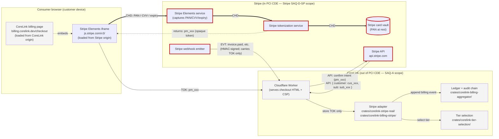
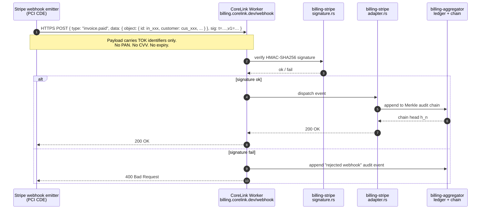

# PCI DSS v4.0 — CoreLink Boundary & Data-Flow Diagram

> **doc_status:** DRAFT · **audit_status:** ACTIVE · **purpose:** define the
> exact scope boundary between CoreLink (out-of-PCI-CDE) and Stripe
> (in-PCI-CDE) for every payment-related data flow, proving the SAQ-A
> eligibility claim in `PCI-DSS-SAQ-A-2026-05-15.md`.
>
> **Audience:** PCI assessors, SOC 2 auditors, customer procurement, internal
> Security/Engineering reviewers.
>
> **Re-issue trigger:** any new payment surface, any new Stripe integration
> mode (e.g., adding Connect, ACH, or Apple Pay direct), any change to the
> CSP / payment-page script inventory, or annually as part of recertification.

---

## 1. Legend

```
Boxes:
  [browser]   = consumer browser (out of CoreLink scope; in customer's hands)
  [stripe]    = Stripe-operated origin / CDE (Stripe SAQ-D-SP scope)
  [corelink]  = CoreLink-operated origin (SAQ-A scope: hosts redirect page only)
  [vault]     = Stripe's PCI-compliant card vault

Arrows:
  ── CHD ──▶  full PAN / CVV / expiry (cardholder data; in PCI scope)
  ── TOK ──▶  opaque Stripe token (pm_… / cus_… / sub_… / evt_…; NOT CHD)
  ── EVT ──▶  Stripe webhook event (HMAC-signed; carries TOK, never CHD)
  ── API ──▶  Stripe REST API call (server→server, TLS 1.3, bearer auth)

Scope boundary:
  ╔══════ PCI CDE (in scope) ══════╗   ╔══════ Out-of-PCI-CDE ══════╗
  ║ Stripe-operated infrastructure ║   ║ CoreLink-operated services ║
  ╚════════════════════════════════╝   ╚════════════════════════════╝
```

---

## 2. Headline diagram — checkout flow (new subscription)



### Annotation — where the boundary is drawn

- The **red, heavy** edges (`==`) are CHD flows. **Every red edge has both
  endpoints inside the Stripe SAQ-D-SP scope.** No red edge ever crosses
  into a CoreLink-operated component.
- The **green, dashed** edges (`-.`) are tokenized flows. They are the only
  payment-adjacent flows that touch CoreLink. None of them carry CHD per
  PCI SSC FAQ 1153 (Stripe tokens are not CHD).
- The Stripe Elements iframe runs **in the consumer's browser** but it is
  served from `js.stripe.com` (a Stripe origin) and its DOM is
  cross-origin-isolated from the CoreLink-served parent page. CoreLink
  cannot read keystrokes or DOM content of the iframe, by browser
  same-origin policy. (Verified via Stripe's own SAQ-A eligibility
  documentation, "Direct post / iframe" pattern.)

---

## 3. ASCII fallback (for auditors who paste this into emails)

```
┌────────────────────────── CONSUMER BROWSER ──────────────────────────┐
│                                                                       │
│   ┌─────────────────────────┐   ┌───────────────────────────────┐    │
│   │ CoreLink checkout page  │   │ Stripe Elements iframe        │    │
│   │ billing.corelink.dev    │◀─embeds─│ js.stripe.com/v3/      │    │
│   │ (no card inputs)        │   │ ┌─ PAN, CVV, expiry inputs ─┐ │    │
│   └─────────────────────────┘   │ └────────────────────────────┘ │    │
│             ▲                   └───────────┬───────────────────┘    │
│             │                               │ CHD (PAN/CVV/expiry)   │
│             │                               ▼                        │
│             │           ╔═══════════════════════════════════╗        │
│             │           ║       STRIPE (PCI CDE)             ║       │
│             │           ║                                    ║       │
│             │           ║  Stripe Elements service           ║       │
│             │           ║       │                            ║       │
│             │           ║       ▼                            ║       │
│             │           ║  Tokenization service              ║       │
│             │           ║       │                            ║       │
│             │           ║       ▼                            ║       │
│             │           ║  ┌──────────────────┐              ║       │
│             │           ║  │ Card vault (PAN) │              ║       │
│             │           ║  └──────────────────┘              ║       │
│             │           ║       │                            ║       │
│             │           ║       ▼                            ║       │
│             │           ║  Returns: pm_xxx (opaque)          ║       │
│             │           ╚════════════════│═══════════════════╝       │
│             │                            │                            │
│             │ ◀───── pm_xxx (TOK) ───────┘                            │
│             │                                                         │
└─────────────│─────────────────────────────────────────────────────────┘
              │
              │ HTTPS POST { pm_xxx }
              ▼
┌─────────────────────────── CORELINK (SAQ-A scope) ───────────────────┐
│                                                                       │
│   ┌────────────────────────┐                                         │
│   │ Cloudflare Worker      │                                         │
│   │ billing.corelink.dev   │── API call ────────────┐                │
│   └────────────────────────┘                         │                │
│              │                                       │                │
│              ▼                                       ▼                │
│   ┌────────────────────────────────────┐   ┌──────────────────┐     │
│   │ crates/corelink-stripe-real/        │── │ api.stripe.com   │     │
│   │ crates/corelink-billing-stripe/     │   │ (TLS 1.3, bearer) │     │
│   │ crates/corelink-billing-aggregator/ │◀── │ returns cus_,    │     │
│   │ crates/corelink-tier-selection/     │   │ sub_, in_, evt_  │     │
│   └────────────────────────────────────┘   └──────────────────┘     │
│              │                                                       │
│              ▼                                                       │
│   ┌────────────────────────┐                                         │
│   │ Cloudflare D1          │                                         │
│   │ stores ONLY:           │                                         │
│   │   • cus_xxx            │                                         │
│   │   • sub_xxx            │                                         │
│   │   • pm_xxx (opaque)    │                                         │
│   │   • in_xxx             │                                         │
│   │   • evt_xxx            │                                         │
│   │   • billing-ledger     │                                         │
│   │     (no CHD)           │                                         │
│   └────────────────────────┘                                         │
│                                                                       │
└───────────────────────────────────────────────────────────────────────┘

╔══════════════════════════════════════════════════════════════════════╗
║ KEY                                                                  ║
║   Red double lines / CHD label = cardholder data; in Stripe scope    ║
║   Green dashed lines / pm_xxx  = opaque token; NOT CHD               ║
║   ════════════════════════════                                       ║
║   The PCI CDE boundary is the wall around the Stripe block.           ║
║   No CHD ever crosses that wall into CoreLink components.            ║
╚══════════════════════════════════════════════════════════════════════╝
```

---

## 4. Webhook (async) flow — also boundary-clean



The webhook surface is the only payment-related ingress that CoreLink
operates. It receives **only Stripe identifiers**, never CHD. The HMAC
signature (`v1=`) is verified before any side effect, with the secret
material handled per `RB-STRIPE-CREDENTIAL-ROTATION.md`.

---

## 5. Storage map — exactly what CoreLink persists about payments

| Storage surface | Fields persisted | CHD? | Justification |
| --- | --- | --- | --- |
| D1 — `billing.customers` | `customer_id` (Stripe `cus_…`), `tenant_id`, `created_at` | NO | `cus_…` is an opaque Stripe identifier. |
| D1 — `billing.subscriptions` | `subscription_id` (`sub_…`), `customer_id`, `tier`, `status`, `current_period_end` | NO | All opaque or operational. |
| D1 — `billing.payment_methods` | `payment_method_id` (`pm_…`), `customer_id`, `brand` (e.g. "visa"), `last4`, `exp_month`, `exp_year` | NO (last4 + brand explicitly excluded from CHD per PCI DSS v4.0 §3.3.1 / 3.3.2 truncation rules) | Stored only if Stripe API returns them; never user-entered. last4 ≠ PAN per PCI SSC. |
| D1 — `billing.invoices` | `invoice_id` (`in_…`), `subscription_id`, `amount`, `currency`, `paid_at` | NO | No card identifiers. |
| D1 — `billing.ledger` | `event_id` (`evt_…`), `event_type`, `payload_hash`, `chain_head`, `signed_at` | NO | Audit-chain entries reference Stripe IDs only. |
| D1 — `billing.webhook_log` | `evt_id`, `signature_status`, `received_at`, `body_hash` | NO | Body is hashed, not stored raw; even if stored raw, contains only TOK. |
| R2 — backups | Same schema as D1 | NO | Backups follow the same column set. |
| Logpush — Cloudflare logs | Best-effort redacted operational logs | NO (redaction module defense-in-depth) | See `crates/corelink-logpush/src/redaction.rs`; PAN/CVV/CPF patterns redacted before egress. |

> **Last-four-digits and brand are not CHD.** Per PCI DSS v4.0 §3.3.1.1, the
> first 6 and last 4 digits of a PAN may be displayed in clear; storage of
> last-4 + brand alone (without the middle 6–9 digits) does not constitute
> CHD storage. We store last-4 + brand only because Stripe returns them by
> default in its API response; they are operational metadata for displaying
> "Visa ending in 4242" in the customer portal.

---

## 6. What is explicitly *not* in scope (and why)

- **No physical card readers** — CoreLink is card-not-present only.
- **No MOTO (mail-order / telephone-order)** — phone billing not supported.
- **No card-on-file outside Stripe** — payment methods are stored only in
  Stripe's vault. CoreLink stores `pm_…` references only.
- **No Connect, marketplace, or platform-payouts flows** — CoreLink is
  a direct merchant, not a Stripe Connect platform. (If Connect is added
  in the future, this diagram and the SAQ-A must be re-evaluated, as
  Stripe Connect platforms typically require SAQ-A-EP and additional
  responsibility for the payment page.)
- **No analytics, tag managers, or chat widgets on the checkout page** —
  the CSP allows only `'self'` and `https://js.stripe.com`. Any addition
  triggers a re-attestation per `PCI-DSS-ANNUAL-RECERTIFY.md`.

---

## 7. Verification recipe (auditor self-serve)

Anyone can independently verify the boundary claim with the following
commands (run from the repo root):

```bash
# 1. Verify zero CHD column names in DB schema (D1 migrations).
grep -rEn 'card_number|cvv|cvc|\bpan\b' specs/03_architecture/data_model.md
# expected: zero hits (the file mentions only "cardinality" and "expand-contract")

# 2. Verify zero CHD persistence in non-test code.
grep -rEn 'card_number|cvv|cvc|\bpan\b' --include='*.rs' --include='*.ts' --include='*.tsx' --include='*.py' --include='*.go' --include='*.js' \
  | grep -vE '/tests/|/test/|/specs/|_test\.|\.test\.'
# expected: hits only in crates/corelink-logpush/src/redaction.rs (the defense-in-depth redactor; documented in PCI-DSS-SAQ-A-2026-05-15.md §"Defense-in-depth note")

# 3. Verify Stripe is the only TPSP for payments in the vendor register.
grep -nE 'Stripe|payment' specs/_compliance/VENDOR-RISK-REGISTER.md

# 4. Verify the CSP / script inventory on the live checkout page.
curl -sI https://billing.corelink.dev/checkout | grep -i content-security-policy
# expected: script-src 'self' https://js.stripe.com

# 5. Verify Stripe AOC is current in Drata.
# (Drata dashboard, vendor module → Stripe → AOC tab. Manual step.)
```

The 2026-05-15 baseline run of (1)+(2): 0 hits in (1); 4 hits in (2), all
in the redactor; both consistent with this diagram and with
`PCI-DSS-SAQ-A-2026-05-15.md`.

---

## 8. Cross-links

- Parent SAQ-A: `specs/_compliance/PCI-DSS-SAQ-A-2026-05-15.md`
- Annual recertification checklist: `specs/_compliance/PCI-DSS-ANNUAL-RECERTIFY.md`
- Compliance matrix: `specs/03_architecture/compliance_matrix.md`
- Vendor risk register (Stripe): `specs/_compliance/VENDOR-RISK-REGISTER.md`
- Data model (zero-CHD claim): `specs/03_architecture/data_model.md`
- Logpush redaction module (defense-in-depth): `crates/corelink-logpush/src/redaction.rs`
- Stripe integration crates:
  - `crates/corelink-stripe-real/`
  - `crates/corelink-billing-stripe/`
  - `crates/corelink-billing-aggregator/`
  - `crates/corelink-tier-selection/`
- Customer-facing trust page: `apps/docs/docs/trust/pci-dss.mdx`
