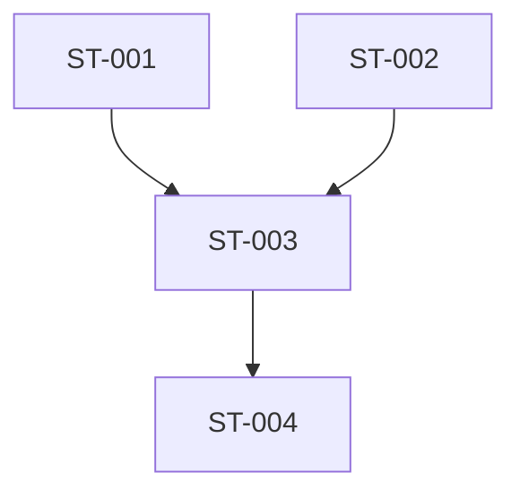

# Work Item — WI-SXX-NNN: {{Título}}

> **Template Version:** 2.2.0
> **doc_status:** DRAFT | REVIEW | FROZEN | THAWED | SUPERSEDED | DEPRECATED (default inicial: `DRAFT`)
> **work_status:** PROPOSED | READY | DOING | REVIEWING | BLOCKED | DONE | CANCELED | ROLLED_BACK (default inicial: `PROPOSED`)
> **audit_status:** ACTIVE | AUDIT_PENDING | AUDITED (default inicial: `ACTIVE`)
> **Versão:** 1.0.0
> **Última atualização:** YYYY-MM-DD
> **Owner (assignee):** {{Nome}}
> **Aprovador Final:** {{Nome}}
> **Revisores:** {{ENG: Nome; SEC: Nome; SRE: Nome; QA: Nome; PROD: Nome}}
> **Sprint pai:** S-XX
> **Supersedes:** —
> **Superseded By:** —

> **CONTRATO INVIOLÁVEL — LEIA ANTES DE TUDO:**
>
> 1. Um WI só transiciona para `DONE` quando **TODAS** as caixas de §10 (Completeness), §11 (DoD), §14 (Quality Standards) estiverem ✅ **COM EVIDENCE ARTIFACT** registrado.
> 2. `✅` sem *evidence* = `❌`. Checkbox é **teatro**, *evidence* é prova.
> 3. Toda caixa tem **dono** (role tag) e **modo de validação** (automation tag).
> 4. Produção requer PRR separado — ver §16 e `_templates/production_readiness_review.md`.
> 5. Se WI estoura estimate em >50%, **DEVE** escalar conforme §20.
> 6. Se WI causa incident futuro, §24 (Post-mortem Hooks) **DEVE** ser preenchido.

---

## Legenda de tags (usada em todas as checklists)

### Role tags
| Tag | Role | Responsabilidade |
|---|---|---|
| 🔧 | **ENG** | Engineer — implementa + testa código |
| 🔒 | **SEC** | Security Reviewer — valida threat model + controles |
| 🔏 | **PRIV** | Privacy Reviewer — valida Privacy by Design + direitos titular |
| 📊 | **SRE** | SRE / Operations — valida observability + runbooks + SLOs |
| 🎨 | **PROD** | Product Reviewer — valida customer impact + UX |
| ✓ | **QA** | QA Reviewer — valida test strategy + coverage |
| 💰 | **FIN** | Finance / Cost Owner — valida cost impact |
| 📜 | **LEGAL** | Legal — valida compliance / contract changes |
| 🏛 | **ARCH** | Architect — valida aderência a ADRs / consistência |

### Automation tags
| Tag | Modo | Exemplo |
|---|---|---|
| 🤖 | **Automatizado** (CI, linter, tool) | `cargo clippy -- -D warnings` |
| 👤 | **Manual** (revisão humana) | Code review, threat model walkthrough |
| 🤖👤 | **Híbrido** (check automatizado + revisão humana) | SAST scan + triage human |

### Evidence requirement
Toda caixa em §10, §11, §14 **DEVE** ter coluna `Evidence` com:
- **Link** para artefato (log, screenshot, test output, dashboard, PR diff), OU
- **Descrição verificável** (ex: "saída de `cargo llvm-cov` mostra 87.3%") + anexo

Sem *evidence*, check é inválido.

---

## Sumário

0. [Identificação](#0-identificação)
1. [Intent](#1-intent)
2. [Narrative](#2-narrative)
3. [Customer Impact & Journey](#3-customer-impact--journey)
4. [Capability Mapping / Trace](#4-capability-mapping--trace)
5. [Tipo e Classificação](#5-tipo-e-classificação)
6. [Escopo](#6-escopo)
7. [Anti-Scope](#7-anti-scope)
8. [Acceptance Criteria (Gherkin)](#8-acceptance-criteria-gherkin)
9. [Design Decisions](#9-design-decisions)
10. [Completeness Criteria (SOTA, evidence-driven)](#10-completeness-criteria-sota-evidence-driven)
11. [Definition of Done](#11-definition-of-done)
12. [Invariants](#12-invariants)
13. [Artifacts Produced](#13-artifacts-produced)
14. [Quality Standards (SOTA)](#14-quality-standards-sota)
15. [Chaos Experiments](#15-chaos-experiments)
16. [Production Readiness Review (PRR)](#16-production-readiness-review-prr)
17. [Sub-tasks](#17-sub-tasks)
18. [Dependencies](#18-dependencies)
19. [Effort Estimate](#19-effort-estimate)
20. [Time-boxing & Escalation Protocol](#20-time-boxing--escalation-protocol)
21. [Observability Plan](#21-observability-plan)
22. [Cost Analysis](#22-cost-analysis)
23. [API / Contract Impact](#23-api--contract-impact)
24. [Post-mortem Hooks](#24-post-mortem-hooks)
25. [Rollback / Recovery](#25-rollback--recovery)
26. [Security & Privacy Considerations](#26-security--privacy-considerations)
27. [Knowledge Transfer & Handoff](#27-knowledge-transfer--handoff)
28. [Risk Register](#28-risk-register)
29. [Review Checkpoints](#29-review-checkpoints)
30. [Sign-off](#30-sign-off)
31. [Change Log](#31-change-log)
32. [Apêndice: Anti-patterns deste WI](#32-apêndice-anti-patterns-deste-wi)

---

## 0. Identificação

| Field | Value |
|---|---|
| **WI ID** | WI-SXX-NNN |
| **Título** | {{título crisp em modo imperativo}} |
| **Versão** | 1.0.0 |
| **doc_status** | `DRAFT` (inicial) |
| **work_status** | `PROPOSED` (inicial) |
| **audit_status** | `ACTIVE` |
| **Sprint pai** | S-XX |
| **WI pai (se sub-WI)** | WI-SXX-MMM |
| **WIs filhos (se decomposto)** | WI-SXX-AAA, WI-SXX-BBB |
| **Sub-tasks** | ver §17 |
| **Owner (assignee principal)** | {{Nome}} |
| **Co-assignees (se pair/mob)** | {{Nome, Nome}} |
| **Reviewers designados** | {{ENG: Nome; SEC: Nome; SRE: Nome; QA: Nome; PROD: Nome}} |
| **Data criação** | YYYY-MM-DD |
| **Data alvo (target)** | YYYY-MM-DD |
| **Data início real** | YYYY-MM-DD |
| **Data fim real (DONE)** | YYYY-MM-DD |
| **Branch** | `feat/WI-SXX-NNN-{{slug}}` |
| **PR(s)** | {{URL(s)}} |
| **Issue tracker** | {{URL se aplicável}} |
| **Tags** | {{subsistema, área, tecnologia}} |
| **Tier do produto afetado** | Free \| Solo \| Team \| Business \| Enterprise \| Todos |
| **Regiões afetadas** | {{BR, US, EU, Global}} |

---

## 1. Intent

> **Uma frase declarativa. Testável. Sem ambiguidade.**

**Padrão:** `Implementar/Adicionar/Remover {{o quê}} que {{faz o quê verificável}} em {{condições/limites}}.`

**Exemplo bom:**
> Implementar o endpoint `CAS::FindMissingBlobs` do REAPI v2 com *lookup* em R2 e cache de metadata em KV, servindo *requests* de *tenant* autenticado em P99 ≤ 50 ms para batches de ≤ 1000 *digests*.

**Exemplo ruim:**
> Adicionar melhorias no CAS. ❌ (vago, não mensurável, não verificável)

---

## 2. Narrative

> **Parágrafo-único** (300–500 palavras) em prosa fluente. Conta a **história** deste WI.
>
> Inspiração: Amazon 6-pager. Engenheiro novo no time entende o WI só lendo isto, sem decifrar checkboxes.

### 2.1 Contexto

{{Por que este WI existe agora? Qual trigger? Qual dor atual?}}

### 2.2 Abordagem

{{Como vamos resolver? Por que essa abordagem e não outra? Referência a ADR(s) relevantes.}}

### 2.3 Valor entregue

{{O que muda para o customer / sistema / equipe quando este WI termina?}}

### 2.4 Principais riscos & trade-offs

{{Maiores incertezas. Maiores trade-offs conscientes.}}

---

## 3. Customer Impact & Journey

> **Lane applicability:** LOW_RISK: ⛔ N/A (marcar "N/A: LOW_RISK lane"). STANDARD/HIGH_RISK: ✅ obrigatória. Ver framework §33.5.4.1.
> Toda WI com impacto em customer — positivo, neutro, ou negativo — é erro de produto ignorar.

### 3.1 Personas afetadas

| Persona | PERSONA-ID | Natureza do impacto |
|---|---|---|
| {{nome}} | PERSONA-XX | Direto, positivo (unlock de capability) |
| {{nome}} | PERSONA-YY | Indireto, neutro |

### 3.2 Customer journey (touchpoints)

Fluxo desde o customer até o resultado:

```
Customer ──► {{entrada/ação}} ──► {{API/UI}} ──► {{processamento interno}} ──► {{resposta/resultado}}
```

### 3.3 Jornadas (User Journeys) afetadas

| UJ-ID | Nome da jornada | Etapa afetada | Delta esperado |
|---|---|---|---|
| UJ-001 | Primeiro *cache hit* | Etapa 3 (verificação de *digest*) | Latência −30% |

### 3.4 Métricas de customer-visible

| Métrica | Baseline | Alvo pós-WI | Como medir |
|---|---|---|---|
| Latência P99 *first build* | {{X}} ms | {{Y}} ms | Dashboard `customer-latency` |
| Taxa de sucesso *cache lookup* | {{A}}% | {{B}}% | Dashboard `cache-hit-rate` |
| NPS / CSAT (se amostrado) | — | — | Pesquisa pós-feature |

### 3.5 Comunicação ao customer

- [ ] Changelog público atualizado 👤 🎨
- [ ] In-app notification (se aplicável) 👤 🎨
- [ ] Email / newsletter (se mudança material) 👤 🎨
- [ ] Docs públicas atualizadas 👤 🎨
- [ ] Post blog / anúncio (se launch) 👤 🎨

### 3.6 Mitigação de fricção

| Fricção potencial | Mitigação |
|---|---|
| {{mudança de comportamento}} | {{feature flag, migration guide, período de transição}} |

### Anti-pattern ❌
> "Customer não vai notar." Se for verdade, reflita: vale o investimento? Se não for, documente o que notará.

---

## 4. Capability Mapping / Trace

Rastreabilidade ascendente obrigatória. *Trace checker* valida no CI.

| Artefato upstream | Estado requerido | Relação com este WI | Evidence |
|---|---|---|---|
| **CAP-XXX**: {{nome}} | `doc_status: FROZEN` | delivers FULL | `link` |
| **CAP-YYY**: {{nome}} | `doc_status: FROZEN` | delivers PARTIAL (subset A) | `link` |
| **INV-AAA**: {{nome}} | `doc_status: FROZEN`, `audit_status: ACTIVE` | must preserve | teste em §14.4 |
| **INV-BBB**: {{nome}} | novo — `doc_status: DRAFT` neste WI, move pra `FROZEN` ao merge | introduces new | TLA+ spec em `specs/03_architecture/formal/INV-BBB.tla` |
| **NFR-CCC**: {{nome}} | `doc_status: FROZEN` | must meet threshold | benchmark em §14.3 |
| **ADR-XXXX**: {{decisão}} | `doc_status: FROZEN` | implements | — |
| **User Journey UJ-YYY** | `doc_status: FROZEN` | step 3 implementation | §3.3 |
| **JTBD-ZZZ** | `doc_status: FROZEN` | enables | §3 |

---

## 5. Tipo e Classificação

### 5.1 Tipo primário

- [ ] `feature` — nova capability user-facing
- [ ] `infra` — infra sem impacto user-facing direto
- [ ] `refactor` — melhoria interna, comportamento inalterado
- [ ] `docs` — documentação, spec, runbook
- [ ] `security` — controle de segurança, vuln fix, hardening
- [ ] `privacy` — controle de privacidade, direito de titular
- [ ] `perf` — otimização de performance
- [ ] `ops` — observability, deploy, runbook
- [ ] `test` — expansão de cobertura, novos tipos de teste
- [ ] `ux` — experiência, ergonomia, DX
- [ ] `compliance` — controle regulatório
- [ ] `debt` — pagamento de dívida técnica
- [ ] `experiment` — teste A/B ou exploração (ver §5.5)

### 5.2 Prioridade

- [ ] **P0** — bloqueante de sprint (sprint não entrega sem este)
- [ ] **P1** — crítico (alto custo de não fazer)
- [ ] **P2** — importante
- [ ] **P3** — desejável

### 5.3 Blast radius

- [ ] **Local** — função / módulo
- [ ] **Subsystem** — componente C4
- [ ] **System** — múltiplos componentes
- [ ] **Product** — usuários ou API pública
- [ ] **Organization** — processos externos (Legal, Finance, Support)

### 5.4 Reversibilidade

- [ ] **Two-way door** — fácil reverter (< 1 dia)
- [ ] **Hybrid** — reversível em janela T; depois vira one-way
- [ ] **One-way door** — custosa/impossível reverter → escrutínio proporcional

**Justificativa da classificação:** {{prosa}}

### 5.5 Experiment? (A/B test, feature flag experiment)

- [ ] Não.
- [ ] Sim — preencher abaixo:

#### Hipótese experimental
> Se {{fazemos X}}, então {{métrica Y muda em Z%}}, porque {{razão causal}}.

#### Grupo de controle / tratamento
{{descrição}}

#### Duração planejada / power analysis
{{N usuários por grupo, duração}}

#### Critério de decisão
{{quando encerra e decide}}

### 5.6 Compliance triggers

Marcar cada um:

- [ ] Toca dados pessoais (GDPR/LGPD) — 🔏 PRIV review obrigatória
- [ ] Toca dados de health (HIPAA) — 🔏 PRIV + 📜 LEGAL
- [ ] Toca dados financeiros / billing — 💰 FIN + 📜 LEGAL
- [ ] Toca compliance SOC 2 — 🔒 SEC review
- [ ] Muda contrato com customer — 📜 LEGAL
- [ ] Nenhum dos acima

---

## 6. Escopo

### 6.1 Em escopo (exaustivo)

| # | Item | Detalhamento |
|---|---|---|
| 1 | {{feature/componente}} | {{como faz}} |
| 2 | {{...}} | {{...}} |

### 6.2 Componentes C4 afetados

| Componente | Referência C4 | Natureza da mudança |
|---|---|---|
| `{{módulo}}` | `c4_components.md § X.Y` | adiciona / modifica / remove |

### 6.3 Arquivos do repositório

| Arquivo | Ação | Justificativa |
|---|---|---|
| `src/reapi/cas.rs` | modifica | adiciona handler |
| `src/storage/r2.rs` | modifica | novo método `head_object_batch` |
| `tests/integration/cas_r2_test.rs` | cria | test de integração |

### 6.4 Sistemas externos tocados

| Sistema | Natureza |
|---|---|
| Cloudflare R2 | nova API call `HEAD object` |
| Clerk | validação de JWT (inalterada) |
| Neon Postgres | query de `cas_blobs` index (inalterada) |

---

## 7. Anti-Scope

| Item | Razão | Rastreamento |
|---|---|---|
| {{feature adjacente}} | Fora da intent §1 | WI-SXX-YYY |
| {{otimização Z}} | Requer benchmark antes | backlog issue #123 |
| {{decisão W}} | Rejeitada | ADR-XXXX |
| {{caso de uso marginal}} | Cobertura <1% | ODR-YYYY (aceitação de risco) |

### Anti-pattern ❌
> "Anti-scope é óbvio, não precisa listar." Sem anti-scope explícito = *scope creep* garantido + sprint que não fecha.

---

## 8. Acceptance Criteria (Gherkin)

> Toda AC **DEVE** estar em sintaxe Given-When-Then e mapear a teste executável.

### AC-001: {{descrição curta}}

```gherkin
Given {{estado inicial verificável}}
When {{ação executada}}
Then {{resultado observável}}
And {{condição adicional}}
```

| Evidence | Teste executável |
|---|---|
| PR diff + test output | `tests/integration/wi_sxx_nnn_test.rs::test_ac_001` |

### AC-002: {{descrição}}

```gherkin
Given ...
When ...
Then ...
```

| Evidence | Teste |
|---|---|
| — | `tests/...` |

*(replicar para todos os AC)*

### AC Coverage Matrix

| AC | Happy path | Error paths | Boundary | Property |
|---|---|---|---|---|
| AC-001 | ✅ test_ac_001 | ✅ test_ac_001_invalid_token | ✅ test_ac_001_empty_batch | ✅ prop_ac_001_idempotent |

### Anti-pattern ❌
> "AC em prosa sem Gherkin." Prosa vira discussão; Gherkin vira teste.

---

## 9. Design Decisions

### 9.1 Decisões locais (não justificam ADR)

| # | Decisão | Rationale | Alternativas consideradas |
|---|---|---|---|
| 1 | Usar `HEAD` em vez de `GET` pro R2 lookup | Economiza bandwidth | `GET` com `Range: 0-0` — rejeitado por overhead desnecessário |
| 2 | Cache TTL de 60s em KV | Balance entre frescor e latência | 30s (muita invalidação), 300s (stale demais) |

### 9.2 Decisões que justificam ADR

- [ ] Nenhuma decisão deste WI merece ADR.
- [ ] ADR(s) propostos:
  - **ADR-XXXX** (draft): {{título}}
  - **ADR-YYYY** (draft): {{título}}

### 9.3 Trade-offs explícitos

| Em troca de... | Aceitamos... | Por que aceitamos |
|---|---|---|
| Latência menor | Memória adicional em KV | Memory barato, latência crítica |
| Simplicidade | Dependência em KV | KV já é parte do stack |

### Anti-pattern ❌
> "Uma linha dizendo a decisão, zero alternativas." Decisão sem alternativas registradas = default inconsciente, não decisão.

---

## 10. Completeness Criteria (SOTA, evidence-driven)

> **REGRA INVIOLÁVEL:** toda caixa exige **evidence**. Sem *evidence*, ❌.

### 10.1 Code Completeness

| # | Check | Auto | Role | Evidence |
|---|---|---|---|---|
| 10.1.1 | Toda função pública tem Rustdoc com `# Arguments`, `# Returns`, `# Errors` | 🤖 | 🔧 | `cargo doc --no-deps` output (zero warnings) |
| 10.1.2 | Toda struct/enum pública tem Rustdoc | 🤖 | 🔧 | idem |
| 10.1.3 | Todo módulo novo tem `//! doc-comment de módulo` | 🤖 | 🔧 | idem |
| 10.1.4 | Nenhum `unwrap()`/`expect()`/`panic!()` reachable por input externo | 🤖👤 | 🔧 | PR diff grep + review |
| 10.1.5 | Nenhum `todo!()`/`unimplemented!()` | 🤖 | 🔧 | grep output |
| 10.1.6 | Nenhum TODO/FIXME órfão (todos linkam issue aberta) | 👤 | 🔧 | PR review |
| 10.1.7 | `cargo clippy --all-targets --all-features -- -D warnings` clean | 🤖 | 🔧 | CI log |
| 10.1.8 | `cargo fmt --check` clean | 🤖 | 🔧 | CI log |
| 10.1.9 | `cargo udeps` clean (sem deps não usadas) | 🤖 | 🔧 | CI log |
| 10.1.10 | `cargo deny check` clean (licenças, CVEs, bans) | 🤖 | 🔒 | CI log |
| 10.1.11 | Nenhum `#[allow(...)]` sem comentário de justificativa `// SAFETY:` ou `// ALLOWED:` | 👤 | 🔧 | PR review |
| 10.1.12 | Sem nova dep sem revisão registrada em §9.1 | 👤 | 🔧 | §9.1 + PR review |

### 10.2 Test Completeness

| # | Check | Auto | Role | Evidence |
|---|---|---|---|---|
| 10.2.1 | Todos AC em §8 têm teste e estão verdes | 🤖 | ✓ | CI test report |
| 10.2.2 | Happy path testado | 🤖 | ✓ | coverage report |
| 10.2.3 | Error paths testados (cada `Err()` variant) | 👤 | ✓ | coverage branch + review |
| 10.2.4 | Boundary conditions (empty, zero, max, off-by-one) | 👤 | ✓ | test file review |
| 10.2.5 | Property test para cada INV em §12 | 🤖 | ✓ | `proptest` run logs |
| 10.2.6 | Contract test para cada integração externa | 🤖 | ✓ | CI log |
| 10.2.7 | Determinismo: 100 execuções consecutivas verdes | 🤖 | ✓ | CI matrix run |
| 10.2.8 | Isolamento: testes paralelos não colidem | 🤖 | ✓ | `cargo test -- --test-threads={{N}}` |
| 10.2.9 | Nomes descritivos: `test_{unidade}_{condição}_{resultado_esperado}` | 👤 | ✓ | PR review |
| 10.2.10 | Nenhum `#[ignore]` sem link de issue | 👤 | ✓ | grep + review |

### 10.3 Documentation Completeness

| # | Check | Auto | Role | Evidence |
|---|---|---|---|---|
| 10.3.1 | README atualizado se impacto user-facing | 👤 | 🎨 | diff README |
| 10.3.2 | Rustdoc gera sem warnings | 🤖 | 🔧 | `cargo doc --no-deps` |
| 10.3.3 | Architecture diagrams refletem estado atual (C4 niveis afetados) | 👤 | 🏛 | diff de diagrama |
| 10.3.4 | Sequence diagram criado se novo fluxo crítico | 👤 | 🏛 | arquivo `.mmd` novo |
| 10.3.5 | Glossário atualizado se termos novos de domínio | 👤 | 🏛 | diff `00_framework.md §40` |
| 10.3.6 | CHANGELOG.md com entrada | 👤 | 🔧 | diff CHANGELOG |
| 10.3.7 | OpenAPI / gRPC reflection refletindo APIs reais | 🤖 | 🔧 | build artifact |

### 10.4 Observability Completeness

| # | Check | Auto | Role | Evidence |
|---|---|---|---|---|
| 10.4.1 | Todas métricas planejadas em §21 emitindo em dev | 🤖 | 📊 | query Grafana |
| 10.4.2 | Cardinality budget respeitado | 🤖 | 📊 | análise de labels no prom-lens |
| 10.4.3 | Logs estruturados com campos obrigatórios (`trace_id`, `tenant_id`, `component`) | 👤 | 📊 | sample log inspection |
| 10.4.4 | Traces completos: toda chamada externa tem span próprio | 👤 | 📊 | trace inspection no Tempo |
| 10.4.5 | Dashboard criado/atualizado, linkado em §21.4 | 👤 | 📊 | URL ativa |
| 10.4.6 | Cada alerta tem runbook link ativo | 👤 | 📊 | arquivo `runbooks/rb-XXX.md` |
| 10.4.7 | Synthetic alert test disparou runbook com sucesso | 👤 | 📊 | gravação do dry-run |

### 10.5 Security Completeness

| # | Check | Auto | Role | Evidence |
|---|---|---|---|---|
| 10.5.1 | AuthN obrigatória em endpoints novos | 🤖 | 🔒 | test suite `auth_required_test.rs` |
| 10.5.2 | AuthZ / tenant isolation enforced | 🤖 | 🔒 | property test cross-tenant |
| 10.5.3 | Input validation em fronteira externa | 🤖 | 🔒 | fuzz test run sem panic |
| 10.5.4 | Error messages não vazam internals (stack, SQL, paths) | 👤 | 🔒 | PR review + sample |
| 10.5.5 | Secrets no secrets manager (zero hardcoded) | 🤖 | 🔒 | `trufflehog` CI |
| 10.5.6 | Dependências scanned (`cargo audit` clean) | 🤖 | 🔒 | CI log |
| 10.5.7 | SAST scan clean (zero High/Critical) | 🤖 | 🔒 | CodeQL / semgrep report |
| 10.5.8 | DAST scan clean se endpoints HTTP novos | 🤖 | 🔒 | ZAP report |
| 10.5.9 | Threat model atualizado se novo trust boundary | 👤 | 🔒 | diff `security_model.md` |
| 10.5.10 | STRIDE mini-análise completa em §26 | 👤 | 🔒 | §26 preenchida + signoff |

### 10.6 Privacy Completeness

Aplicável se toca PII ou dados regulados (§5.6).

| # | Check | Auto | Role | Evidence |
|---|---|---|---|---|
| 10.6.1 | Data classification aplicada (§26) | 👤 | 🔏 | §26 + signoff |
| 10.6.2 | Retention configurada | 🤖 | 🔏 | migration ou config |
| 10.6.3 | Audit log emitido para operações sensíveis | 🤖 | 🔏 | integration test |
| 10.6.4 | LINDDUN mini-análise (§26) | 👤 | 🔏 | §26 |
| 10.6.5 | Direito de exclusão testado em E2E | 🤖 | 🔏 | test output |
| 10.6.6 | Data minimization verificado (nenhum campo sobrecoletado) | 👤 | 🔏 | PR review |
| 10.6.7 | Processing record atualizado (Art. 30 GDPR / LGPD) | 👤 | 🔏 | diff registro |

### 10.7 Performance Completeness

| # | Check | Auto | Role | Evidence |
|---|---|---|---|---|
| 10.7.1 | Benchmark adicionado se hot path | 🤖 | 🔧 | arquivo `benches/*.rs` |
| 10.7.2 | Performance budgets §14.3 verificados | 🤖 | 🔧 | bench comparativo |
| 10.7.3 | Soak test ≥ 1h sem leak | 🤖 | 📊 | memory profile run |
| 10.7.4 | Load test ≥ 2× pico esperado sustentado | 🤖 | 📊 | `wrk` / `oha` report |
| 10.7.5 | Profiling se suspeita de regressão | 👤 | 🔧 | `flamegraph` artifact |

### 10.8 Reliability Completeness

| # | Check | Auto | Role | Evidence |
|---|---|---|---|---|
| 10.8.1 | Timeout em toda chamada externa | 👤 | 📊 | grep `.timeout(` + review |
| 10.8.2 | Retry com exponential backoff + jitter onde aplicável | 👤 | 📊 | code inspection |
| 10.8.3 | Circuit breaker onde dep externa instável | 👤 | 📊 | code inspection |
| 10.8.4 | Graceful degradation verificada (R2 down, DB down) | 🤖 | 📊 | chaos test output |
| 10.8.5 | Idempotência verificada se mutativo (test duplo-write) | 🤖 | 🔧 | integration test |
| 10.8.6 | Rate limits respeitados sob carga | 🤖 | 📊 | load test com excesso |
| 10.8.7 | Chaos experiments de §15 executados | 🤖 | 📊 | chaos report |

### 10.9 Compliance Completeness

| # | Check | Auto | Role | Evidence |
|---|---|---|---|---|
| 10.9.1 | Se afeta dados regulados: review da 📜 LEGAL registrada | 👤 | 📜 | email / ticket |
| 10.9.2 | Audit trail para operação sensível | 🤖 | 🔒 | integration test |
| 10.9.3 | Retention policy correta aplicada | 👤 | 🔏 | config review |
| 10.9.4 | Compliance matrix atualizada (se SOC 2 / ISO 27001 em escopo) | 👤 | 🔒 | diff `compliance_matrix.md` |

### 10.10 Accessibility & i18n (se afeta UI)

| # | Check | Auto | Role | Evidence |
|---|---|---|---|---|
| 10.10.1 | WCAG 2.1 AA: `axe-core` run clean | 🤖 | 🎨 | axe report |
| 10.10.2 | Strings extraíveis para tradução (sem hardcoded) | 👤 | 🎨 | code inspection |
| 10.10.3 | Teste manual com leitor de tela | 👤 | 🎨 | gravação |
| 10.10.4 | Contraste de cores ≥ 4.5:1 | 🤖 | 🎨 | axe |
| 10.10.5 | Navegação por teclado completa | 👤 | 🎨 | manual test |

### 10.11 Process Completeness

| # | Check | Auto | Role | Evidence |
|---|---|---|---|---|
| 10.11.1 | PR aberto com descrição explicando *por quê* | 👤 | 🔧 | PR URL |
| 10.11.2 | CI verde no PR | 🤖 | 🔧 | CI status |
| 10.11.3 | Code review: ≥ 1 aprovação de outro engenheiro | 👤 | 🔧 | PR reviews |
| 10.11.4 | Todos comentários `MUST_FIX` resolvidos | 👤 | 🔧 | PR reviews |
| 10.11.5 | Sub-tasks (§17) todas `DONE` | 👤 | 🔧 | §17 status |
| 10.11.6 | Riscos `R-*` score ≥ 6 têm mitigação registrada (§28) | 👤 | 🔧 | §28 |
| 10.11.7 | Sign-off completo em §30 | 👤 | 🔧 | §30 |

---

## 11. Definition of Done

> Este WI está `DONE` quando **TODAS** as categorias §10 aplicáveis estão 100% ✅ COM EVIDENCE.

### 11.1 DoD snapshot

| Categoria §10 | Aplicável? | Status |
|---|---|---|
| 10.1 Code | ✅ Sempre | ❌ pendente |
| 10.2 Test | ✅ Sempre | ❌ |
| 10.3 Documentation | ✅ Sempre | ❌ |
| 10.4 Observability | ✅ Sempre (se tem code path) | ❌ |
| 10.5 Security | ✅ Sempre | ❌ |
| 10.6 Privacy | Condicional (§5.6) | N/A ou ❌ |
| 10.7 Performance | Condicional (hot path) | N/A ou ❌ |
| 10.8 Reliability | ✅ Sempre (se tem code path) | ❌ |
| 10.9 Compliance | Condicional (§5.6) | N/A ou ❌ |
| 10.10 a11y/i18n | Condicional (se UI) | N/A ou ❌ |
| 10.11 Process | ✅ Sempre | ❌ |

### 11.2 Gates terminais

- [ ] 100% das categorias aplicáveis acima ✅
- [ ] Invariants §12 preservados (verificados via teste)
- [ ] Quality Standards §14 todos atingidos (medidos, não estimados)
- [ ] PRR §16 aprovado se WI afeta produção
- [ ] Sign-off §30 completo

### Anti-pattern ❌
> "95% das caixas" ≠ DONE. Continua `REVIEWING` até 100% + evidence.

---

## 12. Invariants

### 12.1 Safety invariants operacionais (durante este WI)

| ID | Invariant | Verificação | Evidence |
|---|---|---|---|
| WI-INV-001 | `main` branch sempre compilando | CI pre-merge | CI logs |
| WI-INV-002 | Nenhuma regressão em testes pre-existentes | Full regression suite | CI log |
| WI-INV-003 | Nenhum secret commitado | git-secrets + trufflehog | pre-commit hook |

### 12.2 Liveness invariants operacionais

| ID | Invariant | Verificação |
|---|---|---|
| WI-INV-004 | Toda request termina dentro de timeout declarado | test + runtime check |
| WI-INV-005 | Cache eventualmente converge após write (stale ≤ TTL) | integration test |

### 12.3 Invariants do produto que este WI deve preservar

| ID (global) | Invariant | Método de verificação |
|---|---|---|
| INV-TenantIsolation | Nenhum cross-tenant leak em nenhum estado alcançável | property test 10k iterations, 2 tenants fictícios |
| INV-CASIdempotency | Upload duplicado do mesmo *digest* = 1 representação | integration test |
| INV-AuditLogImmutability | Audit log append-only | schema constraint + test tentativa de update |

### 12.4 Novos invariants introduzidos por este WI

> Se introduz invariant novo, **DEVE** ir pro catálogo global via *thaw* de `02_product/invariants.md`.

- [ ] Nenhum invariant novo.
- [ ] Proposto:
  - **INV-XXX (draft)**: {{enunciado formal preciso}}
  - Método de verificação: {{property test / TLA+ / integration}}
  - Severidade: CRITICAL | HIGH | MEDIUM | LOW
  - Motion para adicionar: PR #{{N}} em `02_product/invariants.md`

---

## 13. Artifacts Produced

### 13.1 Código

| Arquivo | Localização | Propósito | Status |
|---|---|---|---|
| Função `find_missing_blobs` | `src/reapi/cas.rs` | Handler RPC | TODO/DONE |
| Struct `MissingBlobsResult` | `src/reapi/cas.rs` | Return type tipado | TODO/DONE |

### 13.2 Testes

| Arquivo | Tipo | Cobre | Status |
|---|---|---|---|
| `tests/unit/cas_find_missing_test.rs` | unit | lógica pura | TODO/DONE |
| `tests/integration/cas_r2_test.rs` | integration | integração R2 | TODO/DONE |
| `tests/props/cas_idempotency.rs` | property | INV-CASIdempotency | TODO/DONE |
| `tests/contract/reapi_conformance_test.rs` | contract | REAPI v2 spec | TODO/DONE |
| `tests/chaos/r2_unavailable_test.rs` | chaos | FM-R2Down | TODO/DONE |

### 13.3 Documentação

| Arquivo | Tipo | Status |
|---|---|---|
| Rustdoc em `src/reapi/cas.rs` | API docs | TODO/DONE |
| `docs/reapi/find_missing_blobs.md` | User guide | TODO/DONE |
| Diagrama sequence em `docs/seq/cas_find_missing.mmd` | diagrama | TODO/DONE |

### 13.4 Infra / Config

| Item | Mudança | Status |
|---|---|---|
| `wrangler.toml` | new binding `CAS_METADATA_KV` | TODO/DONE |
| `migrations/000X_cas_blobs_index.sql` | new migration | TODO/DONE |

### 13.5 Observability

| Recurso | Tipo | Status |
|---|---|---|
| `corelink_cas_find_missing_total` | counter | TODO/DONE |
| `corelink_cas_find_missing_duration_seconds` | histogram | TODO/DONE |
| `CoreLinkCasLatencyHigh` | alerta | TODO/DONE |
| Dashboard `CAS Operations` painel novo | dashboard | TODO/DONE |

### 13.6 ADRs / PDRs / ODRs escritos

- [ ] Nenhum
- [ ] ADR-XXXX: {{título}}

### 13.7 Runbooks

| Arquivo | Ação |
|---|---|
| `runbooks/rb-cas-high-latency.md` | atualizado |

### 13.8 Knowledge base / Help center

| Artigo | Ação |
|---|---|
| Help Center "Cache hit rate explained" | atualizado |

---

## 14. Quality Standards (SOTA)

### 14.1 Test Coverage

| Métrica | Threshold | Evidence |
|---|---|---|
| Line coverage (código novo) | ≥ 85% | `cargo llvm-cov` |
| Branch coverage (código novo) | ≥ 80% | `cargo llvm-cov --branch` |
| Mutation kill rate (paths críticos) | ≥ 75% | `cargo-mutants` |
| Property test iterations | ≥ 1000 | `proptest` config |
| Fuzz test iterations (parsers novos) | ≥ 1.000.000 | `cargo fuzz` log |

### 14.2 Code Quality

| Métrica | Threshold | Verificação |
|---|---|---|
| Complexidade ciclomática por função | ≤ 15 | `tokei` / custom |
| Linhas por função | ≤ 100 | linter |
| Linhas por arquivo | ≤ 1000 | linter |
| Depth de nested blocks | ≤ 4 | linter |
| Argumentos por função | ≤ 7 | linter |
| Lint warnings | 0 | `cargo clippy` |
| Format diff | 0 | `cargo fmt` |
| Public API surface growth | justificado em §9 | API diff tool |

### 14.3 Performance Budgets

| Métrica | Budget | Evidence |
|---|---|---|
| Latência p50 | ≤ NFR-XXX.p50 | bench |
| Latência p99 | ≤ NFR-XXX.p99 | bench |
| Memory footprint por request | ≤ {{X}} MiB | bench |
| Alocações por request | ≤ {{N}} | `dhat` heap profile |
| Throughput sustentado | ≥ {{RPS}} | load test |
| Cold start (se Container restart) | ≤ {{X}} ms | CI bench |
| Binary size delta | ≤ +{{Y}}% | CI check |

### 14.4 Security Gates

| Gate | Threshold | Evidence |
|---|---|---|
| SAST (CodeQL / semgrep) | zero High/Critical | scan report |
| `cargo audit` | zero vuln aberta | CI |
| `cargo deny check` | clean | CI |
| Fuzzing (parsers novos) | sem panic em {{N}} horas | CI |
| Pen-testable endpoints | documentados e marcados | `docs/security/endpoints.md` |
| Secret scanning (`trufflehog`) | zero finding | pre-commit + CI |

### 14.5 Observability Gates

| Gate | Requisito | Evidence |
|---|---|---|
| Métricas emitindo em dev | todas §21 listadas | Grafana query |
| Logs com campos obrigatórios | `trace_id`, `tenant_id`, `component` | sample log |
| Traces sem orphan spans | 100% | trace inspection |
| Cardinality budget respeitada | ≤ {{X}} séries únicas | prom-lens |
| Dashboard atualizado | refletindo métricas novas | URL |
| Alerta → runbook linkado | 100% alertas | inspect |

### 14.6 Documentation Gates

| Gate | Requisito | Evidence |
|---|---|---|
| Rustdoc public items | 100% | `cargo doc --no-deps` warnings=0 |
| Architecture diagrams | refletem código | diff |
| Runbook testado em dry-run | 100% novos runbooks | gravação |
| Glossário consistente | sem termos duplicados ou órfãos | grep |

### 14.7 Reproducibility Gates

| Gate | Requisito | Evidence |
|---|---|---|
| Build reprodutível | `Cargo.lock` commitado + pinned deps | hash comparison |
| Dev setup reproduzível | `make dev-setup` em ≤ 30 min em máquina limpa | runbook test |
| Tests reprodutíveis | mesma seed → mesmo resultado (`proptest`) | config |
| CI reprodutível | re-execução do mesmo commit = mesmo resultado | CI log |

### 14.8 Accessibility & i18n Gates (se UI)

| Gate | Requisito | Evidence |
|---|---|---|
| WCAG 2.1 AA | axe-core clean | report |
| Contraste ≥ 4.5:1 | 100% textos | axe |
| Teste com screen reader | passou VoiceOver / NVDA | gravação |
| i18n strings extraíveis | 100% strings em catalog | diff |
| Locale switching | sem regressão visual | visual test |

### 14.9 Sustainability (informativo)

| Métrica | Objetivo |
|---|---|
| CPU time delta por request | minimize |
| Dados enviados por request | minimize (ver Zstd compression) |
| Storage eficiência (dedup ratio) | maximize |

---

## 15. Chaos Experiments

> **Lane applicability:** LOW_RISK: ⛔ N/A. STANDARD: 🟡 obrigatório **se** toca I/O ou coordenação distribuída. HIGH_RISK: ✅ obrigatório. Ver framework §33.5.4.1.
> **🔗 Inheritance:** failure modes abordados aqui **DEVEM** existir em `specs/03_architecture/failure_modes.md` (canonical) com ID `FM-XXX`. WIs adicionam deltas específicos; FMs novos sobem ao catálogo via PR.
> **Inheritance field:** adicionar `inherits_from: ["FAILURE-MODES"]` ao YAML do WI.
> Chaos engineering é **primeira classe**, não afterthought — em lanes que o exigem.

### 15.1 Failure modes endereçados por este WI

| FM-ID | Failure Mode | Já coberto? |
|---|---|---|
| FM-001 | R2 lento (latência > 1s) | sim (experimento 1 abaixo) |
| FM-002 | R2 indisponível (503) | sim (experimento 2) |
| FM-003 | KV indisponível | sim (experimento 3) |

### 15.2 Experimentos planejados

#### Experimento 1: R2 slow path
- **Hipótese:** sistema mantém P99 ≤ 200ms mesmo quando R2 injeta 500ms de latência artificial em 10% dos requests
- **Método:** chaos-mesh HTTP delay injection em staging
- **Duração:** 30 min
- **Métricas observadas:** corelink_cas_*_duration_seconds, error rate
- **Critério pass/fail:** erro rate permanece < 1%

| Evidence | Status |
|---|---|
| {{link para report}} | TODO |

#### Experimento 2: R2 total outage
- **Hipótese:** sistema degrada graciosamente retornando 503 retryable, sem panic nem leak
- **Método:** mock R2 retorna 503 em 100% dos requests
- **Duração:** 10 min
- **Critério pass/fail:** zero crash, erro estruturado, runbook acionado

| Evidence | Status |
|---|---|
| {{link}} | TODO |

#### Experimento 3: {{...}}
*(preencher)*

### 15.3 Cadência contínua

- Experimentos relevantes **DEVEM** ser incluídos em chaos runbook recorrente.
- Re-execução mensal em staging.

### Anti-pattern ❌
> "Chaos é luxo, faremos quando amadurecer." Falhas acontecem em dev-1 exatamente como em prod. Chaos antecipa.

---

## 16. Production Readiness Review (PRR)

> **Lane applicability:** LOW_RISK: ⛔ N/A. STANDARD: 🟡 obrigatório **se** customer-facing. HIGH_RISK: ✅ obrigatório sempre. Ver framework §33.5.4.1 + §33.6 (PRINC-033).
> DoD (§11) confirma que WI está **implementado corretamente**.
> PRR confirma que WI está **pronto pra enfrentar customers em produção**.
> São gates **distintos**.

### 16.1 Aplicável?

- [ ] Não (WI é interno, zero customer exposure) — marcar N/A.
- [ ] Sim (WI afeta produção) — preencher §16.2 e referenciar PRR doc.

### 16.2 PRR documento

Arquivo: `specs/04_sprints/SXX/work_items/WI-SXX-NNN-prr.md` (baseado em `_templates/production_readiness_review.md`).

`work_status` do PRR (ver `production_readiness_review.md` §21):
- [ ] `NOT_STARTED` — PRR doc criado, sem reviewers ativos
- [ ] `IN_REVIEW` — reviewers avaliando
- [ ] `CONDITIONALLY_APPROVED` — aprovado com caveats (rollout ≤ canary 10%; caveats com `expires_at` obrigatório)
- [ ] `APPROVED` — aprovado pleno (rollout até GA 100%)
- [ ] `REJECTED` — não pode promover em nenhuma porcentagem

**Regra inviolável:** este WI **NÃO PODE** transicionar para `work_status: DONE` enquanto o PRR linkado estiver em `NOT_STARTED | IN_REVIEW | REJECTED` para features com impacto em produção.

### 16.3 Sumário PRR

| Check | Status |
|---|---|
| Load tested em ≥ 2× expected peak | ❌ |
| Disaster recovery plan testado | ❌ |
| On-call briefed | ❌ |
| Runbooks completos | ❌ |
| SLOs defined e trackados | ❌ |
| Rollback plan testado | ❌ |
| Monitoring + alerting ativos | ❌ |
| Capacity plan atualizado | ❌ |
| Security review completo | ❌ |
| Customer comms preparadas | ❌ |

PRR completa em documento separado.

---

## 17. Sub-tasks

> Ver `_templates/subtask.md` — cada sub-task é contrato próprio com **19 seções totais (§0–§18)**.
>
> **REG-WI-002**: Algo é sub-task IFF pode ser trabalhada em paralelo **E** tem *acceptance* independente.

### 17.1 Tabela-sumário

| ST-ID | Título | Assignee | Size | Status | Trace | Link |
|---|---|---|---|---|---|---|
| ST-001 | {{título}} | {{Nome}} | M | TODO | CAP-XXX | [→](ST-001.md) |
| ST-002 | {{título}} | {{Nome}} | S | TODO | — | [→](ST-002.md) |

### 17.2 Progresso agregado

| Métrica | Valor |
|---|---|
| Total sub-tasks | {{N}} |
| `DONE` | {{N}} |
| `DOING` | {{N}} |
| `BLOCKED` | {{N}} |
| % completo | {{N}}% |

### 17.3 DAG de dependências



---

## 18. Dependencies

### 18.1 Upstream (bloqueia este WI)

| Dependência | Tipo | Atendida? | Hard blocker? |
|---|---|---|---|
| WI-SXX-YYY com `work_status: DONE` + `doc_status: FROZEN` | interno sprint | ❌ | sim |
| ADR-XXXX com `doc_status: FROZEN` | decisão | ✅ | sim |
| Spec `02_product/capabilities.md` com `doc_status: FROZEN` | spec | ✅ | sim |
| Vendor X API disponível em produção | externa | ✅ | sim |

### 18.2 Downstream (este WI desbloqueia)

| Dependente | O que libera |
|---|---|
| WI-SXX-ZZZ | pode começar após `DONE` |

### 18.3 Cross-sprint dependencies

| Sprint / WI externo | Relação |
|---|---|
| S-YY | consome artefato produzido aqui |

### 18.4 External (vendors, compliance, legal)

| Dependência | SLA | Owner externo |
|---|---|---|
| Cloudflare Containers GA | estável | Cloudflare |

---

## 19. Effort Estimate

### 19.1 Size T-shirt

- [ ] XS — ≤ 2h
- [ ] S — ≤ 1 dia útil
- [ ] M — ≤ 3 dias úteis
- [ ] L — ≤ 5 dias úteis
- [ ] XL — > 5 dias úteis → **DEVE** decompor

### 19.2 Rationale

> Justificativa do tamanho. Referências a trabalhos similares.

### 19.3 Optimistic / Realistic / Pessimistic (PERT)

| Cenário | Dias úteis |
|---|---|
| Otimista | {{X}} |
| Realista | {{Y}} |
| Pessimista | {{Z}} |
| PERT = (O + 4R + P) / 6 | {{calculado}} |

### 19.4 Uncertainty factors

- {{fator que pode aumentar}}
- {{fator que pode reduzir}}

### 19.5 Histórico de estimates (re-estimates)

| Data | Realista (dias) | Razão da mudança |
|---|---|---|
| YYYY-MM-DD | {{X}} | initial |
| YYYY-MM-DD | {{Y}} | descoberto bloqueio em ST-003 |

---

## 20. Time-boxing & Escalation Protocol

### 20.1 Burndown expectativa

| Checkpoint | % esperado `DONE` |
|---|---|
| 25% do tempo | 20% |
| 50% do tempo | 50% |
| 75% do tempo | 80% |
| 100% do tempo | 100% |

### 20.2 Triggers de escalação

- [ ] Estouro de estimate > 25% → **daily update** ao Sprint Owner
- [ ] Estouro > 50% → **escalação formal** ao Sprint Owner + reavaliação de escopo
- [ ] Estouro > 100% → **decisão binária** Sprint Owner: re-escopear, decompor, ou declarar WI `CANCELED`

### 20.3 Decisões possíveis em escalação

1. **Re-escopear (reduzir scope)**: mover features marcadas pra WI futuro (novo WI com ID próprio), manter escopo mínimo viável neste WI (Partial Work Item, PWI).
2. **Decompor (split WI)**: criar **WIs novos com IDs sequenciais próprios** (ex: `WI-SXX-020` e `WI-SXX-021` se o próximo disponível no sprint é `020`), transferir escopo, e marcar este WI como `doc_status: SUPERSEDED` (se este WI já foi `FROZEN`) ou `doc_status: DEPRECATED` (se este WI nunca saiu de `DRAFT/REVIEW`). Preencher campo YAML `superseded_by` deste WI com a lista dos sucessores; cada WI sucessor registra `supersedes: ["<este WI>"]`. Ver §31 Change Log + §0 metadata. **NUNCA** usar sufixos `.a`, `.b`, `.1`, `.2` — viola PRINC-006 (numeração estável, sem reuso, sem renumeração).
3. **Cancelar**: WI não é mais viável ou necessário. Transicionar `work_status → CANCELED` com learnings registrados em §24 (Post-mortem Hooks).
4. **Estender sprint**: só em casos excepcionais, requer aprovação do Sprint Owner + Aprovador Final registrada em §20.4.

**Regra de decomposição (REG-WI-SPLIT-001):**

> Quando um WI é decomposto em escalação:
> - Os novos WIs **DEVEM** ter IDs sequenciais extraídos do próximo livre no namespace do sprint (`WI-SXX-NNN`, onde NNN = max existente + 1).
> - O WI original **DEVE** transicionar para `doc_status: DEPRECATED` (se nunca foi `FROZEN`) ou `doc_status: SUPERSEDED` (se já foi `FROZEN` e executado em parte).
> - O campo YAML `superseded_by` do WI original **DEVE** listar os IDs dos sucessores.
> - Cada novo WI **DEVE** ter `supersedes: [<ID original>]` no metadata.
> - Trace-checker CI valida integridade da cadeia.

### 20.4 Log de escalações

| Data | Trigger | Decisão | Assinado por |
|---|---|---|---|
| — | — | — | — |

### Anti-pattern ❌
> "Vamos empurrar, falta pouco." Empurrar sem protocolo trava sprint e escode aprendizado. Escalar cedo é profissionalismo.

---

## 21. Observability Plan

> **🔗 Herdado de:** `specs/03_architecture/observability_model.md` (canonical). Esta seção registra APENAS deltas locais (métricas/logs/traces/dashboards/alertas **novos** criados por este WI). Naming, retention, cardinality budget vêm da fonte.
> **Lane applicability:** LOW_RISK: 🟡 só se emite nova telemetria. STANDARD/HIGH_RISK: ✅ obrigatória.
> **Inheritance field:** adicionar `inherits_from: ["OBSERVABILITY-MODEL"]` ao YAML do WI.

### 21.1 Métricas novas

| Nome | Tipo | Unidade | Labels | Cardinality budget | Alerta |
|---|---|---|---|---|---|
| `corelink_cas_find_missing_total` | counter | requests | `tenant_id, status` | ≤ 10k | rate ↗ +20% in 10m |
| `corelink_cas_find_missing_duration_seconds` | histogram | s | `tenant_id` | ≤ 5k | p99 > 0.1s in 5m |

### 21.2 Logs novos

| Evento | Nível | Campos obrigatórios | Sampling | Retenção |
|---|---|---|---|---|
| `cas.find_missing.success` | INFO | `trace_id, tenant_id, batch_size, missing_count, duration_ms` | 1.0 | 30d |
| `cas.find_missing.error` | ERROR | `trace_id, tenant_id, error_kind, error_detail` | 1.0 | 90d |

### 21.3 Traces

| Span | Atributos | Parent |
|---|---|---|
| `cas.find_missing_blobs` | `tenant_id, batch_size` | request root |
| `r2.head_object_batch` | `bucket, key_count, hit_count` | `cas.find_missing_blobs` |
| `kv.batch_lookup` | `count, hits, misses` | `cas.find_missing_blobs` |

### 21.4 Dashboards

| Dashboard | URL | Painéis |
|---|---|---|
| `CoreLink CAS Operations` | TBD | RPS, latency p50/p99, error rate, missing-rate histogram |

### 21.5 Alertas

| Nome | Condição | Severity | Runbook |
|---|---|---|---|
| `CoreLinkCasFindMissingLatencyHigh` | p99 > 100ms por 5m | warning | `runbooks/rb-cas-high-latency.md` |
| `CoreLinkCasFindMissingErrorRateHigh` | error_rate > 1% por 2m | critical | `runbooks/rb-cas-errors.md` |

### 21.6 Runbook(s) afetado(s)

- `runbooks/rb-cas-high-latency.md` — adicionar nova causa "R2 HEAD lento"
- `runbooks/rb-cas-errors.md` — adicionar seção KV fallback

---

## 22. Cost Analysis

> **Lane applicability:** LOW_RISK: ⛔ N/A. STANDARD: ✅ obrigatória. HIGH_RISK: ✅ obrigatória com TCO 12m. Ver framework §33.5.4.1.
> **🔗 Inheritance:** ADR vinculado (via `related_adrs` no YAML) é fonte canônica de decisão de custo. Esta §22 documenta **delta de implementação** do WI específico, não a decisão estratégica.

### 22.1 Delta de custo de infraestrutura

| Componente | Delta mensal | Base de cálculo |
|---|---|---|
| R2 operations (HEAD requests) | +$X | estimativa N req/dia × $0.XX/million |
| KV reads | +$Y | estimativa M reads/dia × $0.XX/million |
| CPU container (se mais processamento) | +$Z | estimativa tempo CPU adicional |
| **Total delta / mês** | **+$T** | — |

### 22.2 Delta de custo operacional

| Item | Delta |
|---|---|
| Alertas a monitorar | +2 alerts → nenhum delta on-call se MTTR baixo |
| Runbooks a manter | +1 (atualização) |
| Docs a manter | +1 seção |

### 22.3 Delta de custo de desenvolvimento

| Fator | Delta |
|---|---|
| Complexidade ciclomática do sistema | +{{%}} |
| Surface de teste | +{{N}} test files |
| Build time | +{{X}}s |

### 22.4 Opportunity cost

{{O que deixamos de fazer por priorizar isto?}}

### 22.5 TCO 12 meses (projeção)

- Cost: {{$T × 12}} + custo de maintenance
- Expected value: {{valor criado — ex: X customers convertidos, Y tempo economizado}}
- ROI qualitativo: {{argumento}}

---

## 23. API / Contract Impact

> **Lane applicability:** LOW_RISK: ⛔ N/A. STANDARD: 🟡 obrigatória **se** toca API. HIGH_RISK: ✅ obrigatória + migration plan completo. Ver framework §33.5.4.1.
> **🔗 Inheritance:** ADR/PDR sobre versioning canônico (via `related_adrs`) determina política. Este seção registra delta deste WI.

### 23.1 Este WI muda API pública?

- [ ] Não
- [ ] Sim — completar seções abaixo

### 23.2 Natureza da mudança

- [ ] Adição (nova endpoint / field / method) — **non-breaking**
- [ ] Modificação (semântica muda) — **potencialmente breaking**
- [ ] Remoção / deprecation — **breaking** após janela

### 23.3 Versionamento

| Aspecto | Decisão |
|---|---|
| Version bump | `major.minor.patch` → `X.Y+1.0` |
| Backward compatibility | sim / não |
| Deprecation timeline | {{data}} ou N/A |

### 23.4 Migration guide

Link: `docs/migrations/WI-SXX-NNN.md`

Conteúdo mínimo:
- O que muda
- Exemplo antes / depois
- Ferramenta de migração automática (se existe)
- Timeline de deprecation
- Suporte disponível

### 23.5 Client notification

- [ ] Changelog público
- [ ] Email announcement
- [ ] In-app notification
- [ ] Docs updated

### 23.6 SDK updates necessárias

| SDK | Ação |
|---|---|
| Rust client | atualizar para vX.Y |
| Python client | atualizar |
| TypeScript client | atualizar |

### 23.7 Contract tests

- [ ] Contract test atualizado para novo schema
- [ ] Consumer-driven contract tests rodando
- [ ] Regressão nos contract tests: nenhuma

---

## 24. Post-mortem Hooks

> Se este WI contribuir para incident futuro, esta seção é o **link de volta** entre incident e este WI.

### 24.1 Incidents relacionados (preenchido post-fato)

| INC-ID | Data | Severity | Ligação com este WI |
|---|---|---|---|
| — | — | — | — |

### 24.2 Lições capturadas de post-mortems

Se um post-mortem identificar este WI como contributing cause:

- [ ] Post-mortem linkado aqui
- [ ] Action items criados
- [ ] Atualização de templates ou framework proposta (se pattern recorrente)

### 24.3 Preventive measures tomadas neste WI

> O que fizemos neste WI **para prevenir** categorias de falha conhecidas:

- {{medida}}
- {{medida}}

---

## 25. Rollback / Recovery

> **Lane applicability:** LOW_RISK: 🟡 mínimo — declarar reversibilidade em §5.4. STANDARD: ✅ obrigatória. HIGH_RISK: ✅ obrigatória + teste de rollback executado. Ver framework §33.5.4.1.
> **🔗 Inheritance:** `specs/03_architecture/failure_modes.md` + `specs/03_architecture/resilience_patterns.md` (fontes canônicas disponíveis desde Lote 4) são fontes canônicas. Esta §25 registra rollback **específico** deste WI; estratégias gerais vêm da herança.

### 25.1 Strategy

Este WI é (conforme §5.4):

- [ ] Two-way: rollback via `git revert + redeploy` em ≤ 10 min
- [ ] Hybrid: reversível até {{evento}}; depois one-way
- [ ] One-way: não reversível; justificativa em §5.4

### 25.2 Rollback procedure (se two-way/hybrid)

1. Disable feature flag (se aplicável): {{flag}} = false
2. `git revert <commit>` em main
3. Deploy via `wrangler deploy --env prod`
4. Verificar métricas voltam ao baseline: dashboard `{{url}}`
5. Comunicar em canal {{X}} se impacto externo

### 25.3 Data migration reversibility

- [ ] Migration é **additive-only** (revert seguro via migration reverse)
- [ ] Migration é **expand-contract** (reversível durante fase expand; janela: {{X}} dias)
- [ ] Migration é **destrutiva** (drop column) — procedure de restore:
  1. Neon point-in-time restore para snapshot pré-migration
  2. Re-apply migrations diffs
  3. Reconciliar dados

### 25.4 Feature flags deste WI

| Flag | Default inicial | Default final | Remove after |
|---|---|---|---|
| `feature.cas_find_missing_v2` | false (canary 5%) | true | {{data}} |

### 25.5 Rollback test evidence

- [ ] Rollback exercitado em staging
- [ ] Tempo medido: {{X}} min
- [ ] Dashboard pós-rollback confirma estado baseline

---

## 26. Security & Privacy Considerations

> **Lane applicability:** LOW_RISK: ⛔ N/A (marcar). STANDARD: 🟡 STRIDE mini se toca boundary. HIGH_RISK: ✅ STRIDE + LINDDUN completos obrigatórios. Ver framework §33.5.4.1.
> **🔗 Inheritance:** `specs/03_architecture/security_model.md` + `specs/03_architecture/privacy_model.md` (fontes canônicas disponíveis desde Lote 4) são fontes canônicas (threat models, trust boundaries, controles). Esta §26 registra **novos** trust boundaries introduzidos por este WI + mini-análise específica.

### 26.1 Novo trust boundary introduzido?

- [ ] Sim — `security_model.md` atualizado
- [ ] Não

### 26.2 Classificação de dados processados

| Dado | Classificação | Controles |
|---|---|---|
| `digest` (hash BLAKE3 ou SHA-256) | Interno | TLS in transit |
| `blob content` | Confidencial (tenant data) | TLS + at-rest encryption + tenant isolation |
| `tenant_id` | Confidencial | scope em toda query |
| `audit log entry` | Interno + Imutável | schema constraint |

### 26.3 STRIDE mini-análise

| Ameaça | Aplicável? | Vetor | Mitigação |
|---|---|---|---|
| Spoofing | Sim | fake JWT | Clerk JWT validation |
| Tampering | Sim | modificar digest mid-flight | TLS + digest verification server-side |
| Repudiation | Sim | negar operação | audit log imutável |
| Information Disclosure | Sim | cross-tenant leak | tenant isolation property test |
| Denial of Service | Sim | R2 saturation | rate limit per tenant + circuit breaker |
| Elevation of Privilege | N/A | — | — |

### 26.4 LINDDUN mini-análise (se toca PII)

| Ameaça | Aplicável? | Mitigação |
|---|---|---|
| Linkability | {{sim/não}} | {{...}} |
| Identifiability | {{...}} | {{...}} |
| (outras) | | |

### 26.5 Controles específicos deste WI

- AuthN via Clerk JWT
- AuthZ: `tenant_id` extraído do JWT claim; toda query R2/KV scoped
- Rate limit: governor 100 req/s/tenant
- Audit log: evento `cas.find_missing` em cada call
- Input validation: batch_size ≤ 1000, digest format regex
- Error sanitization: sem stack trace em response

### 26.6 Review formal

- [ ] 🔒 Security Reviewer revisou § 26 — data:, assinatura:
- [ ] 🔏 Privacy Reviewer revisou (se aplicável §5.6) — data:, assinatura:

---

## 27. Knowledge Transfer & Handoff

> **Lane applicability:** LOW_RISK: ⛔ N/A. STANDARD: ✅ obrigatória. HIGH_RISK: ✅ obrigatória + onboarding test. Ver framework §33.5.4.1.

### 27.1 Para quem este WI transfere conhecimento

| Audience | O que precisa saber |
|---|---|
| On-call engineer | Como diagnosticar falhas de `find_missing` (ver runbook) |
| New team member | Como `find_missing` integra no fluxo REAPI (ver docs + diagrama sequence) |
| Customer Support | O que dizer a customers sobre cache hit rate (ver help center article) |
| Sales/Solutions Eng | Como posicionar o valor (ver PRR §customer impact) |

### 27.2 Assets de transferência

- [ ] Docs técnicas atualizadas (links em §13.3)
- [ ] Runbooks atualizados (links em §13.7)
- [ ] Sequence diagram no confluence/docs
- [ ] Architecture decision registrada em ADR (se aplicável)
- [ ] Slack / channel update (se time ampliado)

### 27.3 Onboarding test

- [ ] Um engenheiro que não participou do WI consegue ler a documentação e explicar o fluxo em ≤ 30 min
- [ ] On-call diagnostica uma injeção sintética de falha usando apenas runbook

### 27.4 Ownership after DONE

| Artefato | Long-term owner |
|---|---|
| `src/reapi/cas.rs` | REAPI subteam |
| Runbook | SRE team |
| Docs | Tech writer + REAPI subteam |

---

## 28. Risk Register

| ID | Risco | Prob | Imp | Score (P×I) | Mitigação | Contingência | Owner |
|---|---|---|---|---|---|---|---|
| R-001 | R2 latência spike em regiões periféricas | M | M | 4 | cache KV L2 agressivo | degrade para erro 503 retryable | 🔧 ENG |
| R-002 | Cardinality metric explode se muitos tenants | L | H | 3 | limitar labels a `tenant_id` apenas | dashboard alerta cardinality | 📊 SRE |
| R-003 | Estouro de estimate por complexidade KV binding | M | L | 2 | spike técnico em ST-001 | re-escopear KV para v2 | 🔧 ENG |

### Ações por score

| Score | Ação |
|---|---|
| 1–2 | Aceitar |
| 3–4 | Mitigar |
| 6–9 | Mitigar + contingência ativa + revisão semanal |

---

## 29. Review Checkpoints

### 29.1 Design review (antes de `DOING`)

- [ ] Design discutido em PR description ou doc separado
- [ ] Aprovado por 🏛 ARCH
- [ ] Feedback incorporado

### 29.2 Mid-execution review (durante `DOING`)

- [ ] 50% marca: status update registrado (§19.5 se houve re-estimate; §20.4 se houve escalação; §31 Change Log caso contrário)
- [ ] Bloqueios identificados escalados conforme §20

### 29.3 Code review (durante `REVIEWING`)

- [ ] ≥ 1 aprovação de 🔧 ENG reviewer
- [ ] 🔒 SEC aprovou (se §5.6 indicou)
- [ ] Todos `MUST_FIX` resolvidos

### 29.4 Pre-merge review

- [ ] §10 100% ✅ com evidence
- [ ] §14 standards atingidos (medidos)
- [ ] §12 invariants preservados

### 29.5 PRR review (se aplicável §16)

- [ ] PRR completa e aprovada
- [ ] On-call briefing realizado

---

## 30. Sign-off

> **Aplicabilidade por lane (fonte canônica: framework §33.5.4.3):**
>
> - `LOW_RISK`: apenas papéis marcados ✅ obrigatório em todas as lanes (3 roles mínimo).
> - `STANDARD`: papéis ✅ + SRE + QA + Product + Security/Privacy condicionais conforme §5.6 (5–8 roles).
> - `HIGH_RISK`: **todos** os papéis desta tabela (10–12 roles); condicionais 🟡 tornam-se obrigatórios quando forcing factor relacionado está ativo.
>
> **Regra:** a coluna "Aplicabilidade" abaixo indica o mínimo; lane mais alta pode forçar mais roles.

| Papel | Nome | Critério de aprovação | Aplicabilidade por lane | Assinatura | Data |
|---|---|---|---|---|---|
| 🔧 **WI Owner** (assignee) | {{Nome}} | WI executado conforme contrato integral | ✅ todas as lanes | _________________ | YYYY-MM-DD |
| 🔧 **Code Reviewer** | {{Nome}} | §10.1 + §10.2 + §14.1 + §14.2 ✅ | ✅ todas as lanes | _________________ | YYYY-MM-DD |
| 📊 **SRE Reviewer** | {{Nome}} | §10.4 + §10.8 + §14.5 + §21 + §25 + §16 ✅ | 🟡 STANDARD+; obrigatório se toca I/O ou observability | _________________ | YYYY-MM-DD |
| ✓ **QA Reviewer** | {{Nome}} | §10.2 + §14.1 ✅ | 🟡 STANDARD+ (LOW_RISK: CI valida sozinho) | _________________ | YYYY-MM-DD |
| 🎨 **Product Reviewer** | {{Nome}} | §3 + §8 + §23 ✅ | 🟡 STANDARD+ (se customer-facing) | _________________ | YYYY-MM-DD |
| 🔒 **Security Reviewer** | {{Nome}} | §10.5 + §26 ✅ | 🟡 condicional se §5.6 compliance trigger; ✅ HIGH_RISK | _________________ | YYYY-MM-DD |
| 🔏 **Privacy Reviewer** | {{Nome}} | §10.6 + §26.4 ✅ | 🟡 condicional se PII/PHI; ✅ HIGH_RISK com PII | _________________ | YYYY-MM-DD |
| 🏛 **Architect** | {{Nome}} | §4 + §9 + §10.3 + §26 ✅ | 🟡 STANDARD+ se toca C4 component; ✅ HIGH_RISK | _________________ | YYYY-MM-DD |
| 💰 **Cost Owner** | {{Nome}} | §22 aprovado | 🟡 STANDARD+ se custo > R$500/mês; ✅ HIGH_RISK | _________________ | YYYY-MM-DD |
| 📜 **Legal** | {{Nome}} | compliance aprovado | 🟡 HIGH_RISK se §5.6 muda contrato/DPA | _________________ | YYYY-MM-DD |
| **Sprint Owner** | {{Nome}} | WI fecha dentro de S-XX | ✅ todas as lanes | _________________ | YYYY-MM-DD |
| **Aprovador Final** | {{Nome}} | WI pode `DONE → integrar` | ✅ todas as lanes | _________________ | YYYY-MM-DD |

**Total mínimo por lane:** LOW_RISK = 3 | STANDARD = 5–8 | HIGH_RISK = 10–12.

### Apêndice: Dissents

> Discordâncias minoritárias registradas para histórico.

*(vazio se nenhuma)*

---

## 31. Change Log

| Versão | Data | Autor | Estado | Mudança |
|---|---|---|---|---|
| 1.0.0 | YYYY-MM-DD | {{Nome}} | PROPOSED | WI criado |
| 1.0.1 | YYYY-MM-DD | {{Nome}} | PROPOSED | AC refinado após design review |
| 1.1.0 | YYYY-MM-DD | {{Nome}} | READY | DoR atingido |
| 1.2.0 | YYYY-MM-DD | {{Nome}} | DOING | sub-task ST-004 adicionada mid-execution |
| 1.3.0 | YYYY-MM-DD | {{Nome}} | REVIEWING | todas sub-tasks DONE |
| 2.0.0 | YYYY-MM-DD | {{Nome}} | DONE | todos §10 ✅ com evidence |

---

## 32. Apêndice: Anti-patterns deste WI

> Lista cumulativa de anti-patterns evitados explicitamente neste WI. Referência cruzada a `00_framework.md §39`.

- AP-003 (Capability vaga): AC em §8 são Gherkin verificável, não prosa.
- AP-008 (Premature spec optimization): §23 documenta apenas API atual, não especula futura.
- AP-013 (One-way door sem consciência): §5.4 classifica reversibilidade com justificativa.
- AP-017 (Silent failure): §21.2 lista eventos de erro com nível apropriado.
- AP-018 (Premature abstraction): tipos `MissingBlobsResult` criados para um caller; generalização rejeitada em §9.1.

---

**Fim de WI-SXX-NNN.**

---

### Notas para autores

- **Preenchimento:** começar por §0–§8 e §17 durante `PROPOSED`. Completar §10–§14 ao final de `DOING`.
- **Automação:** checklists com 🤖 rodam em CI; 👤 são revisão manual explícita.
- **Evidence:** sem *evidence artifact*, check é inválido. Link > descrição.
- **Proporcionalidade:** WI XS pode ter §16 (PRR) = N/A; WI XL precisa de PRR formal.
- **Escalação:** se este template parecer excessivo para o WI em mãos, possivelmente o WI está mal-dimensionado (muito pequeno para WI, melhor ser sub-task; ou requer decomposição).
